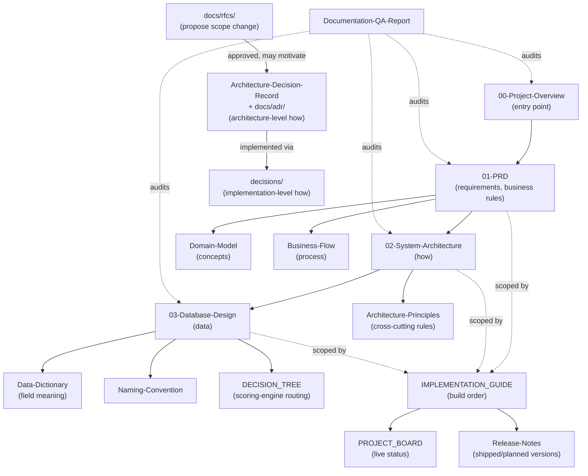

# Architecture — Where Do I Look?

**DMF Learning Analytics Platform (DLAP)**

| | |
|---|---|
| **Document ID** | ONET-DOC-014 |
| **Version** | 1.0.0 |
| **Status** | Frozen — DLAP Documentation Baseline v2.0.0 |
| **Date** | 2026-07-02 |
| **Author** | DMF Platform Team |
| **Related documents** | [docs/00-Project-Overview](docs/00-Project-Overview.md) · [CLAUDE.md](CLAUDE.md) · [IMPLEMENTATION_GUIDE.md](IMPLEMENTATION_GUIDE.md) |

## Revision History

| Version | Date | Description | Author |
|---|---|---|---|
| 1.0.0 | 2026-07-02 | Initial release, added as a Post-Freeze Amendment to the DLAP Documentation Baseline v2.0.0 (see [docs/00-Project-Overview.md §13](docs/00-Project-Overview.md#13-documentation-freeze)). A concern-based router: "I want to know about X — where do I look?" | DMF Platform Team |

## What This File Is (and Isn't)

**This is not the system architecture.** That document already exists —
[docs/02-System-Architecture.md](docs/02-System-Architecture.md) — and this file does not repeat
it. `ARCHITECTURE.md` answers a narrower question: *given the ~20 documents this project now has,
which one actually answers my question?* It is task/concern-oriented ("I want to see the
database — where?"), which is a different shape than
[CLAUDE.md](CLAUDE.md)'s Documentation Map (document-oriented: "here's what each file contains") —
see [§3](#3-how-this-differs-from-claudemds-documentation-map) for why both exist without
duplicating each other.

## Table of Contents

1. [Where Do I Look?](#1-where-do-i-look)
2. [Additional Routes](#2-additional-routes)
3. [How This Differs From CLAUDE.md's Documentation Map](#3-how-this-differs-from-claudemds-documentation-map)
4. [The Documentation's Own Architecture](#4-the-documentations-own-architecture)
5. [Cross-References](#5-cross-references)

---

## 1. Where Do I Look?

| If you want to see... | Go to |
|---|---|
| **Requirements** | [docs/01-PRD.md](docs/01-PRD.md) |
| **Database** | [docs/03-Database-Design.md](docs/03-Database-Design.md) |
| **Business Rules** | [docs/01-PRD.md §21](docs/01-PRD.md#21-core-product-capabilities) (the PRD — business rules are a requirements concern, not a separate document) |
| **Naming** | [docs/Naming-Convention.md](docs/Naming-Convention.md) |
| **Decisions** | [docs/Architecture-Decision-Record.md](docs/Architecture-Decision-Record.md) (ADR — architecture-level) · [decisions/](decisions/README.md) (IDR — implementation-level) · [docs/rfcs/](docs/rfcs/README.md) (RFC — scope-level) — see [§4](#4-the-documentations-own-architecture) for how the three relate |
| **Development order** (ลำดับการพัฒนา) | [IMPLEMENTATION_GUIDE.md](IMPLEMENTATION_GUIDE.md) |
| **Task status** (สถานะงาน) | [PROJECT_BOARD.md](PROJECT_BOARD.md) |

## 2. Additional Routes

Not asked for directly, but the same kind of question, answered the same way:

| If you want to see... | Go to |
|---|---|
| Why the module boundaries and layers are shaped this way | [docs/02-System-Architecture.md](docs/02-System-Architecture.md) |
| The conceptual chain (Student → ... → Recommendation), not the tables | [docs/Domain-Model.md](docs/Domain-Model.md) |
| The business-value chain (Learning Evidence → ... → Improvement), not the code | [docs/Business-Flow.md](docs/Business-Flow.md) |
| Which engine scores a given assessment (Multiple Choice / Essay / Portfolio / Observation) | [docs/DECISION_TREE.md](docs/DECISION_TREE.md) |
| Field-level validation rules, not just column types | [docs/Data-Dictionary.md](docs/Data-Dictionary.md) |
| The cross-cutting engineering principles (SSOT, DRY, KISS, YAGNI, ...) | [docs/Architecture-Principles.md](docs/Architecture-Principles.md) |
| What's shipped, or planned to ship, and when | [docs/Release-Notes.md](docs/Release-Notes.md) |
| Project identity, scope, and the DLAP rename's rationale | [docs/00-Project-Overview.md](docs/00-Project-Overview.md) |
| Whether the whole document set is internally consistent | [docs/Documentation-QA-Report.md](docs/Documentation-QA-Report.md) |

## 3. How This Differs From CLAUDE.md's Documentation Map

[CLAUDE.md](CLAUDE.md)'s Documentation Map is a table of every document with a one-line summary of
its contents — the right reference when you already know *which document* you're looking for and
just need the link, or when you want a complete inventory. This file is the right reference when
you know *what you're trying to find out* but not which document has it — a smaller, task-shaped
entry point, not a second inventory. Neither restates the other's content; both link to the same
underlying documents, per [Architecture-Principles.md
§1](docs/Architecture-Principles.md#1-single-source-of-truth-ssot) — update both when a document
is added, but the fact of what's *in* each document is only ever described once, in that
document's own header/purpose section.

## 4. The Documentation's Own Architecture

This is not the software's architecture ([docs/02-System-Architecture.md](docs/02-System-Architecture.md)
already owns that) — it is how the **documents themselves** relate, which is worth drawing once
because the set has grown large enough that the relationship isn't obvious from a flat file list:

**Reading it:** [00-Project-Overview](docs/00-Project-Overview.md) is the only document with no
prerequisites. Everything under it either *specifies* (PRD → System Architecture → Database
Design, each answering a narrower question than the last) or *explains* (Domain-Model and
Business-Flow are alternate views of the same specification, not additional requirements).
[RFC → ADR → IDR](docs/rfcs/README.md#1-three-tiers-rfc--adr--idr) is the one part of this diagram
that isn't a fixed hierarchy — it's a process loop that runs every time scope needs to grow past
what's already specified. Everything on the bottom row exists to turn the specification into
running software and track that it happened.

## 5. Cross-References

* The full one-line-per-document inventory: [CLAUDE.md](CLAUDE.md)'s Documentation Map.
* The frozen-baseline manifest and every post-freeze addition (including this file):
  [docs/00-Project-Overview.md §13](docs/00-Project-Overview.md#13-documentation-freeze).
* Naming rules this file's own name follows (`UPPER_SNAKE_CASE.md`, root, operational/actionable —
  a router is something you *use*, not a specification):
  [docs/Naming-Convention.md §4](docs/Naming-Convention.md#4-file--directory-naming).
