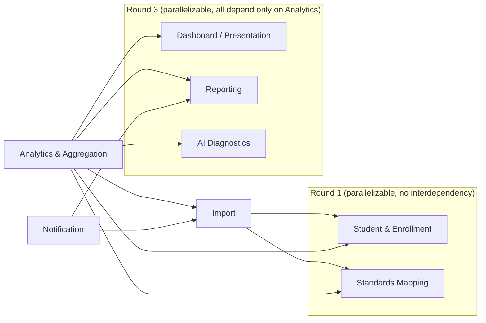

# Implementation Guide

**DMF Learning Analytics Platform (DLAP)**

| | |
|---|---|
| **Document ID** | ONET-DOC-011 |
| **Version** | 1.0.0 |
| **Status** | Frozen — DLAP Documentation Baseline v2.0.0 |
| **Date** | 2026-07-02 |
| **Author** | DMF Platform Team |
| **Related documents** | [docs/00-Project-Overview](docs/00-Project-Overview.md) · [docs/01-PRD](docs/01-PRD.md) · [docs/02-System-Architecture](docs/02-System-Architecture.md) · [docs/03-Database-Design](docs/03-Database-Design.md) · [docs/Architecture-Principles](docs/Architecture-Principles.md) · [docs/Naming-Convention](docs/Naming-Convention.md) · [decisions/README](decisions/README.md) |

## Revision History

| Version | Date | Description | Author |
|---|---|---|---|
| 1.0.0 | 2026-07-02 | Initial release, added as a Post-Freeze Amendment to the DLAP Documentation Baseline v2.0.0 (see [docs/00-Project-Overview.md §13](docs/00-Project-Overview.md#13-documentation-freeze)). Practical build guide: Roadmap → Task → Implementation Order → Dependencies → Coding Rules → Definition of Done → QA Checklist. | DMF Platform Team |

## Purpose

Every other document under `docs/` specifies *what* to build and *why*. This document is the one
that answers *what to build first, in what order, by what rules, and how to know a piece of it is
actually finished*. It exists at the project root — next to `CLAUDE.md`, not inside `docs/` —
because, like `CLAUDE.md`, it is meant to be opened constantly during implementation, not read once
during a design review. Per [docs/Architecture-Principles.md
§1](docs/Architecture-Principles.md#1-single-source-of-truth-ssot), it does not restate
requirements, schema, or architecture — every task below links to the specification it implements
rather than re-describing it.

## Table of Contents

1. [Roadmap](#1-roadmap)
2. [Task](#2-task)
3. [Implementation Order](#3-implementation-order)
4. [Dependencies](#4-dependencies)
5. [Coding Rules](#5-coding-rules)
6. [Definition of Done](#6-definition-of-done)
7. [QA Checklist](#7-qa-checklist)
8. [Cross-References](#8-cross-references)

---

## 1. Roadmap

This is the same roadmap as [docs/00-Project-Overview.md
§9](docs/00-Project-Overview.md#9-roadmap) — repeated here only as the spine [§2 Task](#2-task)
hangs off of, not as a second source of truth for it.

| Phase | Milestone |
|---|---|
| 0 | Documentation — **complete, frozen** (this guide is part of that freeze). |
| 1 | Foundation |
| 2 | Import & Validation |
| 3 | Standards Mapping & Analytics |
| 4 | Reporting |
| 5 | Multi-school Readiness (not detailed in this guide — out of scope until scheduled) |
| 6+ | Additional Assessment Types (not detailed in this guide — out of scope until scheduled) |

## 2. Task

Concrete, checkable tasks per phase. Each links the functional requirement(s) it satisfies and the
module that owns it ([docs/02-System-Architecture.md
§3](docs/02-System-Architecture.md#3-module-decomposition)). This is the granularity a task-tracker
ticket should be created at — not finer (a ticket per method) and not coarser (a ticket per phase).

### Phase 1 — Foundation

* **T1.1** Scaffold the Composer project from `dmf-template`; set the namespace root to `DMF\`
  (not the template's `App\` default) — [docs/02-System-Architecture.md
  §5](docs/02-System-Architecture.md#5-repository--directory-structure).
* **T1.2** Wire `dmf/core` as a Composer path dependency; confirm `Database\Connection`,
  `Auth\{Guard,TokenManager,RateLimiter}`, `Http\{Request,Response,Router}`, and
  `Validation\Validator` are reachable — [docs/02-System-Architecture.md
  §4](docs/02-System-Architecture.md#4-layered-architecture).
* **T1.3** Create the `dmf_academic` schema — every table in [docs/03-Database-Design.md
  §3–§10](docs/03-Database-Design.md#3-table-definitions--organizational), in the dependency order
  given in [§3 Implementation Order](#3-implementation-order) below.
* **T1.4** Seed `assessment_types` with exactly one active row (`ONET`) and the ten reserved codes
  — [docs/03-Database-Design.md §4](docs/03-Database-Design.md#4-table-definitions--assessment-framework).
  **Do not** build import/validation logic for the reserved codes — that is out of v1.0 scope
  ([docs/01-PRD.md §7](docs/01-PRD.md#7-out-of-scope)).
* **T1.5** Implement the **Student & Enrollment module** (`DMF\Student\*`): `students`,
  `student_enrollments`, `classrooms`, `teacher_classrooms` repositories, and the "resolve current
  classroom" service every other module calls instead of querying `students` directly.
* **T1.6** Implement staff authentication (FR-001) using `dmf-core`'s `Auth\Guard` +
  `Auth\TokenManager` + `Auth\RateLimiter`, backed by `login_rate_limits`.
* **T1.7** Implement the role-scoped dashboard shell (FR-002) — routing and auth-check only; no
  charts yet (those are Phase 3).

### Phase 2 — Import & Validation

* **T2.1** Implement `PdfParser`, `ExcelParser`, `CsvParser` under `DMF\Import\Parser\*` (FR-003/
  FR-004/FR-005) — see [decisions/IDR-001](decisions/IDR-001-phpspreadsheet-for-excel-import.md)
  for the Excel parsing library decision.
* **T2.2** Implement the per-academic-year import template registry
  ([docs/02-System-Architecture.md §7](docs/02-System-Architecture.md#7-import-pipeline-architecture)).
* **T2.3** Implement structural/content Validation (FR-006) using `dmf-core`'s
  `Validation\Validator`, plus DLAP-specific rules (score range, item-number bounds).
* **T2.4** Implement Normalization — item-to-indicator mapping (FR-009) — see
  [docs/Business-Flow.md §4](docs/Business-Flow.md#4-normalization) for the business framing of
  this step.
* **T2.5** Implement duplicate detection (FR-007) and the import log / audit trail (FR-008).
* **T2.6** Implement the cron-polled job runner and the commit transaction (Storage, FR-006's
  "no partial commits" rule) — [docs/03-Database-Design.md
  §13](docs/03-Database-Design.md#13-data-integrity-rules).

### Phase 3 — Standards Mapping & Analytics

* **T3.1** Import/seed the `สาระ/มาตรฐาน/ตัวชี้วัด` standards catalogue (FR-019) for the current
  curriculum revision.
* **T3.2** Implement the Analytics & Aggregation module (`DMF\Analytics\*`): classroom/grade/school
  summary recompute (FR-010/FR-011), item statistics (FR-012), year-over-year trend (FR-013) — the
  recompute algorithm in [docs/03-Database-Design.md
  §14](docs/03-Database-Design.md#14-aggregation-recompute-strategy).
* **T3.3** Implement the Dashboard module's chart-rendering layer (PRD §22) — see
  [decisions/IDR-002](decisions/IDR-002-chartjs-for-dashboard.md) for the Chart.js integration
  decision.
* **T3.4** Implement the AI Diagnostics module's rule-based path (FR-014); the optional LLM
  narrative (FR-015) may be deferred within this phase if time-boxed, since it degrades gracefully
  by design ([docs/02-System-Architecture.md
  §11](docs/02-System-Architecture.md#11-ai-diagnostics-integration)).
* **Explicitly not in Phase 3 (or any scheduled phase):** populating `student_standard_mastery`.
  This table is schema-ready ([docs/03-Database-Design.md
  §9](docs/03-Database-Design.md#9-table-definitions--aggregation--materialized-summaries)) but has
  no consuming feature yet — do not write to it until a per-student report task exists to justify
  it (YAGNI — [docs/Architecture-Principles.md
  §7](docs/Architecture-Principles.md#7-yagni--you-arent-gonna-need-it)).

### Phase 4 — Reporting

* **T4.1** Implement PDF export for the teacher classroom report (FR-016). **Open decision:** no
  PDF-rendering library has an IDR yet — write `decisions/IDR-004-<library>-for-pdf-export.md`
  before starting this task, following the format in [decisions/README.md](decisions/README.md).
* **T4.2** Implement Excel export for the school summary report (FR-017).
* **T4.3** Implement the scheduled-report cron job and SMTP dispatch (FR-018).
* **T4.4** Implement the Notification module's in-app status banner (import completion).

## 3. Implementation Order

The build order below follows the module dependency graph in [docs/02-System-Architecture.md
§3](docs/02-System-Architecture.md#3-module-decomposition) exactly — a module is never started
before every module it depends on is usable, though modules with no dependency on each other can
be built in parallel by different people.

**Sequence:** (1) `dmf-core` wiring — prerequisite for everything, not a module of its own. (2)
Student & Enrollment **and** Standards Mapping, in parallel — neither depends on the other or on
anything else in this project. (3) Import — depends on both Round 1 modules. (4) Analytics &
Aggregation — depends on Import, Standards Mapping, and Student & Enrollment. (5) Dashboard,
Reporting, and AI Diagnostics, in parallel — each depends only on Analytics. (6) Notification —
depends on Import and Reporting, so it is built last even though it is architecturally simple,
because it has nothing to notify about until the modules that trigger it exist.

## 4. Dependencies

External packages this implementation is expected to need, and the decision record backing each
non-obvious choice:

| Package | Purpose | Decision Record |
|---|---|---|
| `dmf/core` | Auth, Database, HTTP, Validation, Security, Config, Logger | [docs/Architecture-Decision-Record.md](docs/Architecture-Decision-Record.md) (platform-level, all six ADRs) |
| `phpoffice/phpspreadsheet` | `.xlsx` parsing (Import) | [decisions/IDR-001](decisions/IDR-001-phpspreadsheet-for-excel-import.md) |
| A PDF rendering library (not yet chosen) | PDF export (Reporting, FR-016) | **Open** — write an IDR before Phase 4 T4.1 |
| Chart.js (+ `chartjs-chart-matrix`) | Dashboard charts | [docs/Architecture-Decision-Record.md, ADR-005](docs/Architecture-Decision-Record.md#adr-005--why-chartjs) (platform-level) and [decisions/IDR-002](decisions/IDR-002-chartjs-for-dashboard.md) (module-level integration) |
| Bootstrap 5 | Dashboard layout/components | [docs/Architecture-Decision-Record.md, ADR-004](docs/Architecture-Decision-Record.md#adr-004--why-bootstrap-5) |
| `phpunit/phpunit`, `phpstan/phpstan`, `squizlabs/php_codesniffer` | Testing, static analysis, PSR-12 linting | matches `dmf-core`'s own `composer.json` dev dependencies |

No ORM, no message queue client, no HTTP framework beyond `dmf-core`'s own `Http\Router` — adding
any of these would need its own ADR, not just an IDR, since it would be an architecture-level
choice, not an implementation-level one (see [decisions/README.md](decisions/README.md) for that
distinction).

## 5. Coding Rules

These are the rules a pull request is checked against; each links to the document that actually
defines it rather than restating it here (SSOT):

1. **Namespace root is `DMF\`, PSR-4, one class per file, `PascalCase.php`** —
   [docs/Naming-Convention.md §2](docs/Naming-Convention.md#2-php-naming) and
   [§4](docs/Naming-Convention.md#4-file--directory-naming).
2. **Depend on `dmf-core` contracts, not concretions** — never reimplement auth, DB access,
   validation, hashing, or logging that `dmf-core` already provides
   ([CLAUDE.md](CLAUDE.md#conventions-to-follow-once-code-exists)).
3. **A module's tables are only queried by that module's own repositories** — Module Isolation,
   [docs/Architecture-Principles.md §3](docs/Architecture-Principles.md#3-module-isolation).
4. **PDO prepared statements only, everywhere** — no string-interpolated SQL, no exceptions for
   "it's just an internal query."
5. **No inline import processing on the HTTP request thread** — always queue-and-cron, per
   [docs/02-System-Architecture.md §7](docs/02-System-Architecture.md#7-import-pipeline-architecture).
6. **Reference data is data** — `assessment_types`, the standards catalogue, and
   `learning_contents` are edited through the Approval Flow
   ([docs/01-PRD.md §21](docs/01-PRD.md#21-core-product-capabilities)), never hardcoded as PHP
   constants or `match` branches.
7. **A schema or naming change follows [docs/Naming-Convention.md](docs/Naming-Convention.md)** —
   if a table/column name doesn't fit an existing pattern there, that document is updated in the
   same pull request, not worked around silently.
8. **An architecturally significant choice gets an ADR or an IDR before the code that depends on
   it is merged** — see [decisions/README.md](decisions/README.md) for which one.
9. **No secret ever committed** — `DB_PASS`, `TOKEN_SECRET`, `LLM_API_KEY`, and any future secret
   are environment variables only, read via `Config::require()` so a missing one fails at boot.
10. **KISS/YAGNI apply to every task above** — a task's acceptance criteria (linked from
    [§2 Task](#2-task) back to the relevant FR) define "done"; do not build beyond it in the same
    pull request — [docs/Architecture-Principles.md §6–§7](docs/Architecture-Principles.md#6-kiss--keep-it-simple).

## 6. Definition of Done

A task from [§2](#2-task) is done when **all** of the following are true — this list is the
concrete form of [docs/01-PRD.md §25](docs/01-PRD.md#25-lifecycle--governance)'s acceptance
criteria, not a separate standard:

- [ ] The linked FR's acceptance criteria (in [docs/01-PRD.md
      §19](docs/01-PRD.md#19-functional-requirements)) are met and manually verified, not just
      assumed from passing tests.
- [ ] PHPUnit tests exist and pass; coverage on Import, Validation, and Analytics logic is ≥ 80%
      ([docs/01-PRD.md §20](docs/01-PRD.md#20-non-functional-requirements)).
- [ ] PHPStan analysis is clean at the level `dmf-core`'s own `phpstan.neon` uses.
- [ ] PHPCS reports zero PSR-12 violations.
- [ ] Every new/changed table or column matches [docs/Naming-Convention.md](docs/Naming-Convention.md)
      and has a corresponding entry in [docs/Data-Dictionary.md](docs/Data-Dictionary.md) — added in
      the same pull request, not a follow-up.
- [ ] No module boundary was crossed except through a public repository/service method (§5, rule 3).
- [ ] Any new architecturally significant decision has an ADR or IDR (§5, rule 8).
- [ ] No secret, credential, or student PII appears in a log line, error message, or committed file.

## 7. QA Checklist

Run before merging any pull request that touches more than a single, obviously-isolated bug fix.
This mirrors the ten categories [docs/Documentation-QA-Report.md](docs/Documentation-QA-Report.md)
used to audit the documentation, applied here to code:

| Category | Check |
|---|---|
| **Consistency** | Does the behavior match what [docs/01-PRD.md](docs/01-PRD.md) actually says, not what seemed reasonable while coding? |
| **Architecture** | Does the change respect the module graph in [§3](#3-implementation-order) — no new cross-module table access? |
| **Database** | Does a migration exist for every schema change, and does it match [docs/03-Database-Design.md](docs/03-Database-Design.md) exactly (including index/constraint definitions)? |
| **Business Rules** | Are "no partial commits," "no hard delete of committed scores," and the anonymization boundary ([docs/03-Database-Design.md §13](docs/03-Database-Design.md#13-data-integrity-rules)) still enforced after this change? |
| **Security** | Prepared statements only; rate limiting active on any new auth-adjacent endpoint; uploads validated by size/MIME before parsing. |
| **Performance** | Does any dashboard-facing query still read only from a pre-aggregated summary table, never computing live from raw responses (§8 of [docs/02-System-Architecture.md](docs/02-System-Architecture.md#8-analytics--aggregation-architecture))? |
| **Test Coverage** | Does [§6 Definition of Done](#6-definition-of-done)'s coverage/lint/analysis bar hold? |
| **Naming Convention** | Do new identifiers (tables, classes, methods, config keys, API actions) follow [docs/Naming-Convention.md](docs/Naming-Convention.md) exactly — including the `snake_case` `?action=` rule, not a generic REST convention? |
| **Documentation Sync** | If this change contradicts something in `docs/`, is `docs/` updated in the same pull request with a proper Revision History entry — not left to drift, per the freeze discipline in [docs/00-Project-Overview.md §13](docs/00-Project-Overview.md#13-documentation-freeze)? |
| **Decision Record** | If this pull request made a new library/pattern choice, does an IDR (or ADR, if architecture-level) exist for it, per [decisions/README.md](decisions/README.md)? |

## 8. Cross-References

* Requirements every task above implements: [docs/01-PRD.md](docs/01-PRD.md).
* Module boundaries and the dependency graph [§3](#3-implementation-order) is drawn from:
  [docs/02-System-Architecture.md §3](docs/02-System-Architecture.md#3-module-decomposition).
* Schema every Phase 1 task creates: [docs/03-Database-Design.md](docs/03-Database-Design.md).
* The business rationale behind the flow these tasks build:
  [docs/Business-Flow.md](docs/Business-Flow.md), [docs/Domain-Model.md](docs/Domain-Model.md).
* Where to record a new implementation-level choice: [decisions/README.md](decisions/README.md).
