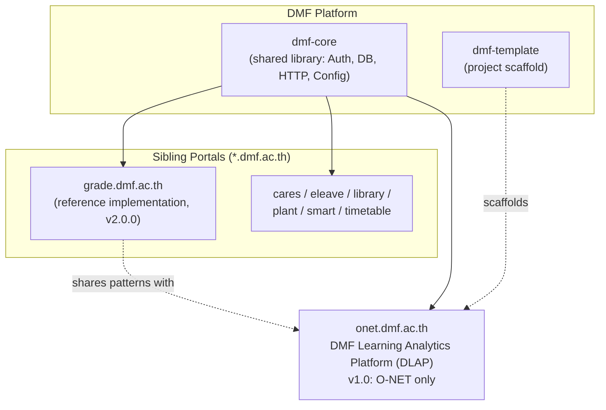

# 00 — Project Overview

**DMF Learning Analytics Platform (DLAP)**
*(formerly "DMF Academic Analytics" — module domain: `onet.dmf.ac.th`)*

| | |
|---|---|
| **Document ID** | ONET-DOC-000 |
| **Version** | 2.0.8 |
| **Status** | Frozen — DLAP Documentation Baseline v2.0.0 |
| **Date** | 2026-07-03 |
| **Author** | DMF Platform Team |
| **Classification** | Internal — DMF Platform |

> **Naming note:** Document IDs keep the `ONET-DOC-` prefix from the project's original codename
> for traceability across revisions — it is an internal control number, not a product name. The
> product name is **DMF Learning Analytics Platform (DLAP)**; the module continues to deploy at
> the existing `onet.dmf.ac.th` domain and `dmf_academic` database, both left unchanged under the
> Backward Compatibility principle (see [Architecture-Principles.md](Architecture-Principles.md)).

## Revision History

| Version | Date | Description | Author |
|---|---|---|---|
| 1.0.0 | 2026-07-02 | Initial release. Establishes project identity, scope, and relationship to the DMF Platform. | DMF Platform Team |
| 1.1.0 | 2026-07-02 | Renamed database schema from `dmf_onet` to `dmf_academic` to reflect its exam-type-agnostic design; added [Architecture-Decision-Record.md](Architecture-Decision-Record.md) to the document set. No change to project scope. | DMF Platform Team |
| 2.0.0 | 2026-07-02 | **Project renamed** to DMF Learning Analytics Platform (DLAP). Reframed from an exam-centric ("O-NET Analytics") system to a student-centric, longitudinal learning-analytics platform: the student's Grade 1–6 learning history is the primary subject; an assessment (O-NET, NT, RT, LAS, Pre/Mid/Post-Test, Classroom/Reading/Writing/Competency Assessment) is one event in that history. Architecture, database, and API design must generalize across all eleven assessment types; **v1.0 functional scope remains O-NET, Grade 6, only** — no new features were added. Added [Architecture-Principles.md](Architecture-Principles.md), [Data-Dictionary.md](Data-Dictionary.md), and [Naming-Convention.md](Naming-Convention.md) to the document set. | DMF Platform Team |
| 2.0.1 | 2026-07-02 | Added [Domain-Model.md](Domain-Model.md) and [Business-Flow.md](Business-Flow.md) to the document set; added [§13 Documentation Freeze](#13-documentation-freeze) recording this document set's freeze as the **DLAP Documentation Baseline v2.0.0**. No scope or architecture change. | DMF Platform Team |
| 2.0.2 | 2026-07-02 | Added a Post-Freeze Amendments log to [§13](#13-documentation-freeze), recording the Business-Flow.md 9-stage reframing, the new [IMPLEMENTATION_GUIDE.md](../IMPLEMENTATION_GUIDE.md), and the new `/decisions` (IDR) folder. | DMF Platform Team |
| 2.0.3 | 2026-07-02 | Added a second Post-Freeze Amendments entry recording [docs/rfcs/](rfcs/README.md) (RFC-001–RFC-003, a new proposal tier above ADR/IDR), [Release-Notes.md](Release-Notes.md) (`ONET-DOC-012`), and [PROJECT_BOARD.md](../PROJECT_BOARD.md). | DMF Platform Team |
| 2.0.4 | 2026-07-02 | Added a third Post-Freeze Amendments entry recording [DECISION_TREE.md](DECISION_TREE.md) (`ONET-DOC-013`) — the evaluation-method routing design (Multiple Choice/Essay/Portfolio/Observation → Question/Rubric/Evidence/Observation Engine) that answers, at a design level, the follow-on-ADR gaps [RFC-002](rfcs/RFC-002-support-rt.md) and [RFC-003](rfcs/RFC-003-support-portfolio-assessment.md) each identified. | DMF Platform Team |
| 2.0.5 | 2026-07-02 | Added a fourth Post-Freeze Amendments entry recording root [ARCHITECTURE.md](../ARCHITECTURE.md) (`ONET-DOC-014`) — a concern-based "where do I look" router, distinct from [02-System-Architecture.md](02-System-Architecture.md) (the software design) and from [CLAUDE.md](../CLAUDE.md)'s document-oriented map. | DMF Platform Team |
| 2.0.6 | 2026-07-02 | Added a fifth Post-Freeze Amendments entry recording root [START_SESSION.md](../START_SESSION.md) (`ONET-DOC-015`) — the fixed procedure every implementation session starts with. Implementation began: Sprint 1, Module 1 (Core Configuration). | DMF Platform Team |
| 2.0.7 | 2026-07-03 | Added a sixth Post-Freeze Amendments entry, made during Module 2 implementation planning: [02-System-Architecture.md §16](02-System-Architecture.md#16-cross-cutting-concerns) and [Naming-Convention.md §5](Naming-Convention.md#5-configuration--environment-variables) updated — the module-specific environment variable prefix changed from `ONET_` to `DLAP_` after confirming no external system had ever deployed against it. See [decisions/IDR-006](../decisions/IDR-006-dlap-env-prefix.md). | DMF Platform Team |
| 2.0.8 | 2026-07-03 | Added a seventh Post-Freeze Amendments entry, made during T2.6 (Duplicate Detection + Audit Trail, FR-007/FR-008) implementation: `import_logs.event`'s vocabulary extended from 6 to 10 values. See [decisions/IDR-008](../decisions/IDR-008-import-audit-event-vocabulary-extension.md). | DMF Platform Team |

## Table of Contents

1. [Purpose of This Document](#1-purpose-of-this-document)
2. [Project Identity](#2-project-identity)
3. [Background](#3-background)
4. [Vision & Mission](#4-vision--mission)
5. [Goals & Objectives](#5-goals--objectives)
6. [Scope](#6-scope)
7. [Stakeholders & Roles](#7-stakeholders--roles)
8. [Relationship to the DMF Platform](#8-relationship-to-the-dmf-platform)
9. [Roadmap](#9-roadmap)
10. [Success Metrics](#10-success-metrics)
11. [Glossary](#11-glossary)
12. [Document Set & Cross-References](#12-document-set--cross-references)
13. [Documentation Freeze](#13-documentation-freeze)

---

## 1. Purpose of This Document

This document is the entry point to the **DMF Learning Analytics Platform (DLAP)** documentation
set. It defines *what* the project is, *why* it exists, and *how* it fits into the wider DMF
Platform, before the detailed requirements ([01-PRD](01-PRD.md)), architecture
([02-System-Architecture](02-System-Architecture.md)), and data model
([03-Database-Design](03-Database-Design.md)) are read. Anyone — human or AI agent — joining this
project should read this document first.

## 2. Project Identity

| Attribute | Value |
|---|---|
| Project name | **DMF Learning Analytics Platform (DLAP)** — formerly "DMF Academic Analytics" |
| Production domain | `onet.dmf.ac.th` (unchanged; see naming note above) |
| Owning organization | โรงเรียนชุมชนดงมะไฟเจริญศิลป์ (Dong Mafai Charoen Sin Community School), school code `47010005`, Sakon Nakhon province |
| Platform family | DMF Platform (`dmf-core`, `dmf-template`, and sibling portals under `*.dmf.ac.th`) |
| Primary entity | **The student** and their Grade 1–6 learning history — not any single assessment. |
| v1.0 implemented data domain | O-NET (Ordinary National Educational Test), Grade 6 (ป.6) — see [§6 Scope](#6-scope) |
| Designed-for data domain | Any assessment type in [§6](#6-scope): Pre-Test, Mid-Test, Post-Test, O-NET, NT, RT, LAS, Classroom / Reading / Writing / Competency Assessment |
| Target stack | PHP 8.3, MySQL/MariaDB, Bootstrap 5, Chart.js, REST API |
| Architecture style | Modular Monolith |
| Hosting model | Shared DirectAdmin/cPanel hosting (consistent with the rest of the DMF Platform) |

## 3. Background

The DMF Platform already operates a family of single-school administrative portals under the
`dmf.ac.th` domain — `grade.dmf.ac.th` (report-card and grade management, the platform's reference
implementation), alongside `cares.dmf.ac.th`, `eleave.dmf.ac.th`, `library.dmf.ac.th`,
`plant.dmf.ac.th`, `smart.dmf.ac.th`, and `timetable.dmf.ac.th`. These portals share a common
foundation library (`dmf-core`) that provides authentication, database access, HTTP routing, and
validation primitives so that each new portal does not re-invent institutional plumbing.

Every year, Grade 6 (ป.6) students sit the **O-NET** (Ordinary National Educational Test),
administered nationally by **สทศ** (NIETS — the National Institute of Educational Testing
Service). Results are returned to the school as PDF summary reports and Excel/CSV score exports,
broken down by subject and by learning standard/indicator (มาตรฐาน/ตัวชี้วัด) under the Basic
Education Core Curriculum B.E. 2551 (Revised B.E. 2560). Today, teachers and the school director
read these exports manually, cross-reference them against curriculum standards by hand, and
produce static summaries — a process that consumes significant time during a period when the
school year has often already moved on.

**Why this project changed direction.** Building an "O-NET Analytics System" as originally scoped
would have answered one question well — how did this cohort do on this year's O-NET — but would
not have answered the question the school actually needs answered over time: *how is this specific
student progressing, from Grade 1 through Grade 6, across every assessment they ever sit?* A
student who is weak on a `ตัวชี้วัด` in a Grade 3 NT test, a Grade 4 classroom assessment, and the
Grade 6 O-NET is one continuous story, not three unrelated reports. **DMF Learning Analytics
Platform (DLAP)** is the DMF Platform module built to tell that story: the student and their
learning history are the primary entity; O-NET, NT, RT, and every other assessment type are events
recorded against that history, not the organizing principle of the system itself.

## 4. Vision & Mission

**Vision:** To give Dong Mafai Charoen Sin Community School a continuous, standard-aligned view of
every student's learning progression from Grade 1 through Grade 6 — not a static annual report
read once per assessment and filed away.

**Mission:** Deliver a secure, PHP-based, student-centric learning-analytics module — built on the
shared `dmf-core` foundation — that automates assessment data import for any supported assessment
type, guarantees data validity, maps every assessed item to its national learning standard, and
surfaces targeted, role-specific insight for teachers, the school director, and (as the platform
grows) education-area supervisors. **Version 1.0 delivers this for O-NET, Grade 6, only** — the
architecture and data model are built so that adding the next assessment type is a configuration
and data change, not a redesign (see [Architecture-Decision-Record.md, ADR-006](Architecture-Decision-Record.md#adr-006--why-a-generic-student-centric-assessment-schema)).

## 5. Goals & Objectives

* Reduce O-NET results analysis time from weeks of manual spreadsheet work to minutes after the
  official file is uploaded (v1.0 functional goal).
* Map 100% of ingested O-NET items to their corresponding learning strand, standard, and indicator
  (v1.0 functional goal).
* Give teachers, the director, and (in a later phase) area-level inspectors a dashboard tailored to
  their role and access boundary.
* Model every student's enrollment and grade progression (Grade 1–6) as first-class history, so
  that a student's learning trajectory can be queried across academic years and across assessment
  types — even though v1.0 only populates that history with O-NET, Grade 6 data.
* Design the assessment framework (assessment types, assessments, questions, scores, standard
  mastery) so that Pre-Test, Mid-Test, Post-Test, NT, RT, LAS, Classroom, Reading, Writing, and
  Competency Assessment data can be added later as rows in a reference table, not as a schema
  migration that touches existing tables (architectural goal only — not a v1.0 deliverable).
* Do all of this within the operating reality of shared school hosting — no dedicated servers,
  no container orchestration, no paid managed infrastructure beyond what `dmf-core` already
  assumes.

Full, testable requirements for each objective are defined in [01-PRD.md](01-PRD.md).

## 6. Scope

**In scope (v1.0 functional delivery — unchanged from the original O-NET-only plan):**
* Import of official O-NET score exports (PDF and Excel/CSV) for ป.6, per subject
  (ภาษาไทย, คณิตศาสตร์, วิทยาศาสตร์, ภาษาอังกฤษ — the four subjects examined since the 2023
  removal of Social Studies from O-NET).
* Structural and logical validation of imported data, with an auditable import log.
* Mapping of test items to learning strand → standard → indicator.
* Classroom, grade, school, **and per-student** analytics dashboards (trend, heatmap, item
  analysis, longitudinal standard-mastery view).
* Role-based access for Teacher, School Director, and System Administrator.
* PDF/Excel export of teacher- and school-level reports.

**In scope (v1.0 architectural/data-model generality — designed now, not implemented as features):**
The database and API are designed around a generic `assessment_types` reference table so that any
of the following can be added later without redesigning existing tables (see
[03-Database-Design.md §4](03-Database-Design.md#4-table-definitions--assessment-framework)):

| Code | Assessment Type | v1.0 status |
|---|---|---|
| `PRE_TEST` | Pre-Test | Reserved — not implemented |
| `MID_TEST` | Mid-Test | Reserved — not implemented |
| `POST_TEST` | Post-Test | Reserved — not implemented |
| `ONET` | O-NET (Ordinary National Educational Test) | **Implemented — the only active assessment type in v1.0** |
| `NT` | National Test | Reserved — not implemented |
| `RT` | Reading Test | Reserved — not implemented |
| `LAS` | Local Assessment System | Reserved — not implemented |
| `CLASSROOM_ASSESSMENT` | Classroom Assessment | Reserved — not implemented |
| `READING_ASSESSMENT` | Reading Assessment | Reserved — not implemented |
| `WRITING_ASSESSMENT` | Writing Assessment | Reserved — not implemented |
| `COMPETENCY_ASSESSMENT` | Competency Assessment | Reserved — not implemented |

Likewise, students' grade progression is modeled as history spanning Grade 1 through Grade 6
(`student_enrollments`, [03-Database-Design.md §3](03-Database-Design.md#3-table-definitions--organizational)),
even though v1.0 only populates Grade 6 O-NET data into it.

**Explicitly out of scope (v1.0):**
* Live integration with the NIETS/สทศ system (no public API exists; data arrives as files).
* Multi-school / multi-tenant operation (tracked as a platform-level roadmap item, see
  [§9](#9-roadmap) and [02-System-Architecture §3](02-System-Architecture.md#3-module-decomposition)).
* **Implementing** any assessment type other than O-NET (NT, RT, LAS, Pre/Mid/Post-Test,
  Classroom/Reading/Writing/Competency Assessment) — these are reserved in the data model
  ([above](#6-scope)) but not built, imported, validated, or displayed in v1.0.
* Synchronous/video learning delivery, or hosting of external LMS content.

Detailed in/out-of-scope statements are in [01-PRD.md §6–7](01-PRD.md#6-scope).

## 7. Stakeholders & Roles

| Stakeholder | Interest |
|---|---|
| Grade 6 Teacher (ครูประจำชั้น ป.6) | Uploads score data, reads classroom-level standard gaps. |
| School Director (ผู้อำนวยการ) | Whole-school visibility, resource allocation decisions. |
| System Administrator | Runs the module on shared hosting: deployment, backups, user accounts. |
| Education-area Inspector (future) | Read-only, anonymized, cross-school comparison — not in MVP. |
| DMF Platform maintainers | Ensure the module stays aligned with `dmf-core` conventions. |

Full role permission matrix: [01-PRD.md §21](01-PRD.md#21-core-product-capabilities).

## 8. Relationship to the DMF Platform

`onet.dmf.ac.th` is a new, independent Composer project — its own codebase, its own database
(`dmf_academic`) — that depends on `dmf/core` exactly as `grade.dmf.ac.th` does. It does not share a
database or runtime with any sibling portal; the platform relationship is a shared library and
shared conventions, not shared state. See [02-System-Architecture.md](02-System-Architecture.md)
for the full component design.

## 9. Roadmap

Aligned to the DMF Platform's own sprint roadmap (`dmf-core/docs/platform-architecture.md §11`):

| Phase | Milestone | Deliverable |
|---|---|---|
| 0 | Documentation (complete — frozen as the DLAP Documentation Baseline v2.0.0, [§13](#13-documentation-freeze)) | This document set: Overview, PRD, Architecture, Database Design, Architecture Principles, Data Dictionary, Naming Convention, Architecture Decision Record, Domain Model, Business Flow, Documentation QA Report. |
| 1 | Foundation | Composer project scaffolded from `dmf-template`; `dmf_academic` schema created, including the generic assessment framework and student enrollment history. |
| 2 | Import & Validation | PDF/Excel/CSV ingestion pipeline for O-NET; import log; structural validation. |
| 3 | Standards Mapping & Analytics | Learning-standard mapping; classroom/grade/school/student aggregation; core dashboards, including the per-student longitudinal standard-mastery view. |
| 4 | Reporting | PDF/Excel export for teacher and school reports; scheduled email reports. |
| 5 | Multi-school Readiness | Tenant isolation, aligned with the platform-wide "Multi-school" milestone. |
| 6+ (future, not scheduled) | Additional Assessment Types | Activate NT, RT, LAS, Pre/Mid/Post-Test, or Classroom/Reading/Writing/Competency Assessment by seeding `assessment_types` and building the corresponding import template — no schema redesign expected, per [ADR-006](Architecture-Decision-Record.md#adr-006--why-a-generic-student-centric-assessment-schema). |

This roadmap governs sequencing only; detailed functional requirements per phase are in
[01-PRD.md](01-PRD.md).

## 10. Success Metrics

* Time from official O-NET file upload to a rendered classroom dashboard: **under 30 seconds**.
* Item-to-standard mapping accuracy: **100%** for all items present in the official สทศ item-standard
  reference table.
* Teacher adoption: **at least 90%** of Grade 6 teaching staff actively using the dashboard within
  one semester of release.
* Architectural fitness (measured at design-review time, not runtime): adding a reserved assessment
  type from [§6](#6-scope) requires **zero** changes to existing table structures — only new rows
  and new import-template code, verified against [03-Database-Design.md](03-Database-Design.md).

Full KPI table: [01-PRD.md §26](01-PRD.md#26-kpi--success-metrics).

## 11. Glossary

| Term | Meaning |
|---|---|
| **DLAP** | DMF Learning Analytics Platform — the product name this document set uses from v2.0.0 onward. |
| **DMF** | Dong Mafai (ดงมะไฟ) — the school's name root; also the platform brand (`dmf-core`, `*.dmf.ac.th`). *Not* an abbreviation for "Data Management Framework". |
| **Assessment** | The generic term for any measured event in a student's learning history — O-NET, NT, RT, LAS, Pre/Mid/Post-Test, or Classroom/Reading/Writing/Competency Assessment. An assessment is an *event*; the student is the *entity* the event is recorded against. |
| **Longitudinal Learning Analytics** | Analysis that follows one student's performance across multiple academic years, grade levels, and assessment types, rather than analyzing one assessment's cohort in isolation. |
| **O-NET** | Ordinary National Educational Test — Thailand's national standardized assessment; the only assessment type implemented in v1.0. |
| **สทศ / NIETS** | National Institute of Educational Testing Service — administers O-NET and issues score reports. |
| **ป.1–ป.6** | Prathom 1–6 / Grade 1–6 — the full primary-education span this platform's student learning history is designed to cover; v1.0 populates only ป.6 (O-NET) data. |
| **สาระการเรียนรู้ (Strand)** | A learning-content strand within a subject (e.g., Number and Algebra within Mathematics). |
| **มาตรฐานการเรียนรู้ (Standard)** | A national learning standard under a strand. |
| **ตัวชี้วัด (Indicator)** | A specific, assessable learning indicator under a standard — the finest-grained unit any assessment's items are mapped to, and the unit longitudinal student mastery is tracked against. |
| **ปพ. (Por Por)** | The family of official Thai academic record document codes (ปพ.5, ปพ.6, ปพ.7), produced by the sibling `grade.dmf.ac.th` module — referenced here only for context, not produced by this module. |

## 12. Document Set & Cross-References

| Document | Purpose |
|---|---|
| [ARCHITECTURE.md](../ARCHITECTURE.md) (project root) | Concern-based "where do I look" router — start here if you don't already know which document has your answer. |
| [START_SESSION.md](../START_SESSION.md) (project root) | The fixed procedure to run at the start of every implementation session. |
| **00-Project-Overview.md** (this document) | Identity, background, scope, platform relationship. |
| [01-PRD.md](01-PRD.md) | Full product requirements: functional, non-functional, roles, workflows. |
| [02-System-Architecture.md](02-System-Architecture.md) | Modular monolith design, layers, pipelines, deployment. |
| [03-Database-Design.md](03-Database-Design.md) | `dmf_academic` schema: student-centric, longitudinal, generic-assessment entities, relationships, indexing, retention. |
| [Domain-Model.md](Domain-Model.md) | Conceptual domain chain: Student → Enrollment → Assessment → Question → Learning Standard → Learning Content → Mastery → Recommendation. |
| [Business-Flow.md](Business-Flow.md) | Business value chain: Learning Evidence → Validation → Normalization → Storage → Analytics → Insight → Recommendation → Intervention → Improvement. |
| [Architecture-Decision-Record.md](Architecture-Decision-Record.md) | ADR-001–ADR-006: rationale for the Modular Monolith, PHP 8.3, MySQL/MariaDB, Bootstrap 5, Chart.js, and the generic student-centric assessment schema. |
| [Architecture-Principles.md](Architecture-Principles.md) | Cross-cutting engineering principles (SSOT, DRY, KISS, YAGNI, Module Isolation, Shared Components, Convention over Configuration, Backward Compatibility) that every other document and future code change must follow. |
| [Data-Dictionary.md](Data-Dictionary.md) | Field-level business meaning and validation rules for every table in `dmf_academic`. |
| [Naming-Convention.md](Naming-Convention.md) | Naming rules for tables, columns, classes, methods, API routes, and files. |
| [Documentation-QA-Report.md](Documentation-QA-Report.md) | Audit of this entire document set for consistency, correctness, and cross-reference integrity. |
| [Release-Notes.md](Release-Notes.md) | Planned and (eventually) shipped release history, versioned independently of this documentation baseline, starting at v0.1.0. |
| [DECISION_TREE.md](DECISION_TREE.md) | Routes a piece of Learning Evidence to the engine that scores it (Question / Rubric / Evidence / Observation Engine) — only Question Engine is built in v1.0. |
| [IMPLEMENTATION_GUIDE.md](../IMPLEMENTATION_GUIDE.md) (project root) | Roadmap → Task → Implementation Order → Dependencies → Coding Rules → Definition of Done → QA Checklist — the practical bridge from this baseline to Phase 1. |
| [decisions/README.md](../decisions/README.md) (project root) | Implementation Decision Records (IDR) — concrete library/pattern choices made during implementation; distinct from and cross-referenced against [Architecture-Decision-Record.md](Architecture-Decision-Record.md). |
| [docs/rfcs/README.md](rfcs/README.md) | Requests For Change (RFC) — proposals to change product *scope* (e.g., activate a new assessment type), one tier above ADR/IDR. |
| [PROJECT_BOARD.md](../PROJECT_BOARD.md) (project root) | Living sprint-level task tracker — not part of this frozen baseline. |
| [archive/01-PRD-legacy.md](archive/01-PRD-legacy.md) | Superseded early draft, retained for historical reference only. |

All active documents share the `ONET-DOC-` document ID prefix and are versioned together; a change
to scope or architecture in one must be reflected in the others — this is itself the **Single
Source of Truth** principle defined in [Architecture-Principles.md](Architecture-Principles.md).

## 13. Documentation Freeze

**Baseline name:** DLAP Documentation Baseline v2.0.0
**Freeze date:** 2026-07-02
**Declared by:** DMF Platform Team

This baseline closes the documentation phase referenced throughout this document set (see
[CLAUDE.md](../CLAUDE.md)'s Project Status section and [§9 Roadmap](#9-roadmap), Phase 0). It is
the version of the documentation set that [Documentation-QA-Report.md](Documentation-QA-Report.md)
audited and signed off on. "Frozen" means: no further content changes are expected against this
baseline; a genuine correction or scope change starts a **new** baseline (the next minor or major
version, with its own revision-history entries across whichever documents it touches), not a silent
edit to a frozen one. This is the Backward Compatibility and Single Source of Truth principles
([Architecture-Principles.md §1](Architecture-Principles.md#1-single-source-of-truth-ssot),
[§8](Architecture-Principles.md#8-backward-compatibility)) applied to the documentation process
itself, not just to its content.

**Manifest — every document in the baseline, and its version at freeze time:**

| Document ID | Document | Version at Freeze |
|---|---|---|
| ONET-DOC-000 | 00-Project-Overview.md | 2.0.1 |
| ONET-DOC-001 | 01-PRD.md | 2.0.1 |
| ONET-DOC-002 | 02-System-Architecture.md | 2.0.1 |
| ONET-DOC-003 | 03-Database-Design.md | 2.0.1 |
| ONET-DOC-004 | Architecture-Decision-Record.md | 1.1.1 |
| ONET-DOC-005 | Architecture-Principles.md | 1.0.1 |
| ONET-DOC-006 | Data-Dictionary.md | 1.0.1 |
| ONET-DOC-007 | Naming-Convention.md | 1.0.1 |
| ONET-DOC-008 | Documentation-QA-Report.md | 1.0.1 |
| ONET-DOC-009 | Domain-Model.md | 1.0.0 |
| ONET-DOC-010 | Business-Flow.md | 1.0.0 |

`archive/01-PRD-legacy.md` is explicitly **out of** this baseline — it was already superseded
before the baseline existed and carries no `ONET-DOC-` ID.

**Post-Freeze Amendments** — changes made after the manifest above was captured. Each entry is
additive to the baseline, not a silent rewrite of it; the manifest above remains the historical
freeze-time snapshot, and each affected document's own Revision History carries the authoritative
detail:

| # | Date | Change | Documents Affected |
|---|---|---|---|
| 1 | 2026-07-02 | Reframed [Business-Flow.md](Business-Flow.md) from a 7-stage technical pipeline to a 9-stage business value chain (Learning Evidence → Validation → Normalization → Storage → Analytics → Insight → Recommendation → Intervention → Improvement), making explicit the human/educational outcome the system supports but does not execute. Added [IMPLEMENTATION_GUIDE.md](../IMPLEMENTATION_GUIDE.md) (`ONET-DOC-011`), the practical build guide bridging this documentation baseline to Phase 1. Added the `/decisions` folder for Implementation Decision Records (IDR-001–IDR-003) — see [decisions/README.md](../decisions/README.md) for how an IDR differs from an ADR. Updated [02-System-Architecture.md §18](02-System-Architecture.md#18-architecture-decision-records) and [Architecture-Decision-Record.md §1/§8](Architecture-Decision-Record.md#8-future-adrs) to route implementation-level decisions to `decisions/` instead of `docs/adr/`. Updated [Naming-Convention.md §4/§6](Naming-Convention.md#4-file--directory-naming) with the root-level `UPPER_SNAKE_CASE.md` and `decisions/IDR-NNN-slug.md` conventions. | `Business-Flow.md` (→2.0.0); `IMPLEMENTATION_GUIDE.md` (new); `decisions/` (new — not part of the `ONET-DOC-` sequence, see below); `02-System-Architecture.md` (→2.0.2); `Architecture-Decision-Record.md` (→1.2.0); `Naming-Convention.md` (→1.1.0); `00-Project-Overview.md` (→2.0.2, this entry) |
| 2 | 2026-07-02 | Added [`docs/rfcs/`](rfcs/README.md) — Requests For Change, a third decision tier *above* ADR/IDR that proposes changing product **scope** (not architecture or implementation): [RFC-001](rfcs/RFC-001-support-nt.md) (activate NT), [RFC-002](rfcs/RFC-002-support-rt.md) (activate RT — Impact Analysis found a real structural gap: RT's oral-fluency component has no discrete test items), [RFC-003](rfcs/RFC-003-support-portfolio-assessment.md) (add a **twelfth**, previously-unreserved assessment type, Portfolio Assessment — the most demanding test of [ADR-006](Architecture-Decision-Record.md#adr-006--why-a-generic-student-centric-assessment-schema)'s generality claim so far, found to need a follow-on ADR before implementation, not just data). Added [Release-Notes.md](Release-Notes.md) (`ONET-DOC-012`) — planned, not-yet-shipped v0.1.0/v0.2.0 entries mapped to [IMPLEMENTATION_GUIDE.md](../IMPLEMENTATION_GUIDE.md) Phases 1–2. Added [PROJECT_BOARD.md](../PROJECT_BOARD.md) — a living Sprint 1 tracker, explicitly excluded from this baseline for the same reason `decisions/` and `docs/rfcs/` are. | `docs/rfcs/` (new — not part of the `ONET-DOC-` sequence); `Release-Notes.md` (new, `ONET-DOC-012`); `PROJECT_BOARD.md` (new, root, excluded from the baseline); `01-PRD.md` (→2.0.2, Versioning appendix links to Release-Notes.md); `decisions/README.md` (cross-referenced to the new RFC tier); `Naming-Convention.md` (→1.2.0) |
| 3 | 2026-07-02 | Added [DECISION_TREE.md](DECISION_TREE.md) (`ONET-DOC-013`) — routes a piece of Learning Evidence (Multiple Choice / Essay / Portfolio / Observation) to the engine that scores it (Question / Rubric / Evidence / Observation Engine); only Question Engine is built (v1.0). Answers, at a design level, the follow-on-ADR gaps RFC-002 and RFC-003 identified, and names the still-open schema question (§7 of that document) their eventual ADRs must resolve. Cross-referenced from both RFCs and from [docs/rfcs/README.md](rfcs/README.md). Generalized [Naming-Convention.md](Naming-Convention.md)'s `UPPER_SNAKE_CASE.md` rule (§4) from "root-level only" to "operational/actionable, regardless of location," since this document lives under `docs/` despite the casing. | `DECISION_TREE.md` (new, `ONET-DOC-013`); `rfcs/RFC-002-support-rt.md`, `rfcs/RFC-003-support-portfolio-assessment.md`, `rfcs/README.md` (cross-referenced, no version field to bump — RFCs don't carry one); `Naming-Convention.md` (→1.3.0) |
| 4 | 2026-07-02 | Added root [ARCHITECTURE.md](../ARCHITECTURE.md) (`ONET-DOC-014`) — a concern-based "where do I look" router (Requirements → PRD, Database → 03-Database-Design, Business Rules → PRD, Naming → Naming-Convention, Decisions → ADR/IDR/RFC, Development order → IMPLEMENTATION_GUIDE, Task status → PROJECT_BOARD), plus a diagram of how the documents themselves relate. Explicitly scoped to avoid duplicating [02-System-Architecture.md](02-System-Architecture.md) (the software design) or [CLAUDE.md](../CLAUDE.md)'s Documentation Map (the document-oriented inventory) — see [ARCHITECTURE.md §3](../ARCHITECTURE.md#3-how-this-differs-from-claudemds-documentation-map). | `ARCHITECTURE.md` (new, `ONET-DOC-014`); `Naming-Convention.md` (→1.3.1); `CLAUDE.md` (doc map updated, no version field to bump) |
| 5 | 2026-07-02 | Added root [START_SESSION.md](../START_SESSION.md) (`ONET-DOC-015`) — the fixed session-start procedure (read CLAUDE.md → IMPLEMENTATION_GUIDE.md → PROJECT_BOARD.md, review status/IDRs/RFCs/ADRs, continue from highest-priority task, one task per session). Documentation phase declared complete; implementation of Sprint 1 (Core Platform), Module 1 (Core Configuration) began — see [PROJECT_BOARD.md](../PROJECT_BOARD.md) and [decisions/IDR-004](../decisions/IDR-004-custom-env-loader.md). | `START_SESSION.md` (new, `ONET-DOC-015`) |
| 6 | 2026-07-03 | Renamed the module-specific env-var prefix `ONET_` → `DLAP_` after confirming (full-repository search, documented in the IDR) that nothing outside this repository had ever deployed against the old prefix — the database name, domain, and document-ID prefix are explicitly unaffected, remaining different cases. See [decisions/IDR-006](../decisions/IDR-006-dlap-env-prefix.md). | `02-System-Architecture.md` (→2.0.3); `Naming-Convention.md` (→1.4.0); `CLAUDE.md` (Naming note updated, no version field to bump); `decisions/IDR-004` (forward-reference note added, body unchanged) |

`decisions/*.md` (IDR-NNN files) are deliberately **not** assigned `ONET-DOC-` IDs and are not
listed in the manifest above — unlike `docs/`, which this baseline freezes as a specification,
`decisions/` is designed to keep growing throughout implementation (a new IDR every time a concrete
library or integration choice is made), so treating it as part of a frozen, enumerated baseline
would misrepresent it. The same reasoning applies to `docs/rfcs/*.md` (RFC-NNN files, despite
physically living under `docs/`) and to `PROJECT_BOARD.md` (a living sprint tracker) — neither is
part of the frozen baseline. `IMPLEMENTATION_GUIDE.md` and `PROJECT_BOARD.md` sit at the project
root next to `CLAUDE.md` rather than under `docs/`, matching the GitHub convention for top-level
operational guides (`README.md`, `CONTRIBUTING.md`) — see
[Naming-Convention.md §4](Naming-Convention.md#4-file--directory-naming).

**What "frozen" does not mean:** it does not mean implementation is blocked from starting — quite
the opposite; this baseline existing is the precondition [§9 Roadmap](#9-roadmap) Phase 1 was
waiting on. It means that if Phase 1 implementation reveals the documentation was wrong about
something, the fix is a new, explicit revision (a new row in the affected document's Revision
History, and a version bump), not a quiet in-place edit — so anyone who reviewed and approved this
baseline can trust that what they reviewed is what stays reviewable, even after it changes.
