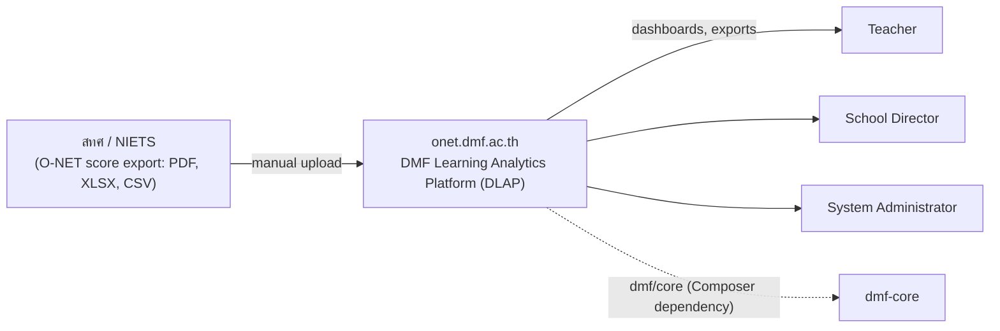

# 01 — Product Requirement Document (PRD)

**DMF Learning Analytics Platform (DLAP)** *(formerly "DMF Academic Analytics" — module domain: `onet.dmf.ac.th`)*

| | |
|---|---|
| **Document ID** | ONET-DOC-001 |
| **Version** | 2.0.2 |
| **Status** | Frozen — DLAP Documentation Baseline v2.0.0 |
| **Date** | 2026-07-02 |
| **Author** | DMF Platform Team |
| **Related documents** | [00-Project-Overview](00-Project-Overview.md) · [02-System-Architecture](02-System-Architecture.md) · [03-Database-Design](03-Database-Design.md) · [Architecture-Decision-Record](Architecture-Decision-Record.md) · [Architecture-Principles](Architecture-Principles.md) |

## Revision History

| Version | Date | Description | Author |
|---|---|---|---|
| 1.0.0 | 2026-07-02 | Initial release. Replaces [archive/01-PRD-legacy.md](archive/01-PRD-legacy.md); grounds all requirements in the PHP 8.3 / Modular Monolith / DMF Platform stack. | DMF Platform Team |
| 1.1.0 | 2026-07-02 | Renamed database schema from `dmf_onet` to `dmf_academic` (see [03-Database-Design.md](03-Database-Design.md)). No functional scope change — Grade 6 O-NET remains the only assessment implemented in this version. | DMF Platform Team |
| 2.0.0 | 2026-07-02 | Project renamed to DMF Learning Analytics Platform (DLAP); reframed around the student's Grade 1–6 learning history rather than a single exam, with assessments (O-NET, NT, RT, LAS, Pre/Mid/Post-Test, Classroom/Reading/Writing/Competency Assessment) as events in that history. Scope, Out of Scope, Product Overview, System Context, and Glossary updated accordingly. **No functional requirement (FR-001–FR-020) changed** — v1.0 still delivers O-NET, Grade 6, only. | DMF Platform Team |
| 2.0.1 | 2026-07-02 | QA fixes (see [Documentation-QA-Report.md](Documentation-QA-Report.md)): added the Student & Enrollment and Notification modules to §18's list to match [02-System-Architecture.md §3](02-System-Architecture.md#3-module-decomposition); extended the Approval Flow (§21) to explicitly cover `assessment_types`. Frozen as part of the DLAP Documentation Baseline v2.0.0 ([00-Project-Overview.md §13](00-Project-Overview.md#13-documentation-freeze)). | DMF Platform Team |
| 2.0.2 | 2026-07-02 | Post-Freeze Amendment. Appendix Versioning section now links to the new [Release-Notes.md](Release-Notes.md). | DMF Platform Team |

## Approval

| Name / Role | Status | Date |
|---|---|---|
| School Director (ผู้อำนวยการ) | Pending review | — |
| DMF Platform Maintainer | Pending review | — |

## Table of Contents

1. [Executive Summary](#1-executive-summary)
2. [Background](#2-background)
3. [Problem Statement](#3-problem-statement)
4. [Vision & Mission](#4-vision--mission)
5. [Objectives](#5-objectives)
6. [Scope](#6-scope)
7. [Out of Scope](#7-out-of-scope)
8. [Stakeholders](#8-stakeholders)
9. [Current Workflow](#9-current-workflow)
10. [Existing Problems & Pain Points](#10-existing-problems--pain-points)
11. [Gap Analysis](#11-gap-analysis)
12. [Business Needs & Goals](#12-business-needs--goals)
13. [SWOT](#13-swot)
14. [Assumptions & Constraints](#14-assumptions--constraints)
15. [Risks](#15-risks)
16. [Product Overview & Position](#16-product-overview--position)
17. [System Context](#17-system-context)
18. [Core Modules](#18-core-modules)
19. [Functional Requirements](#19-functional-requirements)
20. [Non-Functional Requirements](#20-non-functional-requirements)
21. [Core Product Capabilities](#21-core-product-capabilities)
22. [Dashboard & Visualization](#22-dashboard--visualization)
23. [Data Ingestion & Integration](#23-data-ingestion--integration)
24. [Reporting & Output](#24-reporting--output)
25. [Lifecycle & Governance](#25-lifecycle--governance)
26. [KPI & Success Metrics](#26-kpi--success-metrics)
27. [Appendix](#27-appendix)

---

## 1. Executive Summary

**DMF Learning Analytics Platform (DLAP)** is a PHP 8.3 module of the DMF Platform built around one
idea: the student's learning history, from Grade 1 through Grade 6, is the primary subject of
analysis — not any single examination. An assessment (O-NET, NT, RT, LAS, a Pre/Mid/Post-Test, or
a Classroom/Reading/Writing/Competency Assessment) is one recorded *event* in that history. Version
1.0 delivers this for exactly one assessment type, **O-NET, Grade 6**: it ingests official O-NET
score exports, validates them, maps every test item to its national learning standard and
indicator, and renders role-based dashboards — including a per-student longitudinal view — for
teachers and the school director. The architecture and database are designed so that adding the
next assessment type is a data and configuration change, not a redesign (see
[Architecture-Decision-Record.md, ADR-006](Architecture-Decision-Record.md#adr-006--why-a-generic-student-centric-assessment-schema)).
It is built as a **Modular Monolith** — a single deployable Composer project, internally organized
into cohesive modules — on top of the shared `dmf-core` library, matching the pattern already
proven by `grade.dmf.ac.th` on the same shared hosting environment.

## 2. Background

Dong Mafai Charoen Sin Community School (โรงเรียนชุมชนดงมะไฟเจริญศิลป์, school code `47010005`,
Sakon Nakhon) administers O-NET to its Grade 6 cohort annually. สทศ (NIETS) returns results as PDF
summary reports and Excel/CSV score files, broken down to the level of `ตัวชี้วัด` (learning
indicator). Today, a teacher or the director opens these files manually, cross-references item
numbers against a printed or spreadsheet-based standards catalogue, and produces a written summary
for the school's own records — a process repeated, largely from scratch, every year.

## 3. Problem Statement

The delay and manual effort in processing O-NET results prevents timely pedagogical response.
Teachers cannot quickly see which specific `ตัวชี้วัด` a classroom is weak on while the cohort is
still theirs to teach, and the director lacks a standing, filterable view of school-wide
performance gaps to guide professional-development or resource decisions.

## 4. Vision & Mission

See [00-Project-Overview §4](00-Project-Overview.md#4-vision--mission) for the full statement.
In summary: convert O-NET score exports into instant, standard-aligned instructional insight,
without requiring infrastructure beyond what the school's existing shared hosting provides.

## 5. Objectives

* Reduce O-NET results processing time from manual, multi-day spreadsheet work to an automated
  pipeline completing in under 30 seconds per uploaded file.
* Achieve 100% mapping accuracy from O-NET item number to `สาระ → มาตรฐาน → ตัวชี้วัด`, for every
  item present in the official สทศ item-standard reference table.
* Provide distinct, role-scoped dashboards for teachers and the director without requiring either
  to read a raw score spreadsheet.
* Stay within the DMF Platform's existing shared-hosting operating model — no new infrastructure
  dependency (no Redis, no container orchestration, no dedicated servers).

## 6. Scope

**In scope — v1.0 functional delivery (O-NET, Grade 6 only):**
* Import of official O-NET score exports (PDF, `.xlsx`, `.csv`) for Grade 6, subjects ภาษาไทย,
  คณิตศาสตร์, วิทยาศาสตร์, ภาษาอังกฤษ.
* Structural and logical validation of imported files, with a persistent import log.
* Mapping of every test item to its learning strand, standard, and indicator.
* Aggregated analytics at classroom, grade (cohort), and school tiers (per-student dashboards
  remain Phase 2 — see [§24](#24-reporting--output) — though v1.0 already *records* per-student
  data in the longitudinal-ready structures below, it does not render a per-student view).
* Item-level analysis (difficulty index, distractor frequency) using Classical Test Theory.
* Year-over-year trend tracking for the school's Grade 6 cohort.
* Role-based dashboards: Teacher, School Director, System Administrator.
* PDF and Excel export of teacher-level and school-level reports.
* A REST API, internal to the module, that the Bootstrap 5 + Chart.js frontend consumes.

**In scope — v1.0 architectural/data-model generality (designed now, not built as features):**
* A generic `assessment_types` reference table covering Pre-Test, Mid-Test, Post-Test, O-NET, NT,
  RT, LAS, Classroom Assessment, Reading Assessment, Writing Assessment, and Competency
  Assessment — only `ONET` is seeded and active in v1.0
  ([00-Project-Overview.md §6](00-Project-Overview.md#6-scope),
  [03-Database-Design.md §4](03-Database-Design.md#4-table-definitions--assessment-framework)).
* Student enrollment modeled as history across Grade 1 through Grade 6
  (`student_enrollments`), even though v1.0 only populates Grade 6 records.
* A per-student, per-indicator longitudinal mastery structure (`student_standard_mastery`) that a
  future assessment type populates without altering its shape.

**Explicitly requires no new infrastructure:** all of the above must run on the same
DirectAdmin/cPanel shared hosting used by `grade.dmf.ac.th` and the rest of the DMF Platform.

## 7. Out of Scope

* Live/API integration with สทศ (NIETS) — no public API exists; files are supplied manually by
  school staff.
* Multi-school or multi-tenant operation — tracked as a platform-level roadmap item
  ([00-Project-Overview §9](00-Project-Overview.md#9-roadmap)), not a current requirement.
* **Implementing** any assessment type other than O-NET — NT, RT, LAS, Pre-Test, Mid-Test,
  Post-Test, Classroom Assessment, Reading Assessment, Writing Assessment, and Competency
  Assessment are reserved codes in the data model ([§6](#6-scope)) but have no import pipeline,
  validation rules, or dashboard support built in v1.0. ปพ.5/ปพ.6/ปพ.7 document generation is
  owned by `grade.dmf.ac.th`, not this module.
* Synchronous/video learning delivery or hosting of external LMS content.
* Word/PowerPoint export — evaluated as a Phase 2 enhancement (§24), not part of the MVP, because
  no PHP library for these formats is already a dependency of `dmf-core` or `dmf-template`.

## 8. Stakeholders

| Stakeholder | Role Summary |
|---|---|
| Grade 6 Teacher (ครูประจำชั้น ป.6) | Uploads score files; reviews classroom diagnostics. |
| School Director (ผู้อำนวยการ) | Whole-school visibility; approves standard-mapping changes. |
| System Administrator | Deploys and operates the module; manages accounts and backups. |
| DMF Platform maintainers | Ensure `dmf-core` contracts are used correctly and consistently. |

## 9. Current Workflow

1. สทศ issues official O-NET score reports (PDF) and, on request, a raw score export (Excel/CSV)
   to the school.
2. A teacher or administrative staff member opens these files and manually transcribes summary
   figures into a local spreadsheet.
3. The spreadsheet is shared informally (e.g., printed or emailed) with the director for a
   once-a-year, static review.

## 10. Existing Problems & Pain Points

* Manual transcription introduces data-entry errors that go unnoticed until aggregation.
* There is no centralized, versioned mapping of item numbers to `ตัวชี้วัด` — each person doing
  the mapping may reconstruct it slightly differently.
* Static spreadsheets and printed summaries cannot be filtered or drilled into by classroom,
  student, or standard.
* Teachers spend hours on formatting instead of on planning remedial instruction.
* By the time a summary is ready, the cohort has often already been promoted, so findings inform
  the *next* cohort rather than the one tested — a lag the module directly targets.

## 11. Gap Analysis

* **As-Is:** Manual, offline, single-person-dependent O-NET result compilation, with turnaround
  measured in weeks and no interactive drill-down capability.
* **To-Be:** Automated, validated, standard-mapped ingestion completing in under 30 seconds, with
  interactive, role-scoped dashboards available immediately after upload.

## 12. Business Needs & Goals

* A fault-tolerant ingestion pipeline that can parse the specific file shapes สทศ actually
  produces (see [23. Data Ingestion & Integration](#23-data-ingestion--integration)).
* A role-based access boundary consistent with `dmf-core`'s `Authorization\Role` hierarchy, so
  student-identifiable data is only ever visible to authorized staff.
* A schema and mapping catalogue for `สาระ/มาตรฐาน/ตัวชี้วัด` that persists across academic years
  and can be corrected without a code deployment.

## 13. SWOT

* **Strengths:** Reuses a proven foundation (`dmf-core`) already running in production at
  `grade.dmf.ac.th`; narrow, well-understood data domain (one test, one grade level, four
  subjects).
* **Weaknesses:** Fully dependent on the structural consistency of สทศ's exported file formats,
  which the school does not control.
* **Opportunities:** The same import/mapping/dashboard pattern extends naturally to NT, RT, or
  classroom-level formative assessments in a later phase.
* **Threats:** สทศ may change file layout or the underlying curriculum standard revision between
  academic years, breaking the parsing/mapping layer if not designed defensively.

## 14. Assumptions & Constraints

**Assumptions**
* สทศ score exports for a given academic year follow a consistent internal structure (column
  order or PDF table layout may shift between years, but not within one release).
* Staff uploading files have basic digital literacy and a modern browser.
* The school's existing shared hosting plan (as used by `grade.dmf.ac.th`) has sufficient disk
  and PHP memory-limit headroom for PDF/Excel parsing of files under 50 MB.

**Constraints**
* Must run on shared DirectAdmin/cPanel hosting: no Redis, no message broker, no root/shell access
  beyond FTP/SSH file upload, no long-running background workers outside of cron.
* Must comply with student-data-privacy expectations already established for the DMF Platform
  (see [02-System-Architecture §14](02-System-Architecture.md#14-security-architecture)).
* Must depend on `dmf/core` for auth, HTTP, database, validation, and security primitives —
  it must not reimplement what `dmf-core` already provides.

## 15. Risks

| Risk | Mitigation |
|---|---|
| สทศ changes the PDF/Excel layout between academic years, breaking the parser. | A per-academic-year, versioned import template registry (§23); on structural mismatch, the system rejects with a precise line/column error rather than silently mis-mapping data. |
| Standards catalogue (`สาระ/มาตรฐาน/ตัวชี้วัด`) becomes outdated after a curriculum revision. | Standards tables are data, not code; updates go through the Approval Flow (§21) without a deployment. |
| Shared hosting resource limits (PHP memory/time limit) are exceeded on large files. | Import runs as a queued job processed by cron (see [02-System-Architecture §7](02-System-Architecture.md#7-import-pipeline-architecture)), not inline on the HTTP request. |

## 16. Product Overview & Position

The module parses official assessment score files, validates them, tracks curriculum-standard
coverage per student over time, and renders both cohort-level and per-student longitudinal
analytics dashboards. In v1.0 it does this for exactly one assessment type — O-NET — but it is
positioned as the DMF Platform's general-purpose learning-analytics module, not a single-exam
tool: the same student, standards catalogue, and dashboard surface are designed to carry NT, RT,
LAS, and classroom-level assessments in later phases without re-architecture. It is not a
replacement for `grade.dmf.ac.th` (which owns day-to-day grades and ปพ. document generation), but
a companion module focused on standardized and classroom assessment analytics across a student's
full Grade 1–6 journey.

## 17. System Context

Full architectural context: [02-System-Architecture §2](02-System-Architecture.md#2-context-diagram).

## 18. Core Modules

* **Student & Enrollment Module** — owns student identity and Grade 1–6 enrollment history; the
  foundational module every other module reads student data through, reflecting the "student as
  primary entity" principle this PRD is built around (see [§1](#1-executive-summary)). Every
  module below depends on it rather than querying student data directly.
* **Import & Validation Module** — parses PDF/Excel/CSV O-NET exports; validates structure and
  content; writes an auditable import log.
* **Standards Mapping Module** — maintains the `สาระ/มาตรฐาน/ตัวชี้วัด` catalogue and the
  item-to-indicator map; links every scored item to its standard.
* **Analytics & Aggregation Module** — computes classroom/grade/school summaries, item statistics,
  and year-over-year trends in v1.0; the same module owns the per-student longitudinal
  standard-mastery structure ([03-Database-Design.md §9](03-Database-Design.md#9-table-definitions--aggregation--materialized-summaries)),
  populated starting in the phase that ships the per-student report (§24 — not v1.0, per YAGNI:
  [Architecture-Principles.md](Architecture-Principles.md#7-yagni--you-arent-gonna-need-it)).
* **Dashboard Module** — Bootstrap 5 + Chart.js presentation layer, role-scoped.
* **Reporting Module** — PDF/Excel export and scheduled email reports.
* **AI Diagnostics Module** — turns weak-standard patterns into a suggested list of instructional
  content/resources (rule-based at MVP; see [02-System-Architecture §11](02-System-Architecture.md#11-ai-diagnostics-integration)).
* **Notification Module** — in-app status banners on import completion; scheduled email dispatch
  for reports (FR-018).

Full module boundaries and dependency graph: [02-System-Architecture §3](02-System-Architecture.md#3-module-decomposition).

## 19. Functional Requirements

Each requirement below is complete and implementable; none are placeholders.

### FR-001 — Staff Authentication
* **Description:** Teachers, the director, and administrators authenticate with a username and
  password via `dmf-core`'s `Auth\Guard` and `Auth\TokenManager` (HMAC-SHA256 signed token,
  matching the pattern already in production at `grade.dmf.ac.th`).
* **Priority:** Critical
* **Business Rule:** Accounts lock for 5 minutes after 5 consecutive failed attempts
  (`Auth\RateLimiter`, MySQL-backed store — no Redis dependency). Tokens expire after 8 hours of
  inactivity.
* **Input:** Username, password.
* **Output:** Signed bearer token; role claim.
* **Acceptance Criteria:** Valid credentials return a token in under 1 second; a locked-out account
  receives a distinct `429` response with a retry-after value.
* **Dependencies:** `dmf-core` `Auth` module.

### FR-002 — Role-Scoped Dashboard Shell
* **Description:** On login, render the dashboard shell (navigation, filters, KPI summary strip)
  matching the caller's role and access boundary (own classroom for a teacher; whole school for
  the director).
* **Priority:** Critical
* **Business Rule:** A teacher's queries are always constrained server-side to their assigned
  classroom(s); this is enforced in the repository layer, not just hidden in the UI.
* **Acceptance Criteria:** Initial dashboard render completes within 2 seconds under normal load;
  a teacher's API calls for another classroom return `403`.
* **Dependencies:** FR-001.

### FR-003 — O-NET PDF Score Report Import
* **Description:** Accept an official สทศ PDF score report, extract per-student, per-subject, and
  per-item scores using coordinate/table-based text extraction.
* **Priority:** Critical
* **Business Rule:** Files over 50 MB are rejected before parsing begins. Each academic year's PDF
  layout is matched against a registered import template (§23); an unmatched layout is rejected
  with an explicit error rather than partially parsed.
* **Input:** PDF file upload (multipart/form-data).
* **Output:** A staged, unvalidated intermediate record set.
* **Acceptance Criteria:** Table-grid extraction accuracy ≥ 99.5% against a reference-verified
  layout for the current academic year's template.
* **Dependencies:** FR-006.

### FR-004 — O-NET Excel Score Import
* **Description:** Accept a `.xlsx` score export and map columns for student ID, name, subject
  scores, and item-level responses where present.
* **Priority:** Critical
* **Business Rule:** Reads from the first worksheet unless an alternate sheet name is configured
  for that academic year's template.
* **Acceptance Criteria:** Correctly resolves header variants for "รหัสนักเรียน", "ชื่อ-สกุล", and
  each subject score column, per the registered template for that year.
* **Dependencies:** FR-006.

### FR-005 — O-NET CSV Score Import
* **Description:** Accept a flat CSV score export with configurable delimiter and encoding.
* **Priority:** High
* **Business Rule:** Auto-detects UTF-8 vs. TIS-620/ANSI encoding to prevent Thai-character
  corruption.
* **Acceptance Criteria:** Correctly parses quoted fields containing embedded delimiters.
* **Dependencies:** FR-006.

### FR-006 — Structural & Content Validation
* **Description:** Validate every staged record against type rules, valid score ranges (0–100 per
  subject, per สทศ scale), and referential integrity against known students and items, using
  `dmf-core`'s `Validation\Validator`.
* **Priority:** Critical
* **Business Rule:** A record failing validation (e.g., negative score, unknown student ID, missing
  primary key) halts that file's commit and routes the whole batch to an error-holding state; no
  partial commits.
* **Acceptance Criteria:** Rejected files return a precise line/row and column identifying the
  first structural error.
* **Dependencies:** None.

### FR-007 — Duplicate Import Detection
* **Description:** Detect and block re-import of a file already committed for the same academic
  year, subject, and student set.
* **Priority:** High
* **Business Rule:** Uniqueness is checked on (academic year, subject, student ID); a duplicate
  triggers a confirmation prompt rather than a silent overwrite.
* **Acceptance Criteria:** Re-uploading an already-committed file is flagged before any DB write.
* **Dependencies:** FR-006.

### FR-008 — Import Log & Audit Trail
* **Description:** Persist every import attempt (actor, timestamp, file name, result, error
  detail) to an import log table.
* **Priority:** High
* **Acceptance Criteria:** Every commit or rejection is queryable by academic year and by actor.
* **Dependencies:** FR-003, FR-004, FR-005.

### FR-009 — Item-to-Standard Mapping
* **Description:** Link every O-NET item number, for a given academic year and subject, to its
  `สาระ` (strand), `มาตรฐาน` (standard), and `ตัวชี้วัด` (indicator), via a maintained mapping
  table sourced from สทศ's published item-standard reference.
* **Priority:** Critical
* **Business Rule:** An item may map to exactly one primary indicator and, optionally, secondary
  related indicators.
* **Acceptance Criteria:** 100% of items in a committed import resolve to a primary indicator;
  unmapped items block commit with an explicit list.
* **Dependencies:** FR-006.

### FR-010 — Classroom-Level Standard Performance Summary
* **Description:** For a teacher's classroom, compute percent-correct per `ตัวชี้วัด`, aggregated
  from committed item-level scores.
* **Priority:** Critical
* **Acceptance Criteria:** Summary recomputes automatically on every successful import commit
  affecting that classroom.
* **Dependencies:** FR-009.

### FR-011 — Grade & School-Level Standard Performance Summary
* **Description:** Aggregate the same standard performance summary at the Grade 6 cohort and
  whole-school tiers, for the director's view.
* **Priority:** High
* **Dependencies:** FR-010.

### FR-012 — Item Difficulty & Discrimination Analysis
* **Description:** Compute Classical Test Theory statistics per item — difficulty index (p-value),
  point-biserial discrimination, and distractor selection frequency.
* **Priority:** Medium
* **Acceptance Criteria:** Calculations match a hand-verified reference dataset to four decimal
  places.
* **Dependencies:** FR-009.

### FR-013 — Year-over-Year Trend Tracking
* **Description:** Chart the school's Grade 6 cohort performance across consecutive academic years
  for each subject and standard.
* **Priority:** Medium
* **Business Rule:** Only compares academic years with committed, validated data for the same
  subject.
* **Dependencies:** FR-011.

### FR-014 — Learning Content Recommendation
* **Description:** For each standard below a configurable performance threshold, surface a list of
  matching instructional resources from a maintained content-resource catalogue.
* **Priority:** Medium
* **Business Rule:** MVP implementation is rule-based (threshold + catalogue lookup); no external
  AI service call is required to satisfy this requirement (see FR-015 for the enhanced variant).
* **Dependencies:** FR-010.

### FR-015 — AI-Assisted Diagnostic Narrative (Enhanced)
* **Description:** Optionally generate a short natural-language diagnostic summary for a classroom
  by calling an external LLM API with the classroom's standard-performance summary as context.
* **Priority:** Low (enhancement — degrades gracefully to FR-014 if the external call fails or is
  unconfigured).
* **Business Rule:** No student-identifiable data is included in the outbound API call; only
  aggregate, anonymized standard performance figures are sent.
* **Dependencies:** FR-010, FR-014.

### FR-016 — Teacher Report Export (PDF)
* **Description:** Export a classroom's standard-performance summary and item analysis as a
  print-ready PDF.
* **Priority:** High
* **Dependencies:** FR-010, FR-012.

### FR-017 — School Report Export (Excel)
* **Description:** Export whole-school, per-classroom standard-performance figures as a formatted
  `.xlsx` workbook for the director.
* **Priority:** High
* **Dependencies:** FR-011.

### FR-018 — Scheduled Report Delivery
* **Description:** Email a configured report (e.g., the school-level summary) to designated
  recipients on a configurable schedule, via a cron-driven job queue table (no external queue
  service).
* **Priority:** Medium
* **Dependencies:** FR-017.

### FR-019 — Standards Catalogue Maintenance
* **Description:** Allow an administrator to view, add, and correct `สาระ/มาตรฐาน/ตัวชี้วัด`
  entries and the item-to-indicator map for a given academic year, subject to the Approval Flow
  (§21).
* **Priority:** High
* **Dependencies:** FR-009.

### FR-020 — System Health & Diagnostics Endpoint
* **Description:** Expose an unauthenticated `ping` endpoint verifying database connectivity,
  matching the `dmf-template` convention.
* **Priority:** Low
* **Acceptance Criteria:** Returns `{"status":"ok","db":true}` within 500 ms under normal load.
* **Dependencies:** None.

## 20. Non-Functional Requirements

All figures below are set against the module's actual operating environment — shared
DirectAdmin/cPanel hosting, PHP-FPM, a single MySQL/MariaDB instance — not a containerized or
elastically-scaled deployment.

| Category | Requirement |
|---|---|
| **Performance** | Dashboard page responses complete within 2.0 seconds under normal single-school load. Import processing of a standard academic-year file completes within 30 seconds via the background cron job (§23). |
| **Availability** | Target 99.5% uptime during the academic year, subject to the shared hosting provider's own SLA; excludes provider-side maintenance windows. |
| **Scalability** | Vertical only: pre-aggregated summary tables keep dashboard queries O(1) relative to raw item count, avoiding the need for horizontal scaling on a single-school dataset (a few hundred students/year). |
| **Maintainability** | PSR-4 autoloading, PSR-12 coding style enforced via PHPCS (`.phpcs.xml`, matching `dmf-core`/`dmf-template`), static analysis via PHPStan, and ≥ 80% test coverage on the Import, Validation, and Analytics modules. |
| **Security** | TLS 1.3 in transit (host-level); `dmf-core` HMAC-SHA256 tokens; PDO prepared statements everywhere; bcrypt password hashing via `Security\PasswordHasher`. |
| **Logging** | Application and audit logs (`dmf-core` `Logger`) retained for 365 days, written to file (no external log aggregation service assumed). |
| **Backup** | Nightly `mysqldump` of `dmf_academic` via cron, matching the DMF Platform's existing backup pattern; retained for 30 days. |
| **Restore** | RTO ≤ 4 hours, RPO ≤ 24 hours, consistent with a single nightly backup cadence. |
| **Accessibility** | Bootstrap 5 default components audited to WCAG 2.1 AA for color contrast and keyboard navigation. |
| **Compatibility** | Current-release Chrome, Edge, Firefox, Safari (trailing 24 months). |
| **Responsive** | Layout supports 320px (mobile) through standard desktop widths via Bootstrap 5's grid. |
| **Coding Standard** | PHP: PSR-12 via `.phpcs.xml`. JavaScript: no framework, ES2020+, linted with a standard config. |
| **Localization** | Thai-first UI; all labels, standard names, and reports render in Thai; English retained only for system/technical labels (e.g., API field names). |

## 21. Core Product Capabilities

### User Roles

Reuses `dmf-core`'s `Authorization\Role` hierarchy (`teacher < director < admin`), with an
`inspector` role reserved but inactive until the multi-school phase.

### Permission Matrix

| Role / Module | Import | Standards Catalogue | Analytics Dashboard | Reporting | System Configuration |
|---|---|---|---|---|---|
| Teacher | Read/Write (own classroom) | Read only | Read only (own classroom) | Read/Write (own classroom) | Denied |
| School Director | Read only | Read/Write (via Approval Flow) | Read only (whole school) | Read/Write (whole school) | Denied |
| System Administrator | Read/Write | Read/Write | Read/Write | Read/Write | Read/Write |

### User Stories

* *As a Grade 6 teacher,* I want to upload the สทศ score file without manually re-typing scores,
  so that I can immediately see which `ตัวชี้วัด` my class is weak on and plan remediation before
  the school year ends.
* *As the School Director,* I want a whole-school heatmap of standard performance across
  classrooms, so that I can direct professional-development budget to the subjects/standards that
  need it most.

### Use Cases

**UC-IMPORT-001**
* **Primary Actor:** Teacher
* **Preconditions:** Authenticated; holds an official สทศ score file for their classroom.
* **Main Success Scenario:** Uploads file → system validates structure → maps items to standards
  → commits to the database → classroom dashboard refreshes with the new academic year's data.
* **Alternate Flow:** Validation fails → system reports the exact row/column error → teacher
  corrects the source file and re-uploads.

**UC-REPORT-001**
* **Primary Actor:** School Director
* **Preconditions:** At least one classroom has committed data for the selected academic year.
* **Main Success Scenario:** Opens the school dashboard → filters by academic year and subject →
  exports the school-level summary as an `.xlsx` workbook.

### Business Rules

* Student-identifiable fields are never included in any cross-classroom or cross-year comparison
  view; only the teacher of record sees named student data for their own classroom.
* A committed import cannot be deleted, only superseded by a corrected re-import that is itself
  logged (§19 FR-008).
* Changes to the standards catalogue require the Approval Flow below; they cannot be edited
  directly by a teacher.

### Workflow

1. Teacher or administrator opens the import screen and selects the target file.
2. The system validates structure, maps items to standards, and stages the batch.
3. On confirmation, the batch commits; classroom, grade, and school summaries recompute.
4. Affected dashboards reflect the update on next page load (no manual refresh action required
   beyond navigating to the dashboard).

### Approval Flow

Changes to the national standards catalogue follow a two-step approval: an academic editor
(teacher or director) proposes a change to an indicator mapping; a System Administrator reviews
and applies it to the production catalogue. The same two-step approval governs activating a
reserved `assessment_types` code ([00-Project-Overview.md §6](00-Project-Overview.md#6-scope)) —
an academic editor proposes activation, a System Administrator applies it — since it is the same
class of change: reference data that is read everywhere but should not be self-served by whoever
happens to want a new value today. This mirrors the DMF Platform's general principle that
reference data changes are reviewed, not self-served.

### Notification

The system displays an in-app status banner on completion of a background import job and,
optionally, sends a scheduled summary email (FR-018) via SMTP — no third-party notification
service is assumed.

## 22. Dashboard & Visualization

All charts render with **Chart.js** inside a **Bootstrap 5** layout.

| Component | Description | Chart.js Type |
|---|---|---|
| **Trend** | Year-over-year average score per subject for the school's Grade 6 cohort. | Line |
| **Heatmap** | Classroom × learning-standard percent-correct grid, red→green scale. | Custom matrix (Chart.js `matrix` plugin) |
| **Radar** | Subject-strand balance for a classroom or cohort. | Radar |
| **Item Analysis** | Per-item option-selection distribution and difficulty index. | Bar |
| **Standard Coverage** | Percent of indicators meeting the performance threshold, by subject. | Doughnut / progress bar |
| **Learning Content** | List view (not a chart) of recommended resources for below-threshold standards. | — |
| **Executive Dashboard** | Director's landing view: whole-school KPI strip + heatmap + trend. | Composite |
| **AI Recommendation** | Card-based narrative summary (FR-015), shown alongside the heatmap. | — |
| **Forecast** | Simple linear projection of next year's expected cohort average, based on the trend series. | Line (projected segment styled distinctly) |

## 23. Data Ingestion & Integration

### Import Engine

A queued ingestion pipeline: an uploaded file is staged to disk and a job row is written; a cron
task (running every minute, matching shared-hosting constraints — no long-running daemons)
processes queued jobs, so large files never block the HTTP request. Full pipeline diagram:
[02-System-Architecture §7](02-System-Architecture.md#7-import-pipeline-architecture).

### PDF

Text/table extraction using a coordinate-aware PDF parsing library, matched against a per-academic
-year template (column/row coordinate registry), because สทศ's PDF layout is stable within a year
but not guaranteed across years.

### Excel

Read via a PHP spreadsheet library (`.xlsx`), matching header text against a configurable alias
list (e.g., "รหัสนักเรียน" / "เลขประจำตัว" both resolve to student ID) defined per template.

### CSV

Delimiter- and encoding-configurable flat-file parsing, with UTF-8/TIS-620 auto-detection.

### Validation

See FR-006. Implemented via `dmf-core`'s `Validation\Validator` with DMF-domain rules
(`NationalIdRule`, `DateRule`) plus module-specific rules for score-range and item-number bounds.

### Duplicate Detection

See FR-007.

### Import Log

See FR-008.

### REST API

Internal REST API (`"METHOD:action"` dispatch via `dmf-core`'s `Http\Router`) consumed by the
Bootstrap 5/Chart.js frontend. Not exposed for third-party integration in the MVP; see
[02-System-Architecture §10](02-System-Architecture.md#10-integration-architecture) for the
external-integration posture.

### Integration — DMF Platform

The module depends on `dmf/core` (Composer path dependency, mirroring `grade.dmf.ac.th`'s
`composer.json`) for Auth, Database, HTTP, Validation, and Security primitives. It does not share
a database or runtime process with any sibling `*.dmf.ac.th` portal.

## 24. Reporting & Output

| Report | Audience | Format | Phase |
|---|---|---|---|
| Teacher Classroom Report | Teacher | PDF | MVP (FR-016) |
| School Summary Report | Director | Excel | MVP (FR-017) |
| Scheduled Email Summary | Director | PDF/Excel attachment | MVP (FR-018) |
| Student Individual Report | Teacher (per student) | PDF | Phase 2 |
| Word narrative export | Director | `.docx` | Phase 2 — requires adding a Word-export library not currently in `dmf-core`/`dmf-template` |
| PowerPoint export | Director | `.pptx` | Phase 2 — same rationale as above |

## 25. Lifecycle & Governance

* **Acceptance Criteria:** A feature is production-ready when PHPUnit coverage is ≥ 80% on
  Import/Validation/Analytics modules, PHPStan analysis is clean, and PHPCS reports zero
  violations — mirroring `dmf-core`'s own `composer.json` scripts (`test`, `lint`, `analyse`).
* **Testing:** Unit tests for parsing/validation/statistics logic; integration tests for the import
  → commit → aggregation pipeline, using the same `tests/{Unit,Integration}` structure as
  `dmf-template`.
* **Deployment:** FTP/SSH file upload to DirectAdmin/cPanel shared hosting, matching the DMF
  Platform's existing deployment model — no container orchestration, no canary releases.
* **Maintenance:** A weekly cron task prunes expired import-job rows and verifies scheduled-report
  delivery logs.
* **Future Expansion:** Multi-school tenancy; activating the ten reserved assessment types
  (Pre-Test, Mid-Test, Post-Test, NT, RT, LAS, Classroom/Reading/Writing/Competency Assessment,
  per [00-Project-Overview.md §6](00-Project-Overview.md#6-scope)); the per-student longitudinal
  report (§24); Word/PowerPoint export; live AI diagnostic narratives as a first-class
  (not degrade-to-rule-based) feature. The `dmf_academic` schema
  ([03-Database-Design.md](03-Database-Design.md)) is already structured (`assessment_types` /
  `assessments` / `student_enrollments` / `student_standard_mastery`) so each of these is a data
  and feature addition, not a schema migration — this is a design decision only
  ([ADR-006](Architecture-Decision-Record.md#adr-006--why-a-generic-student-centric-assessment-schema));
  none of these are implemented or in scope for this version (see [§7](#7-out-of-scope)).

## 26. KPI & Success Metrics

| Metric | Target |
|---|---|
| Import-to-dashboard latency | < 30 seconds per academic-year file |
| Item-to-standard mapping accuracy | 100% for items present in the สทศ reference table |
| Teacher adoption (Grade 6 staff, active use within one semester) | ≥ 90% |
| Structural import success rate (well-formed files) | ≥ 99.5% |
| Reduction in per-teacher reporting hours per O-NET cycle | ≥ 8 hours |

## 27. Appendix

### Glossary

See [00-Project-Overview §11](00-Project-Overview.md#11-glossary) for the shared glossary. Additional
PRD-specific terms:

* **CTT (Classical Test Theory):** Psychometric framework used for item difficulty/discrimination
  (FR-012).
* **Academic Year Template:** A per-year registry of column positions / header aliases used to
  parse that year's สทศ file layout (§23).

### Coding Standard

PSR-12 (PHP), enforced via `.phpcs.xml`, matching `dmf-core` and `dmf-template` exactly. Naming
rules for tables, columns, classes, methods, and API routes are consolidated in
[Naming-Convention.md](Naming-Convention.md) rather than repeated here.

### Versioning

Semantic Versioning 2.0 (`MAJOR.MINOR.PATCH`), matching the DMF Platform's versioning policy
(`dmf-core/docs/platform-architecture.md §10`). Application releases are tracked in
[Release-Notes.md](Release-Notes.md), starting at `0.1.0` — independent of this documentation
baseline's own version.

### References

* National Institute of Educational Testing Service (สทศ/NIETS) O-NET item-standard reference
  tables (supplied per academic year by the school).
* Basic Education Core Curriculum B.E. 2551 (Revised B.E. 2560), มาตรฐานการเรียนรู้และตัวชี้วัด.
* `dmf-core/docs/platform-architecture.md`, `dmf-core/docs/modules.md` — platform conventions this
  PRD builds on.
* [Architecture-Decision-Record.md](Architecture-Decision-Record.md) — rationale for the
  foundational technology choices (Modular Monolith, PHP 8.3, MySQL/MariaDB, Bootstrap 5, Chart.js)
  and the generic student-centric assessment schema (ADR-006).
* [Architecture-Principles.md](Architecture-Principles.md) — cross-cutting engineering principles
  this PRD and every other document is expected to follow.
* [archive/01-PRD-legacy.md](archive/01-PRD-legacy.md) — superseded early draft.
