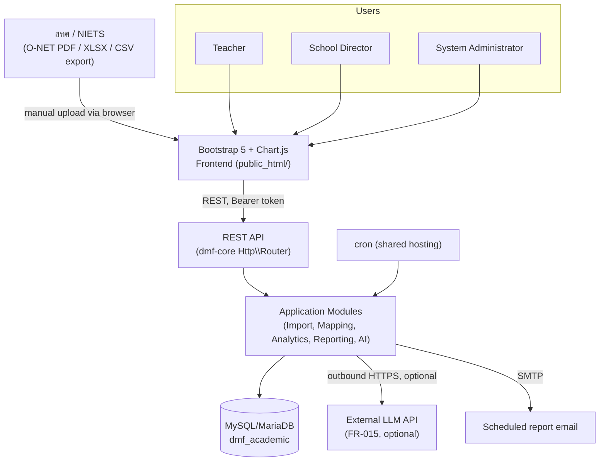
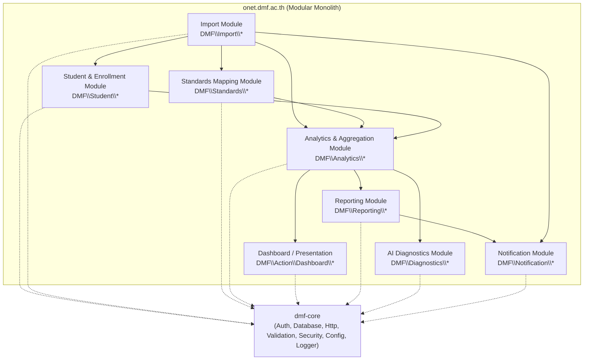
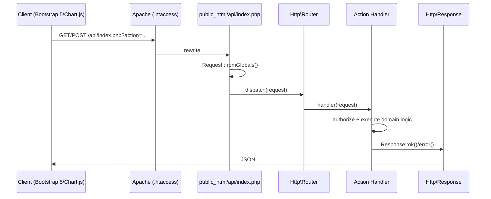
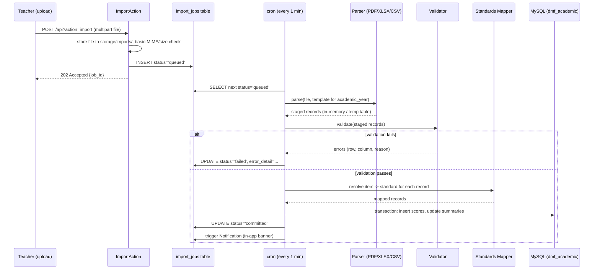
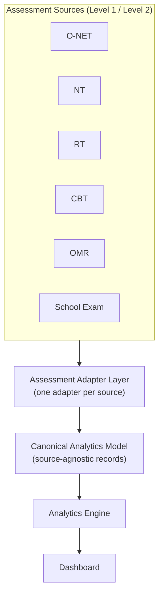
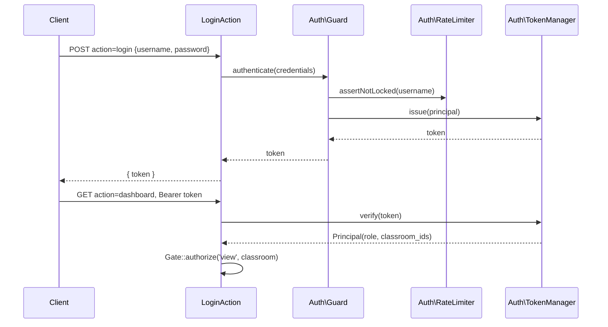
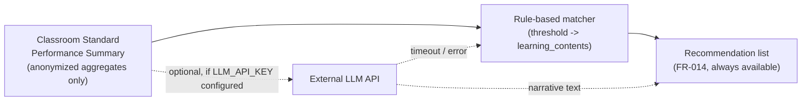
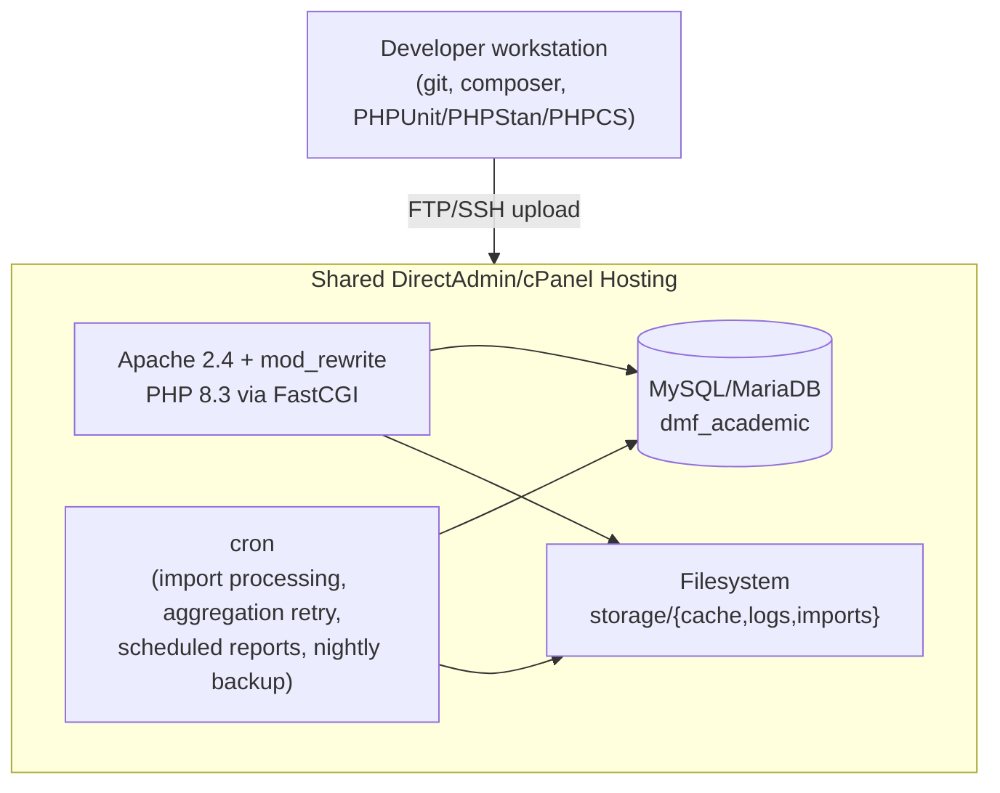

# 02 — System Architecture

**DMF Learning Analytics Platform (DLAP)** *(formerly "DMF Academic Analytics" — module domain: `onet.dmf.ac.th`)*

| | |
|---|---|
| **Document ID** | ONET-DOC-002 |
| **Version** | 2.0.4 |
| **Status** | Frozen — DLAP Documentation Baseline v2.0.0 |
| **Date** | 2026-07-04 |
| **Author** | DMF Platform Team |
| **Related documents** | [00-Project-Overview](00-Project-Overview.md) · [01-PRD](01-PRD.md) · [03-Database-Design](03-Database-Design.md) · [Architecture-Decision-Record](Architecture-Decision-Record.md) · [Architecture-Principles](Architecture-Principles.md) · [decisions/README](../decisions/README.md) |

## Revision History

| Version | Date | Description | Author |
|---|---|---|---|
| 1.0.0 | 2026-07-02 | Initial release. Modular Monolith design built directly on `dmf-core`'s layer model and the `dmf-template` project skeleton. | DMF Platform Team |
| 1.1.0 | 2026-07-02 | Renamed database from `dmf_onet` to `dmf_academic`; updated table references (`onet_items`→`questions`, `item_statistics`→`question_analysis`, `content_resources`→`learning_contents`) to match the exam-type-agnostic schema in [03-Database-Design.md](03-Database-Design.md). Fixed two cross-reference anchors that pointed at the wrong section. | DMF Platform Team |
| 2.0.0 | 2026-07-02 | Renamed to DMF Learning Analytics Platform (DLAP). Added a **Student & Enrollment Module** as a foundational, base-level module (§3) reflecting the student as the platform's primary entity; updated the module dependency graph, layered architecture, and directory structure accordingly. §1 now defers cross-cutting principles to the new [Architecture-Principles.md](Architecture-Principles.md) instead of restating them. Added ADR-006 reference (§18). No change to the Modular Monolith decision itself, nor to any v1.0 functional behavior. | DMF Platform Team |
| 2.0.1 | 2026-07-02 | QA fix (see [Documentation-QA-Report.md](Documentation-QA-Report.md)): corrected eight `App\` namespace references in §3–§4 to the documented `DMF\` root (§5 always said `DMF\`, but the diagrams had not been updated to match). Frozen as part of the DLAP Documentation Baseline v2.0.0 ([00-Project-Overview.md §13](00-Project-Overview.md#13-documentation-freeze)). | DMF Platform Team |
| 2.0.2 | 2026-07-02 | Post-Freeze Amendment. §18 updated to route implementation-level decisions to the new [`decisions/`](../decisions/README.md) folder (Implementation Decision Records) instead of `docs/adr/`, which remains for architecture-level decisions only. No change to any module boundary, layer, or v1.0 functional behavior. | DMF Platform Team |
| 2.0.3 | 2026-07-03 | Post-Freeze Amendment, made during Module 2 implementation. §16 updated: the `Config::fromEnvironment()` prefix changed from `'ONET_'` to `'DLAP_'` — no external system had ever deployed against the old prefix, so there was no backward-compatibility cost. See [decisions/IDR-006](../decisions/IDR-006-dlap-env-prefix.md). | DMF Platform Team |
| 2.0.4 | 2026-07-04 | Post-Freeze Amendment — documentation alignment with approved [RFC-004](rfcs/RFC-004-multi-source-analytics-architecture.md) (no module boundary, layer, or v1.0 functional behavior change). §1 names **Source Independence** explicitly as a standing architectural principle. Added new §8.1 (Assessment Adapter Layer, Canonical Analytics Model), naming the Normalization module (T2.5) as the Canonical Analytics Model's first real instance, with RFC-004's source-independence diagram. | DMF Platform Team |

## Table of Contents

1. [Architecture Vision & Principles](#1-architecture-vision--principles)
2. [Context Diagram](#2-context-diagram)
3. [Module Decomposition](#3-module-decomposition)
4. [Layered Architecture](#4-layered-architecture)
5. [Repository & Directory Structure](#5-repository--directory-structure)
6. [Request Lifecycle](#6-request-lifecycle)
7. [Import Pipeline Architecture](#7-import-pipeline-architecture)
8. [Analytics & Aggregation Architecture](#8-analytics--aggregation-architecture)
9. [Authentication & Authorization](#9-authentication--authorization)
10. [Integration Architecture](#10-integration-architecture)
11. [AI Diagnostics Integration](#11-ai-diagnostics-integration)
12. [Reporting & Export Architecture](#12-reporting--export-architecture)
13. [Deployment Architecture](#13-deployment-architecture)
14. [Security Architecture](#14-security-architecture)
15. [Scalability & Performance](#15-scalability--performance)
16. [Cross-Cutting Concerns](#16-cross-cutting-concerns)
17. [Technology Stack Summary](#17-technology-stack-summary)
18. [Architecture Decision Records](#18-architecture-decision-records)
19. [Cross-References](#19-cross-references)

---

## 1. Architecture Vision & Principles

**DMF Learning Analytics Platform (DLAP)** is a **Modular Monolith**: one deployable PHP Composer
project, one database, one runtime process model — but internally decomposed into clearly bounded
modules with explicit dependency direction, so that no module reaches into another's tables or
internals directly. This mirrors why `dmf-core` itself is organized into `Auth`, `Database`,
`Http`, etc. as separate namespaces with a documented dependency graph (`dmf-core/docs/modules.md`),
rather than a single undifferentiated codebase.

The vision is deliberately **not** microservices: the module runs on shared DirectAdmin/cPanel
hosting with no orchestration platform, no service mesh, and no per-service scaling — a
distributed architecture would add operational complexity the school cannot support. A modular
monolith gets the maintainability benefit of clear boundaries without that cost. Full rationale:
[Architecture-Decision-Record.md, ADR-001](Architecture-Decision-Record.md#adr-001--why-modular-monolith).

This module's design is also centered on one specific modeling choice, made explicit here because
it shapes every section that follows: **the student, and their Grade 1–6 learning history, is the
primary entity; an assessment (O-NET, NT, RT, LAS, or any other type in
[01-PRD.md §6](01-PRD.md#6-scope)) is an event recorded against that history, not the organizing
principle of the system.** Concretely, this means the `Student & Enrollment` module (§3) is a
foundational, base-level module — like Standards Mapping — that `Import` and `Analytics` depend
on, rather than student data being owned by whichever module happens to import it first.

The cross-cutting engineering principles this architecture follows — Single Source of Truth,
Convention over Configuration, Module Isolation, Shared Components, DRY, KISS, YAGNI, and Backward
Compatibility — are defined once, for the whole document set, in
[Architecture-Principles.md](Architecture-Principles.md) rather than restated here. Two
architecture-specific consequences of those principles are worth calling out directly:
1. **Depend on `dmf-core` contracts, not concretions** — same discipline `dmf-core` itself uses
   internally (`Contract\*` interfaces).
2. **No infrastructure the shared host doesn't provide** — every design decision in this document
   is checked against the constraints in [§13](#13-deployment-architecture).

A third, standing since this document's v2.0.0 rename and formalized by
[RFC-004](rfcs/RFC-004-multi-source-analytics-architecture.md) after Sprint 4 planning surfaced the
need to state it explicitly: **Source Independence** — this platform is a Multi-Source Assessment
Analytics Platform, not an O-NET-specific one; O-NET is the first *evidenced* assessment source, not
a template every future source (NT, RT, OMR, CBT, School Assessment, third-party, future AI-based)
must conform to. [§8.1](#81-source-independence--assessment-adapter-layer-and-canonical-analytics-model)
names the concrete extension point this implies.

## 2. Context Diagram



`onet.dmf.ac.th` is a standalone Composer project depending on `dmf/core` exactly as
`grade.dmf.ac.th` does (`"dmf/core": "@dev"` via a local path repository during development,
pinned to a tagged version at release). It owns its own database (`dmf_academic`) and does not share
runtime state with any sibling `*.dmf.ac.th` portal.

## 3. Module Decomposition



| Module | Responsibility | Depends On |
|---|---|---|
| **Student & Enrollment** | Own student identity and Grade 1–6 enrollment history (`students`, `student_enrollments`); resolve "current classroom" for a student; the foundational module every other module reads student data through — no other module queries `students` directly. | `dmf-core` Database, Validation |
| **Import** | Parse PDF/XLSX/CSV; resolve/validate student and classroom references via Student & Enrollment; stage records; run structural/content validation; write import log. | `dmf-core` Database, Validation, Security\Sanitizer; Student & Enrollment |
| **Standards Mapping** | Maintain `สาระ/มาตรฐาน/ตัวชี้วัด` catalogue and item→indicator map; expose lookup to Import and Analytics. | `dmf-core` Database |
| **Analytics & Aggregation** | Compute classroom/grade/school summaries, item statistics (CTT), trends, and (from the phase that ships the per-student report — [01-PRD.md §18](01-PRD.md#18-core-modules)) per-student longitudinal standard mastery across Grade 1–6. | Import, Standards Mapping, Student & Enrollment |
| **Dashboard / Presentation** | Serve REST endpoints the Bootstrap 5/Chart.js frontend renders; enforce role-scoped queries. | Analytics, `dmf-core` Http, Auth, Authorization |
| **Reporting** | Render PDF/Excel exports; manage scheduled report jobs. | Analytics |
| **AI Diagnostics** | Rule-based content recommendation (MVP); optional LLM-narrative enhancement (FR-015). | Analytics |
| **Notification** | In-app status banners; scheduled email dispatch (SMTP). | Import, Reporting |

Each module is a PHP namespace under `DMF\`, not a separate deployable — the "modular" boundary is
enforced by code review and static analysis (PHPStan rules restricting cross-module class
reference to public service classes only), not by network isolation.

## 4. Layered Architecture

Reuses `dmf-core`'s layer model (`dmf-core/docs/platform-architecture.md §3.1`) directly:

```
┌─────────────────────────────────────┐
│  HTTP Layer                         │  Request → Router → Response
│  Dmf\Core\Http\{Request,Response,   │
│    Router}                          │
├─────────────────────────────────────┤
│  Application Layer                  │  Action handlers, one per REST action
│  DMF\Action\*                       │
├─────────────────────────────────────┤
│  Auth / Authorization Layer         │  Token verification, role/policy checks
│  Dmf\Core\Auth\*, Authorization\*   │
├─────────────────────────────────────┤
│  Domain Layer                       │  Student, Import, Mapping, Analytics,
│  DMF\{Student,Import,Standards,     │  Reporting, Diagnostics business logic
│    Analytics,Reporting,             │
│    Diagnostics}\*                   │
├─────────────────────────────────────┤
│  Data Layer                         │  PDO + prepared statements + repositories
│  DMF\Repository\*, Dmf\Core\        │
│    Database\{Connection,            │
│    Repository\AbstractRepository}   │
├─────────────────────────────────────┤
│  Config Layer                       │  Environment-driven, read-only
│  Dmf\Core\Config\Config             │
└─────────────────────────────────────┘
```

Every domain module's repository extends `Dmf\Core\Database\Repository\AbstractRepository` for
common CRUD, adding entity-specific query methods (e.g., `StandardPerformanceRepository::
forClassroom(int $classroomId, int $academicYear)`).

## 5. Repository & Directory Structure

Scaffolded from `dmf-template`, following the same conventions as `grade.dmf.ac.th`
(top-level namespace `DMF\`, not the template's default `App\`, to stay consistent with the
sibling reference implementation):

```
onet.dmf.ac.th/
├── app/
│   ├── Action/                 # HTTP action handlers (one class per REST action)
│   │   ├── Auth/
│   │   ├── Import/
│   │   ├── Dashboard/
│   │   └── Reporting/
│   ├── Student/                # Student identity + Grade 1-6 enrollment history
│   │   ├── Student.php
│   │   └── Enrollment.php
│   ├── Import/                 # Import module: parsers, stagers, validators
│   │   ├── Parser/
│   │   │   ├── PdfParser.php
│   │   │   ├── ExcelParser.php
│   │   │   └── CsvParser.php
│   │   ├── Template/           # Per-academic-year, per-assessment-type layout templates
│   │   └── ImportJob.php
│   ├── Standards/              # Standards catalogue + item mapping
│   ├── Analytics/              # Aggregation, CTT statistics, trend calculators,
│   │                           # per-student longitudinal standard mastery
│   ├── Reporting/              # PDF/Excel exporters, scheduled report jobs
│   ├── Diagnostics/            # Rule-based + optional LLM recommendation
│   ├── Notification/           # In-app + email dispatch
│   ├── Repository/             # Repositories extending Dmf\Core\Database\Repository
│   └── routes.php              # Route registration, per dmf-template convention
├── config/
│   ├── app.php
│   ├── auth.php
│   └── database.php
├── database/
│   ├── schema.sql
│   └── migrations/
├── docs/                       # This document set
├── public_html/
│   ├── index.html              # SPA shell (Bootstrap 5 + Chart.js)
│   ├── .htaccess
│   └── api/
│       ├── index.php           # Front controller
│       └── config.php
├── storage/
│   ├── cache/
│   ├── logs/
│   └── imports/                # Staged upload files pending cron processing
├── tests/
│   ├── Unit/
│   └── Integration/
├── composer.json
├── phpstan.neon
├── phpunit.xml
└── .phpcs.xml
```

## 6. Request Lifecycle

Identical to the platform-standard lifecycle (`dmf-core/docs/platform-architecture.md §5`):



## 7. Import Pipeline Architecture

Because shared hosting has no long-running workers, import processing is **queued and
cron-driven**, not inline on the HTTP request — this directly satisfies PRD FR-003–FR-008 and
the 30-second processing NFR without risking a PHP `max_execution_time` failure on a large file.



The client polls `GET /api?action=import_status&job_id=...` (or checks on next dashboard load) —
no WebSocket/long-poll infrastructure is assumed, consistent with the hosting constraint.

## 8. Analytics & Aggregation Architecture

Dashboards must render in under 2 seconds (PRD §20) against a MySQL instance with no caching
layer (no Redis/Memcached available on shared hosting). This is achieved by **pre-aggregation at
commit time**, not by computing summaries on every dashboard request:

* On every successful import commit ([§7](#7-import-pipeline-architecture)), the Analytics module
  recomputes and upserts the affected rows of `standard_performance_summary` (classroom, grade,
  and school tiers) and `question_analysis` — see
  [03-Database-Design §9](03-Database-Design.md#9-table-definitions--aggregation--materialized-summaries)
  and, for which recompute path runs, [§14 there](03-Database-Design.md#14-aggregation-recompute-strategy).
* Dashboard reads are therefore simple, indexed `SELECT`s against summary tables, not aggregate
  queries over raw item-response rows.

### 8.1 Source Independence — Assessment Adapter Layer and Canonical Analytics Model

Clarified by [RFC-004](rfcs/RFC-004-multi-source-analytics-architecture.md) (documentation only —
no new layer bolted onto the architecture below; a naming of two things that already exist in
embryonic form). This module's Repository → Import → Normalization → Analytics → Dashboard pipeline
makes no structural assumption about which system produced the imported data — a repository is
equally pure CRUD whether a row came from an O-NET-report-derived file, an OMR export, a CBT API
response, or a future AI-based assessment's output:



* **Assessment Adapter Layer** — one adapter per assessment source, owning everything specific to
  that source: parsing its file/API shape, and knowing whether that source is **Level 1** (already
  aggregated — see [03-Database-Design §14](03-Database-Design.md#14-aggregation-recompute-strategy))
  or **Level 2** (raw item response), and translating accordingly. A Level 1 adapter emits
  already-aggregated Canonical records directly; a future Level 2 adapter (OMR, CBT, etc.) computes
  per-item Canonical records from raw responses before they ever leave the adapter. **The Analytics
  Engine never needs to know which kind of adapter produced its input.**
* **Canonical Analytics Model** — the one internal shape every adapter produces and the Analytics
  Engine always consumes, regardless of source. This is not a new invention: it is the pattern the
  Normalization module (`app/Analytics/Normalization/*`, T2.5) already implements today —
  `ItemIndicatorNormalizer` turns per-response evidence into a source-agnostic
  `NormalizedRecord`/`NormalizedStandardMapping` shape, resolved against the same
  `learning_indicators`/`learning_standards`/`learning_strands` catalogue regardless of where the
  response came from. Normalization (T2.5) is this model's first real instance, not a parallel
  concept invented for a future source.

Designing the Assessment Adapter interface itself, or any adapter beyond the one O-NET evidence
already justifies, is out of scope here — see
[RFC-004's Non-Goals](rfcs/RFC-004-multi-source-analytics-architecture.md#non-goals).
* Where a lightweight cache is still useful (e.g., the standards catalogue, which rarely changes),
  `dmf-core`'s `Contract\CacheInterface` is implemented with a simple file-based cache under
  `storage/cache/`, avoiding a new infrastructure dependency.
* `student_standard_mastery` ([03-Database-Design §9](03-Database-Design.md#9-table-definitions--aggregation--materialized-summaries))
  follows the same pre-aggregation approach — one row per student, indicator, and academic year —
  so a future per-student longitudinal view reads it directly rather than joining raw responses
  across every grade a student has been assessed in. Per YAGNI
  ([Architecture-Principles.md §7](Architecture-Principles.md#7-yagni--you-arent-gonna-need-it)),
  v1.0 does not populate this table, since no v1.0 dashboard reads it yet
  ([01-PRD.md §18](01-PRD.md#18-core-modules)).

## 9. Authentication & Authorization

Reuses `dmf-core`'s `Auth` and `Authorization` modules without modification:

* **`Auth\TokenManager`** — HMAC-SHA256 signed tokens (`base64url(header).base64url(payload).sig`),
  verified with `hash_equals()`. No third-party JWT library.
* **`Auth\RateLimiter`** — MySQL-backed login throttling (5 attempts / 5-minute lockout, per PRD
  FR-001).
* **`Authorization\Role`** — hierarchy `teacher < director < admin`, with `inspector` reserved for
  the multi-school phase (PRD §7).
* **`Authorization\Gate`/`Policy`** — classroom-scoping policy: a `teacher` principal can only
  `view`/`import` for classrooms they are assigned to (join against a `teacher_classroom`
  assignment table — see [03-Database-Design](03-Database-Design.md)); a `director` principal can
  `view` any classroom in the school but cannot `import`.



## 10. Integration Architecture

* **Inbound:** No external system calls into `onet.dmf.ac.th` in the MVP — สทศ has no public API,
  so all O-NET data arrives as a manually uploaded file (PRD §7, Out of Scope).
* **Outbound (optional):** FR-015's AI-narrative enhancement makes an outbound HTTPS call to an
  external LLM API, synchronously from the same cron job that performs aggregation (never from
  the user-facing HTTP request thread), with the API key supplied via environment variable
  (`Config::require('LLM_API_KEY')`) and a hard timeout; on failure it falls back to the
  rule-based recommendation (FR-014) without failing the import.
* **Internal REST API:** `"METHOD:action"` dispatch via `Dmf\Core\Http\Router`, the same pattern
  as `grade.dmf.ac.th`. Not exposed for third-party consumption in the MVP; if a future phase
  requires it (e.g., a district-level reporting tool), it will be versioned (`/api/v1/...`) and
  documented separately rather than retrofitted onto the internal action set.

## 11. AI Diagnostics Integration



The rule-based path (FR-014) is the system of record and always available; the LLM narrative
(FR-015) is additive and must never be a hard dependency for the dashboard to render, per the
graceful-degradation rule in PRD FR-015.

## 12. Reporting & Export Architecture

* **PDF export** (FR-016): rendered via a PHP PDF library (e.g., a Dompdf/mPDF-class HTML-to-PDF
  renderer) from the same Blade-free PHP view templates used for the web dashboard, so the printed
  report and the on-screen report never visually diverge.
* **Excel export** (FR-017): a PHP spreadsheet-writer library producing formatted `.xlsx` output
  directly from the pre-aggregated summary tables.
* **Scheduled delivery** (FR-018): a `scheduled_reports` table holds recipient/schedule config; a
  cron task checks due schedules, generates the export, and sends it via SMTP (PHPMailer-class
  library) — no external email API dependency.

## 13. Deployment Architecture



Matches `dmf-core`'s documented hosting constraints (`dmf-core/docs/platform-architecture.md §9`):
no shell access beyond FTP/SSH file upload, Apache 2.4 with `mod_rewrite`, PHP via FastCGI, a
shared MySQL instance, and no Redis/Memcached — the rate limiter, cache, and job queue described
above are all MySQL- or filesystem-backed for exactly this reason.

## 14. Security Architecture

| Concern | Mechanism |
|---|---|
| Credential brute-force | `Auth\RateLimiter` — 5 attempts / 5-minute lockout (MySQL-backed). |
| Token forgery | HMAC-SHA256, `hash_equals()` timing-safe verification. |
| SQL injection | PDO prepared statements everywhere (`dmf-core` `Database\Connection`). |
| Student-data exposure | Classroom-scoping `Authorization\Policy`; cross-classroom/cross-year comparison views are aggregate-only, never student-identifiable (PRD §21 Business Rules). |
| Longitudinal data accumulation | Tracking a student across Grade 1–6 concentrates more history under one identifier than a single-year exam record would; the same PII-nulling retention rule ([03-Database-Design §15](03-Database-Design.md#15-data-retention--privacy)) applies to the full enrollment history, not just the latest year, so leaving the school still bounds how long identifying data is kept regardless of how many years of assessment history exist. |
| Sensitive config | `DB_PASS`, `TOKEN_SECRET`, `LLM_API_KEY` supplied via environment variables — never committed. |
| CORS | Single-domain (`onet.dmf.ac.th`); no wildcard `Access-Control-Allow-Origin`. |
| Clickjacking | `X-Frame-Options: SAMEORIGIN` via `.htaccess`. |
| Content sniffing | `X-Content-Type-Options: nosniff` via `.htaccess`. |
| Upload safety | MIME-type and size validation (≤ 50 MB) before a file ever reaches the parser; uploaded files stored outside `public_html/` (`storage/imports/`) so they are never directly web-accessible. |
| Outbound AI calls | Only anonymized aggregate data leaves the system (§11); API key via environment variable; hard timeout. |

## 15. Scalability & Performance

The dataset is bounded by design: one school, one grade level, four subjects, a few hundred
students per academic year. Scalability work therefore targets **query efficiency**, not
horizontal capacity:

* Pre-aggregated summary tables ([§8](#8-analytics--aggregation-architecture)) keep dashboard
  reads O(1) relative to raw item-response volume.
* Import processing is offloaded to cron so a large file never risks a PHP request timeout
  ([§7](#7-import-pipeline-architecture)).
* Indexing strategy is detailed in
  [03-Database-Design §12](03-Database-Design.md#12-indexing-strategy).
* If the platform later reaches the multi-school phase (PRD §7 roadmap), the schema's
  `school_id`/`academic_year` partitioning (already present from day one — see
  [03-Database-Design](03-Database-Design.md)) means horizontal growth is a matter of adding rows,
  not re-architecting.

## 16. Cross-Cutting Concerns

* **Logging:** `Dmf\Core\Logger\AbstractLogger` subclassed as a file logger writing to
  `storage/logs/`, per PRD's 365-day retention NFR.
* **Configuration:** `Dmf\Core\Config\Config::fromEnvironment('DLAP_')` (renamed from `ONET_` during
  Module 2 implementation — see [decisions/IDR-006](../decisions/IDR-006-dlap-env-prefix.md)), with
  `require()` used for secrets so a missing critical value fails fast at boot rather than at first
  use.
* **Error Handling:** The `dmf-core` exception hierarchy (`ValidationException` → 422,
  `AuthException` → 401/429, `DatabaseException` → 500) is used as-is; module-specific errors
  (e.g., "unmapped item") extend `Dmf\Core\Exception\ValidationException` rather than introducing
  a parallel hierarchy.

## 17. Technology Stack Summary

| Layer | Technology |
|---|---|
| Language / Runtime | PHP 8.3, PHP-FPM (FastCGI) |
| Web Server | Apache 2.4 + `mod_rewrite` |
| Database | MySQL / MariaDB, `utf8mb4`, `InnoDB` |
| Shared Library | `dmf/core` (Composer path/tagged dependency) |
| Frontend | Bootstrap 5, Chart.js, vanilla JavaScript (ES2020+, no framework) |
| API Style | REST, `"METHOD:action"` dispatch, JSON |
| Background Processing | cron (no message broker) |
| Testing | PHPUnit 11, PHPStan, PHP_CodeSniffer (PSR-12) |
| Hosting | DirectAdmin/cPanel shared hosting |

## 18. Architecture Decision Records

The six foundational decisions behind this architecture — Modular Monolith, PHP 8.3,
MySQL/MariaDB, Bootstrap 5, Chart.js, and the generic student-centric assessment schema — are
recorded in [Architecture-Decision-Record.md](Architecture-Decision-Record.md) (ADR-001–ADR-006).

Following the pattern already established in `dmf-core/docs/adr/`, further architecturally
significant decisions made **during implementation** (ones that would change a module boundary,
data-flow pattern, or platform-wide constraint) should be captured as individual ADR files under
`docs/adr/`, one per decision — that per-file convention begins once Phase 1
([00-Project-Overview.md §9](00-Project-Overview.md#9-roadmap)) starts. The six foundational ADRs
are consolidated in a single file because they were made together, before implementation, as part
of this architecture baseline.

Narrower, implementation-level decisions — which specific library, version, or integration pattern
implements a choice an ADR already made (e.g., which Excel-parsing library, or how Chart.js is
wired into the Dashboard module) — are **not** ADRs at all; they are Implementation Decision
Records (IDR) under [`decisions/`](../decisions/README.md), following
[IMPLEMENTATION_GUIDE.md](../IMPLEMENTATION_GUIDE.md)'s task breakdown. See
[decisions/README.md §1](../decisions/README.md#1-adr-vs-idr) for the full ADR-vs-IDR distinction.

## 19. Cross-References

* Requirements these decisions satisfy: [01-PRD.md](01-PRD.md) — FR-001–FR-020, NFR table (§20).
* Data structures referenced throughout: [03-Database-Design.md](03-Database-Design.md).
* Cross-cutting engineering principles this design follows: [Architecture-Principles.md](Architecture-Principles.md).
* Platform-wide conventions this design inherits without deviation: `dmf-core/docs/platform-
  architecture.md`, `dmf-core/docs/modules.md`.
