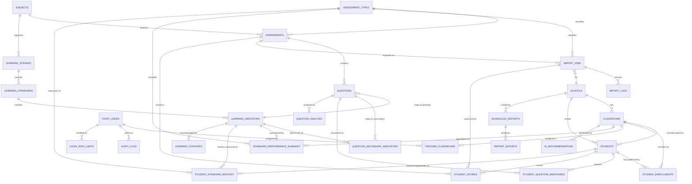

# 03 — Database Design

**DMF Learning Analytics Platform (DLAP) — Database `dmf_academic`**
*(formerly "DMF Academic Analytics" — module domain: `onet.dmf.ac.th`)*

| | |
|---|---|
| **Document ID** | ONET-DOC-003 |
| **Version** | 2.0.1 |
| **Status** | Frozen — DLAP Documentation Baseline v2.0.0 |
| **Date** | 2026-07-02 |
| **Author** | DMF Platform Team |
| **Related documents** | [00-Project-Overview](00-Project-Overview.md) · [01-PRD](01-PRD.md) · [02-System-Architecture](02-System-Architecture.md) · [Architecture-Decision-Record](Architecture-Decision-Record.md) · [Architecture-Principles](Architecture-Principles.md) · [Data-Dictionary](Data-Dictionary.md) |

## Revision History

| Version | Date | Description | Author |
|---|---|---|---|
| 1.0.0 | 2026-07-02 | Initial release. Schema for O-NET import, standards mapping, and pre-aggregated analytics, following `dmf-template`'s naming conventions. | DMF Platform Team |
| 1.1.0 | 2026-07-02 | Renamed schema from `dmf_onet` to **`dmf_academic`**. Generalized the exam-specific tables into exam-type-agnostic tables (`exam_types`, `exams`, `questions`, `student_scores`, `student_question_responses`, `question_analysis`, `learning_contents`) so future assessments could be added as data, not schema changes. No change to v1.0 functional scope. | DMF Platform Team |
| 2.0.0 | 2026-07-02 | **Re-centered the schema on the student.** Renamed `exam_types`→`assessment_types` and `exams`→`assessments` (every `exam_id`/`exam_type_id` FK renamed to `assessment_id`/`assessment_type_id`) to match the platform-wide DLAP terminology. Added **`student_enrollments`** (§3) to model a student's Grade 1–6 grade/classroom history as first-class data, and **`student_standard_mastery`** (§9) to hold per-student, longitudinal, per-indicator performance across academic years and assessment types. `students.classroom_id` is now documented as a denormalized pointer to the *current* enrollment, with `student_enrollments` as the source of truth. Rationale: [ADR-006](Architecture-Decision-Record.md#adr-006--why-a-generic-student-centric-assessment-schema). **No v1.0 functional scope change** — `student_standard_mastery` is schema-ready but not populated until the phase that ships the per-student report ([01-PRD.md §18](01-PRD.md#18-core-modules)). | DMF Platform Team |
| 2.0.1 | 2026-07-02 | QA review (see [Documentation-QA-Report.md](Documentation-QA-Report.md)) found no defects in this document. Frozen as part of the DLAP Documentation Baseline v2.0.0 ([00-Project-Overview.md §13](00-Project-Overview.md#13-documentation-freeze)). | DMF Platform Team |

## Table of Contents

1. [Design Principles](#1-design-principles)
2. [Entity-Relationship Diagram](#2-entity-relationship-diagram)
3. [Table Definitions — Organizational](#3-table-definitions--organizational)
4. [Table Definitions — Assessment Framework](#4-table-definitions--assessment-framework)
5. [Table Definitions — Standards Catalogue](#5-table-definitions--standards-catalogue)
6. [Table Definitions — Questions & Item Mapping](#6-table-definitions--questions--item-mapping)
7. [Table Definitions — Import Pipeline](#7-table-definitions--import-pipeline)
8. [Table Definitions — Scores & Responses](#8-table-definitions--scores--responses)
9. [Table Definitions — Aggregation & Materialized Summaries](#9-table-definitions--aggregation--materialized-summaries)
10. [Table Definitions — Reporting, Diagnostics & Platform](#10-table-definitions--reporting-diagnostics--platform)
11. [Relationships & Cardinality](#11-relationships--cardinality)
12. [Indexing Strategy](#12-indexing-strategy)
13. [Data Integrity Rules](#13-data-integrity-rules)
14. [Aggregation Recompute Strategy](#14-aggregation-recompute-strategy)
15. [Data Retention & Privacy](#15-data-retention--privacy)
16. [Migration Strategy](#16-migration-strategy)
17. [Sample Queries](#17-sample-queries)
18. [Cross-References](#18-cross-references)

---

## 1. Design Principles

Follows `dmf-template/database/schema.sql`'s documented conventions exactly, as already applied in
`dmf_grade`, and the platform-wide rules in [Naming-Convention.md](Naming-Convention.md):

* **Tables:** `snake_case`, plural (`students`, `import_jobs`).
* **Primary keys:** `id BIGINT UNSIGNED AUTO_INCREMENT` for system-generated entities;
  a natural key (e.g., `student_id VARCHAR`) where the source data defines a stable external
  identifier, matching `dmf_grade`'s pattern for `Students.student_id`.
* **Timestamps:** `created_at DATETIME`, `updated_at DATETIME` on every mutable table.
* **Soft delete:** `deleted_at DATETIME NULL` where records must be reversibly retractable (never
  used for committed score data — see [§13](#13-data-integrity-rules)).
* **Character set:** `utf8mb4` throughout, `SET time_zone = '+07:00'` at session start (Thailand
  Standard Time), matching `dmf-core`'s stated database principles.
* **Engine:** `InnoDB` everywhere, for foreign-key and transaction support (import commits are
  multi-table transactions — [02-System-Architecture §7](02-System-Architecture.md#7-import-pipeline-architecture)).
* **Academic year:** stored as an `INT` in Buddhist Era (พ.ศ.), consistent with `dmf_grade`'s
  `academic_year` convention (e.g., `2569`), via `Dmf\Core\Support\ThaiDate`.
* **The student is the primary entity (new in v2.0.0):** every other table in this schema —
  enrollment, scores, responses, longitudinal mastery — is written as data recorded *against* a
  `student_id`. No table treats a single assessment administration as the unit around which
  student data is organized; `assessments` is one of several things a student's record can
  reference, not the root of the schema. See [ADR-006](Architecture-Decision-Record.md#adr-006--why-a-generic-student-centric-assessment-schema).
* **Exam-type-agnostic core, generalized to "assessment" terminology (v1.1.0, renamed v2.0.0):**
  every table that would otherwise have been shaped around O-NET specifically is generalized
  behind an `assessment_types` / `assessments` framework ([§4](#4-table-definitions--assessment-framework)).
  This is a **naming and structural** decision only — see [01-PRD.md §7](01-PRD.md#7-out-of-scope)
  and the schema's own seed data ([§4](#4-table-definitions--assessment-framework)): v1.0 seeds and
  implements exactly one assessment type, `ONET`. No NT/RT/LAS/Pre-Test/Mid-Test/Post-Test/
  Classroom/Reading/Writing/Competency Assessment functionality is built in this version; the
  schema is simply shaped so that adding one later is a data change (`INSERT INTO
  assessment_types ...`), not a migration that renames or restructures existing tables again.

## 2. Entity-Relationship Diagram



## 3. Table Definitions — Organizational

### `schools`
| Column | Type | Null | Key | Default | Description |
|---|---|---|---|---|---|
| id | INT UNSIGNED | NO | PK, AUTO_INCREMENT | — | Internal school ID (single row in MVP; enables multi-school phase). |
| school_code | VARCHAR(10) | NO | UNIQUE | — | Ministry of Education school code (e.g., `47010005`). |
| name_th | VARCHAR(255) | NO | | — | School name in Thai. |
| province | VARCHAR(100) | NO | | — | Province (e.g., `สกลนคร`). |
| created_at | DATETIME | NO | | CURRENT_TIMESTAMP | |
| updated_at | DATETIME | NO | | CURRENT_TIMESTAMP | |

### `classrooms`
| Column | Type | Null | Key | Default | Description |
|---|---|---|---|---|---|
| id | INT UNSIGNED | NO | PK, AUTO_INCREMENT | — | |
| school_id | INT UNSIGNED | NO | FK → schools.id | — | |
| grade_level | TINYINT UNSIGNED | NO | | — | `1`–`6` (ป.1–ป.6); v1.0 only creates `6` rows, since only O-NET (Grade 6) is implemented. |
| room_label | VARCHAR(20) | NO | | — | e.g., `ป.6/1`. |
| academic_year | INT UNSIGNED | NO | | — | พ.ศ., e.g., `2569`. |
| created_at | DATETIME | NO | | CURRENT_TIMESTAMP | |
| updated_at | DATETIME | NO | | CURRENT_TIMESTAMP | |
| | | | UNIQUE (school_id, room_label, academic_year) | | A classroom is scoped to one academic year. |

### `students`
| Column | Type | Null | Key | Default | Description |
|---|---|---|---|---|---|
| student_id | VARCHAR(20) | NO | PK | — | National/school student identifier (natural key, per `dmf_grade` convention). Stable across every grade the student passes through. |
| classroom_id | INT UNSIGNED | NO | FK → classrooms.id | — | **Denormalized pointer to the student's current classroom** (their most recent `student_enrollments` row), kept in sync by the Student & Enrollment module for fast "who's in this classroom today" reads. `student_enrollments` is the authoritative history — never write directly to this column to record a grade change. |
| full_name | VARCHAR(255) | NO | | — | |
| national_id | CHAR(13) | YES | UNIQUE | NULL | Thai national ID; validated via `dmf-core` `NationalIdRule`. |
| status | VARCHAR(20) | NO | | `'active'` | `active`, `transferred`, `graduated`. |
| created_at | DATETIME | NO | | CURRENT_TIMESTAMP | |
| updated_at | DATETIME | NO | | CURRENT_TIMESTAMP | |

### `student_enrollments` (new in v2.0.0)
The authoritative record of which grade and classroom a student was in, for every academic year —
the structural basis for tracking a student's progression from Grade 1 through Grade 6.

| Column | Type | Null | Key | Default | Description |
|---|---|---|---|---|---|
| id | BIGINT UNSIGNED | NO | PK, AUTO_INCREMENT | — | |
| student_id | VARCHAR(20) | NO | FK → students.student_id | — | |
| school_id | INT UNSIGNED | NO | FK → schools.id | — | |
| classroom_id | INT UNSIGNED | NO | FK → classrooms.id | — | |
| grade_level | TINYINT UNSIGNED | NO | | — | Denormalized from `classrooms.grade_level` at enrollment time, so a longitudinal query (e.g., "this student's grade history") does not need to join `classrooms` per row. Kept consistent by the Student & Enrollment module, not hand-edited. |
| academic_year | INT UNSIGNED | NO | | — | พ.ศ. |
| enrollment_status | ENUM('active','transferred','graduated','repeated') | NO | | `'active'` | `repeated` marks a student enrolled in the same `grade_level` in consecutive academic years. |
| created_at | DATETIME | NO | | CURRENT_TIMESTAMP | |
| updated_at | DATETIME | NO | | CURRENT_TIMESTAMP | |
| | | | UNIQUE (student_id, academic_year) | | A student has exactly one grade/classroom per academic year. |

### `staff_users`
| Column | Type | Null | Key | Default | Description |
|---|---|---|---|---|---|
| id | INT UNSIGNED | NO | PK, AUTO_INCREMENT | — | |
| username | VARCHAR(100) | NO | UNIQUE | — | |
| password_hash | VARCHAR(255) | NO | | — | bcrypt via `Security\PasswordHasher`. |
| display_name | VARCHAR(255) | NO | | — | |
| role | ENUM('teacher','director','admin','inspector') | NO | | — | Maps to `Authorization\Role`; `inspector` reserved (unused until multi-school phase). |
| school_id | INT UNSIGNED | NO | FK → schools.id | — | |
| is_active | TINYINT(1) | NO | | 1 | |
| created_at | DATETIME | NO | | CURRENT_TIMESTAMP | |
| updated_at | DATETIME | NO | | CURRENT_TIMESTAMP | |
| deleted_at | DATETIME | YES | | NULL | Soft delete on account deactivation. |

### `teacher_classrooms`
| Column | Type | Null | Key | Default | Description |
|---|---|---|---|---|---|
| id | INT UNSIGNED | NO | PK, AUTO_INCREMENT | — | |
| staff_user_id | INT UNSIGNED | NO | FK → staff_users.id | — | |
| classroom_id | INT UNSIGNED | NO | FK → classrooms.id | — | |
| is_current | TINYINT(1) | NO | | 1 | Mirrors `dmf_grade`'s `teacher_classroom_history.is_current` pattern. |
| created_at | DATETIME | NO | | CURRENT_TIMESTAMP | |
| | | | UNIQUE (staff_user_id, classroom_id) | | |

## 4. Table Definitions — Assessment Framework

This section is the structural basis for future-proofing. It introduces the `assessment_types` /
`assessments` distinction so that every downstream table (questions, scores, responses,
summaries, longitudinal mastery) is written once against a generic "assessment" concept instead of
being hard-coded to O-NET.

### `assessment_types`
| Column | Type | Null | Key | Default | Description |
|---|---|---|---|---|---|
| id | TINYINT UNSIGNED | NO | PK, AUTO_INCREMENT | — | |
| code | VARCHAR(30) | NO | UNIQUE | — | `PRE_TEST`, `MID_TEST`, `POST_TEST`, `ONET`, `NT`, `RT`, `LAS`, `CLASSROOM_ASSESSMENT`, `READING_ASSESSMENT`, `WRITING_ASSESSMENT`, `COMPETENCY_ASSESSMENT`. |
| name_th | VARCHAR(150) | NO | | — | e.g., `การทดสอบทางการศึกษาระดับชาติขั้นพื้นฐาน (O-NET)`. |
| is_active | TINYINT(1) | NO | | 1 | Whether this assessment type is implemented/usable yet. |

**v1.0 seed data:** exactly one row, `('ONET', 'การทดสอบทางการศึกษาระดับชาติขั้นพื้นฐาน (O-NET)', 1)`.
The other ten codes above are **not** seeded in v1.0 — adding them, and the application logic to
act on them, is future scope per [01-PRD.md §7](01-PRD.md#7-out-of-scope).

### `assessments`
| Column | Type | Null | Key | Default | Description |
|---|---|---|---|---|---|
| id | INT UNSIGNED | NO | PK, AUTO_INCREMENT | — | One assessment administration: a specific assessment type, subject, grade level, and academic year. |
| assessment_type_id | TINYINT UNSIGNED | NO | FK → assessment_types.id | — | |
| subject_code | VARCHAR(10) | NO | FK → subjects.subject_code | — | |
| grade_level | TINYINT UNSIGNED | NO | | — | `6` for the ป.6 O-NET administration; any of `1`–`6` for future assessment types. |
| academic_year | INT UNSIGNED | NO | | — | พ.ศ. |
| name_th | VARCHAR(255) | NO | | — | e.g., `O-NET ป.6 คณิตศาสตร์ ปีการศึกษา 2569`. |
| created_at | DATETIME | NO | | CURRENT_TIMESTAMP | |
| updated_at | DATETIME | NO | | CURRENT_TIMESTAMP | |
| | | | UNIQUE (assessment_type_id, subject_code, academic_year) | | One assessment record per type/subject/year. |

`assessments` replaces what an exam-only design would treat as an implicit combination of
`academic_year` + `subject_code` scattered across item and score tables. Centralizing it here
means `questions`, `student_scores`, `import_jobs`, and `standard_performance_summary` all
reference one `assessment_id` rather than repeating `(assessment_type, subject_code,
academic_year)` on every row — and, critically, this is what makes the *event*, not the student,
the many-to-one side of the relationship: a student accumulates many assessment scores over Grade
1–6; an assessment does not "own" the student.

## 5. Table Definitions — Standards Catalogue

### `subjects`
| Column | Type | Null | Key | Default | Description |
|---|---|---|---|---|---|
| subject_code | VARCHAR(10) | NO | PK | — | e.g., `THAI`, `MATH`, `SCI`, `ENG`. |
| subject_name_th | VARCHAR(100) | NO | | — | e.g., `ภาษาไทย`. |
| is_active | TINYINT(1) | NO | | 1 | Allows retiring a subject (e.g., if O-NET scope changes again) without deleting history. |

### `learning_strands` (สาระการเรียนรู้)
| Column | Type | Null | Key | Default | Description |
|---|---|---|---|---|---|
| id | INT UNSIGNED | NO | PK, AUTO_INCREMENT | — | |
| subject_code | VARCHAR(10) | NO | FK → subjects.subject_code | — | |
| strand_code | VARCHAR(20) | NO | | — | Official curriculum strand code. |
| strand_name_th | VARCHAR(255) | NO | | — | |
| | | | UNIQUE (subject_code, strand_code) | | |

### `learning_standards` (มาตรฐานการเรียนรู้)
| Column | Type | Null | Key | Default | Description |
|---|---|---|---|---|---|
| id | INT UNSIGNED | NO | PK, AUTO_INCREMENT | — | |
| strand_id | INT UNSIGNED | NO | FK → learning_strands.id | — | |
| standard_code | VARCHAR(20) | NO | | — | e.g., `ค 1.1`. |
| standard_name_th | TEXT | NO | | — | |
| | | | UNIQUE (strand_id, standard_code) | | |

### `learning_indicators` (ตัวชี้วัด)
| Column | Type | Null | Key | Default | Description |
|---|---|---|---|---|---|
| id | INT UNSIGNED | NO | PK, AUTO_INCREMENT | — | |
| standard_id | INT UNSIGNED | NO | FK → learning_standards.id | — | |
| indicator_code | VARCHAR(30) | NO | | — | e.g., `ค 1.1 ป.6/1`. |
| indicator_name_th | TEXT | NO | | — | |
| grade_level | TINYINT UNSIGNED | NO | | — | Curriculum grade level the indicator targets (`1`–`6`; v1.0 data is `6` only). |
| curriculum_revision | VARCHAR(10) | NO | | `'2560'` | Curriculum revision year (พ.ศ.), so a future curriculum revision does not overwrite history. |
| | | | UNIQUE (standard_id, indicator_code, curriculum_revision) | | |

This strand → standard → indicator hierarchy is already assessment-type-agnostic and grade-span
-agnostic by nature: a `ตัวชี้วัด` is defined by the national curriculum across Grade 1–6, not by
which assessment measures it in a given year. No change was needed here for v2.0.0 — `questions`
from any future assessment type, at any grade level, link to the same catalogue, and
`student_standard_mastery` ([§9](#9-table-definitions--aggregation--materialized-summaries)) tracks
a student's progress against these same indicator rows across every grade.

## 6. Table Definitions — Questions & Item Mapping

### `questions` (formerly `onet_items`, v1.1.0 `onet_items`)
| Column | Type | Null | Key | Default | Description |
|---|---|---|---|---|---|
| id | INT UNSIGNED | NO | PK, AUTO_INCREMENT | — | |
| assessment_id | INT UNSIGNED | NO | FK → assessments.id | — | Replaces the old direct `academic_year` + `subject_code` columns. |
| item_number | SMALLINT UNSIGNED | NO | | — | Item number as printed on the source answer key. |
| primary_indicator_id | INT UNSIGNED | NO | FK → learning_indicators.id | — | FR-009: exactly one primary indicator per question. |
| correct_choice | CHAR(1) | YES | | NULL | `1`–`4` (or NULL if not published). |
| | | | UNIQUE (assessment_id, item_number) | | |

### `question_secondary_indicators`
| Column | Type | Null | Key | Default | Description |
|---|---|---|---|---|---|
| id | INT UNSIGNED | NO | PK, AUTO_INCREMENT | — | |
| question_id | INT UNSIGNED | NO | FK → questions.id | — | |
| indicator_id | INT UNSIGNED | NO | FK → learning_indicators.id | — | Secondary/related indicator (FR-009). |
| | | | UNIQUE (question_id, indicator_id) | | |

## 7. Table Definitions — Import Pipeline

### `import_jobs`
| Column | Type | Null | Key | Default | Description |
|---|---|---|---|---|---|
| id | BIGINT UNSIGNED | NO | PK, AUTO_INCREMENT | — | |
| school_id | INT UNSIGNED | NO | FK → schools.id | — | |
| assessment_id | INT UNSIGNED | NO | FK → assessments.id | — | Replaces the old direct `academic_year` + `subject_code` columns; the assessment type is derivable via `assessments.assessment_type_id`. |
| file_path | VARCHAR(500) | NO | | — | Path under `storage/imports/`, never web-accessible. |
| file_type | ENUM('pdf','xlsx','csv') | NO | | — | |
| status | ENUM('queued','processing','committed','failed') | NO | | `'queued'` | Drives the cron pipeline ([02-System-Architecture §7](02-System-Architecture.md#7-import-pipeline-architecture)). |
| error_detail | TEXT | YES | | NULL | Row/column-level error on `failed`. |
| uploaded_by | INT UNSIGNED | NO | FK → staff_users.id | — | |
| created_at | DATETIME | NO | | CURRENT_TIMESTAMP | |
| updated_at | DATETIME | NO | | CURRENT_TIMESTAMP | |
| | | | UNIQUE (school_id, assessment_id, file_path) | | Supports FR-007 duplicate detection alongside the logical check in [§13](#13-data-integrity-rules). |

### `import_logs`
| Column | Type | Null | Key | Default | Description |
|---|---|---|---|---|---|
| id | BIGINT UNSIGNED | NO | PK, AUTO_INCREMENT | — | |
| import_job_id | BIGINT UNSIGNED | NO | FK → import_jobs.id | — | |
| event | VARCHAR(50) | NO | | — | `queued`, `parsed`, `validated`, `mapped`, `committed`, `rejected`. |
| message | TEXT | YES | | NULL | |
| actor_id | INT UNSIGNED | YES | FK → staff_users.id | NULL | NULL for system/cron-generated events. |
| created_at | DATETIME | NO | | CURRENT_TIMESTAMP | |

FR-008's full audit trail is the append-only sequence of rows in this table per `import_job_id`.

## 8. Table Definitions — Scores & Responses

### `student_scores`
| Column | Type | Null | Key | Default | Description |
|---|---|---|---|---|---|
| id | BIGINT UNSIGNED | NO | PK, AUTO_INCREMENT | — | |
| student_id | VARCHAR(20) | NO | FK → students.student_id | — | |
| assessment_id | INT UNSIGNED | NO | FK → assessments.id | — | Replaces the old direct `subject_code` + `academic_year` columns. |
| score | DECIMAL(5,2) | NO | | — | Raw score, 0.00–100.00. |
| import_job_id | BIGINT UNSIGNED | NO | FK → import_jobs.id | — | Provenance — which committed import produced this row. |
| created_at | DATETIME | NO | | CURRENT_TIMESTAMP | |
| | | | UNIQUE (student_id, assessment_id) | | One committed score per student per assessment (FR-007). |

### `student_question_responses`
| Column | Type | Null | Key | Default | Description |
|---|---|---|---|---|---|
| id | BIGINT UNSIGNED | NO | PK, AUTO_INCREMENT | — | |
| student_id | VARCHAR(20) | NO | FK → students.student_id | — | |
| question_id | INT UNSIGNED | NO | FK → questions.id | — | |
| selected_choice | CHAR(1) | YES | | NULL | `1`–`4`; NULL if item-level responses were not present in the source file (subject-score-only imports remain valid — see [§13](#13-data-integrity-rules)). |
| is_correct | TINYINT(1) | NO | | — | Denormalized for fast CTT aggregation ([§7](#7-table-definitions--import-pipeline)). |
| import_job_id | BIGINT UNSIGNED | NO | FK → import_jobs.id | — | |
| | | | UNIQUE (student_id, question_id) | | |

## 9. Table Definitions — Aggregation & Materialized Summaries

### `standard_performance_summary`
| Column | Type | Null | Key | Default | Description |
|---|---|---|---|---|---|
| id | BIGINT UNSIGNED | NO | PK, AUTO_INCREMENT | — | |
| assessment_type_id | TINYINT UNSIGNED | NO | FK → assessment_types.id | — | Lets a future multi-assessment-type dashboard filter/compare by type; always `ONET` in v1.0. |
| scope | ENUM('classroom','grade','school') | NO | | — | Aggregation tier ([02-System-Architecture §8](02-System-Architecture.md#8-analytics--aggregation-architecture)). |
| scope_id | INT UNSIGNED | NO | | — | `classroom_id`, or `school_id` for `grade`/`school` scope. |
| indicator_id | INT UNSIGNED | NO | FK → learning_indicators.id | — | |
| academic_year | INT UNSIGNED | NO | | — | |
| student_count | INT UNSIGNED | NO | | — | Denominator for percent_correct. |
| percent_correct | DECIMAL(5,2) | NO | | — | 0.00–100.00. |
| last_computed_at | DATETIME | NO | | CURRENT_TIMESTAMP | |
| | | | UNIQUE (assessment_type_id, scope, scope_id, indicator_id, academic_year) | | Upsert target on every import commit. |

### `student_standard_mastery` (new in v2.0.0 — schema-ready, not populated in v1.0)
The per-student counterpart to `standard_performance_summary`: one row per student, per learning
indicator, per academic year, per assessment type — the structure a longitudinal "this student's
progress on `ตัวชี้วัด` X from Grade 1 to Grade 6" view reads from.

| Column | Type | Null | Key | Default | Description |
|---|---|---|---|---|---|
| id | BIGINT UNSIGNED | NO | PK, AUTO_INCREMENT | — | |
| student_id | VARCHAR(20) | NO | FK → students.student_id | — | |
| indicator_id | INT UNSIGNED | NO | FK → learning_indicators.id | — | |
| assessment_type_id | TINYINT UNSIGNED | NO | FK → assessment_types.id | — | |
| academic_year | INT UNSIGNED | NO | | — | |
| grade_level | TINYINT UNSIGNED | NO | | — | Denormalized from `student_enrollments` at computation time, so a trajectory query does not need to join enrollment history per row. |
| question_count | INT UNSIGNED | NO | | — | Number of questions the student answered against this indicator, in this year/assessment type. |
| correct_count | INT UNSIGNED | NO | | — | |
| percent_correct | DECIMAL(5,2) | NO | | — | 0.00–100.00. |
| last_computed_at | DATETIME | NO | | CURRENT_TIMESTAMP | |
| | | | UNIQUE (student_id, indicator_id, assessment_type_id, academic_year) | | |

> **v1.0 status:** this table exists in the schema so the data model does not need to change again
> when the per-student report ships, but the Analytics module does not write to it in v1.0 — no
> v1.0 dashboard reads it, and populating it earlier would be pure YAGNI violation
> ([Architecture-Principles.md §7](Architecture-Principles.md#7-yagni--you-arent-gonna-need-it)).
> It is populated starting in the phase that implements the per-student longitudinal report
> ([01-PRD.md §18](01-PRD.md#18-core-modules), [00-Project-Overview.md §9](00-Project-Overview.md#9-roadmap)).

### `question_analysis` (formerly `item_statistics`)
| Column | Type | Null | Key | Default | Description |
|---|---|---|---|---|---|
| id | BIGINT UNSIGNED | NO | PK, AUTO_INCREMENT | — | |
| question_id | INT UNSIGNED | NO | FK → questions.id | — | |
| scope | ENUM('classroom','school') | NO | | — | |
| scope_id | INT UNSIGNED | NO | | — | |
| difficulty_index | DECIMAL(4,3) | NO | | — | CTT p-value (FR-012). |
| discrimination_index | DECIMAL(4,3) | NO | | — | Point-biserial correlation. |
| distractor_frequency_json | JSON | NO | | — | `{"1": 0.10, "2": 0.62, "3": 0.20, "4": 0.08}`. |
| last_computed_at | DATETIME | NO | | CURRENT_TIMESTAMP | |
| | | | UNIQUE (question_id, scope, scope_id) | | |

## 10. Table Definitions — Reporting, Diagnostics & Platform

### `learning_contents`
| Column | Type | Null | Key | Default | Description |
|---|---|---|---|---|---|
| id | INT UNSIGNED | NO | PK, AUTO_INCREMENT | — | |
| indicator_id | INT UNSIGNED | NO | FK → learning_indicators.id | — | |
| title | VARCHAR(255) | NO | | — | |
| resource_type | ENUM('worksheet','video','lesson_plan','external_link') | NO | | — | |
| url_or_path | VARCHAR(500) | NO | | — | |
| is_active | TINYINT(1) | NO | | 1 | |

### `ai_recommendations`
| Column | Type | Null | Key | Default | Description |
|---|---|---|---|---|---|
| id | BIGINT UNSIGNED | NO | PK, AUTO_INCREMENT | — | |
| classroom_id | INT UNSIGNED | NO | FK → classrooms.id | — | |
| academic_year | INT UNSIGNED | NO | | — | |
| source | ENUM('rule_based','llm') | NO | | — | FR-014 vs. FR-015. |
| narrative | TEXT | YES | | NULL | NULL for pure `rule_based` (list-only) recommendations. |
| generated_at | DATETIME | NO | | CURRENT_TIMESTAMP | |

### `scheduled_reports`
| Column | Type | Null | Key | Default | Description |
|---|---|---|---|---|---|
| id | INT UNSIGNED | NO | PK, AUTO_INCREMENT | — | |
| school_id | INT UNSIGNED | NO | FK → schools.id | — | |
| report_type | ENUM('teacher_pdf','school_excel') | NO | | — | FR-016/FR-017. |
| recipient_emails | TEXT | NO | | — | Comma-separated; validated at write time. |
| cron_expression | VARCHAR(50) | NO | | — | e.g., `0 7 1 * *` (monthly). |
| is_active | TINYINT(1) | NO | | 1 | |
| created_at | DATETIME | NO | | CURRENT_TIMESTAMP | |

### `report_exports`
| Column | Type | Null | Key | Default | Description |
|---|---|---|---|---|---|
| id | BIGINT UNSIGNED | NO | PK, AUTO_INCREMENT | — | |
| scheduled_report_id | INT UNSIGNED | YES | FK → scheduled_reports.id | NULL | NULL for on-demand (non-scheduled) exports. |
| generated_by | INT UNSIGNED | YES | FK → staff_users.id | NULL | NULL for cron-generated. |
| file_path | VARCHAR(500) | NO | | — | |
| status | ENUM('generated','sent','failed') | NO | | `'generated'` | |
| created_at | DATETIME | NO | | CURRENT_TIMESTAMP | |

### `audit_logs`
| Column | Type | Null | Key | Default | Description |
|---|---|---|---|---|---|
| id | BIGINT UNSIGNED | NO | PK, AUTO_INCREMENT | — | |
| actor_id | INT UNSIGNED | YES | FK → staff_users.id | NULL | |
| action | VARCHAR(100) | NO | | — | e.g., `standards_catalogue.update`. |
| entity_type | VARCHAR(100) | NO | | — | |
| entity_id | VARCHAR(50) | NO | | — | |
| detail_json | JSON | YES | | NULL | |
| ip_address | VARCHAR(45) | NO | | — | IPv4/IPv6. |
| created_at | DATETIME | NO | | CURRENT_TIMESTAMP | |

### `login_rate_limits`
Backing store for `dmf-core`'s `Auth\RateLimiter` on shared hosting (no Redis/APCu assumed) —
matches the constraint noted in `dmf-core/docs/platform-architecture.md §9`.

| Column | Type | Null | Key | Default | Description |
|---|---|---|---|---|---|
| id | BIGINT UNSIGNED | NO | PK, AUTO_INCREMENT | — | |
| username | VARCHAR(100) | NO | | — | |
| failed_attempts | INT UNSIGNED | NO | | 0 | |
| locked_until | DATETIME | YES | | NULL | |
| updated_at | DATETIME | NO | | CURRENT_TIMESTAMP | |
| | | | UNIQUE (username) | | |

## 11. Relationships & Cardinality

* A **school** has many **classrooms** and **students**; a **classroom** belongs to exactly one
  **school** and one **academic year**.
* A **student** has exactly one `student_enrollments` row per academic year, spanning every grade
  from 1 through 6 they pass through at this school; `students.classroom_id` always points at the
  classroom from their most recent enrollment row, denormalized for read performance.
* A **staff_user** (teacher) is assigned to one or more **classrooms** via `teacher_classrooms`,
  with `is_current` distinguishing this year's assignment from history — mirroring
  `dmf_grade.teacher_classroom_history`.
* An **assessment_type** classifies one or more **assessments** (v1.0: only `ONET` has rows). An
  **assessment** belongs to exactly one assessment type, one subject, one grade level, and one
  academic year.
* A **learning_indicator** belongs to exactly one **learning_standard**, which belongs to exactly
  one **learning_strand**, which belongs to exactly one **subject** — a strict 1:N chain, per
  `สาระ → มาตรฐาน → ตัวชี้วัด`. This hierarchy is shared by every assessment type and every grade
  level, not duplicated per type or per year.
* A **question** belongs to exactly one **assessment** and has exactly one primary indicator and
  zero-or-more secondary indicators (`question_secondary_indicators`), satisfying PRD FR-009's
  business rule.
* An **import_job** targets exactly one **assessment** and produces zero-or-more `student_scores`
  and `student_question_responses` rows; every score/response row carries its originating
  `import_job_id` for provenance and rollback-by-supersession (PRD §21 Business Rules — a
  committed import is never deleted, only superseded).
* `standard_performance_summary`, `student_standard_mastery`, and `question_analysis` are
  **derived** tables — every row is recomputed, never hand-edited ([§14](#14-aggregation-recompute-strategy)).
  `standard_performance_summary` answers "how did this classroom/grade/school do on this
  indicator this year"; `student_standard_mastery` answers "how has this *student* done on this
  indicator, across every year and assessment type they've been measured on" — the same
  underlying `student_question_responses` data, aggregated along a different axis.

## 12. Indexing Strategy

| Table | Index | Purpose |
|---|---|---|
| `students` | `INDEX (classroom_id)` | Classroom roster lookups (FR-002 scoping). |
| `student_enrollments` | `UNIQUE (student_id, academic_year)`, `INDEX (student_id)` | One enrollment per student per year; fast "full grade history for this student" lookups. |
| `assessments` | `UNIQUE (assessment_type_id, subject_code, academic_year)` | Prevents duplicate assessment registration; primary lookup path for import and question mapping. |
| `questions` | `UNIQUE (assessment_id, item_number)` | Prevents duplicate item registration; primary lookup path for the mapper (FR-009). |
| `student_scores` | `UNIQUE (student_id, assessment_id)`, `INDEX (assessment_id)` | Duplicate prevention (FR-007) and year-over-year trend queries (FR-013). |
| `student_question_responses` | `UNIQUE (student_id, question_id)`, `INDEX (question_id)` | Duplicate prevention; item-statistics aggregation (FR-012). |
| `standard_performance_summary` | `UNIQUE (assessment_type_id, scope, scope_id, indicator_id, academic_year)`, `INDEX (indicator_id, academic_year)` | O(1) dashboard reads (see [02-System-Architecture §8](02-System-Architecture.md#8-analytics--aggregation-architecture)); cross-classroom heatmap queries. |
| `student_standard_mastery` | `UNIQUE (student_id, indicator_id, assessment_type_id, academic_year)`, `INDEX (student_id, indicator_id)` | O(1) "this student's trajectory on this indicator" reads once populated (§9). |
| `import_jobs` | `INDEX (status)`, `INDEX (school_id, assessment_id)` | Cron polling for `status='queued'`; duplicate-file detection (FR-007). |
| `login_rate_limits` | `UNIQUE (username)` | O(1) lockout check on every login attempt. |

## 13. Data Integrity Rules

* **No partial commits:** `student_scores` and `student_question_responses` inserts for a single
  `import_job_id` occur inside one `Dmf\Core\Database\Connection::transaction()` call; a
  validation failure anywhere in the batch rolls back the entire transaction (PRD FR-006).
* **No hard delete of committed scores:** committed score/response rows are immutable; a correction
  is a new `import_job` whose rows supersede the prior ones logically (flagged via the newer
  `import_job_id` and `created_at`), preserving the audit trail (PRD §21).
* **Referential integrity enforced at the database level:** all foreign keys declared `NOT NULL`
  where the relationship is mandatory (e.g., `questions.primary_indicator_id`), so an unmapped
  question cannot physically exist in a committed state — enforcing FR-009's "100% mapped" rule
  structurally, not just procedurally.
* **Score range check:** `student_scores.score` constrained `0.00`–`100.00` via a `CHECK`
  constraint (MySQL 8.0.16+ / MariaDB 10.2+ enforce `CHECK`; validated redundantly in the
  application layer for MariaDB versions predating enforcement).
* **Assessment-type scoping is structural, not incidental:** because `questions`,
  `student_scores`, and `standard_performance_summary`/`student_standard_mastery` all resolve
  their assessment type through a foreign key (`assessment_id → assessments.assessment_type_id`,
  or `assessment_type_id` directly on the summary tables), a future assessment type cannot
  accidentally collide with O-NET data — they are always distinguishable by key, not by
  convention.
* **One enrollment row per student per year:** `student_enrollments`'s unique key
  `(student_id, academic_year)` makes "which grade was this student in during year X" a
  single-row lookup, never an ambiguous one, which is what makes a Grade 1–6 trajectory query
  ([§17](#17-sample-queries)) a simple, deterministic join.
* **Anonymization boundary:** no view or query used for cross-classroom/cross-year comparison
  (director's school-level dashboard) ever joins through `students.full_name` or `national_id` —
  only through `standard_performance_summary`, which has no student-identifying column.
  `student_standard_mastery` (once populated) is keyed by `student_id` by design — it is
  read only by a per-student view a teacher/director opens for one named student at a time, never
  aggregated across students in a way that would leak identity through a side channel.

## 14. Aggregation Recompute Strategy

On every import commit ([02-System-Architecture §7](02-System-Architecture.md#7-import-pipeline-architecture)):

1. Identify affected `(classroom_id, indicator_id, academic_year, assessment_type_id)` tuples from
   the newly committed `student_question_responses`.
2. Recompute `percent_correct` for each affected tuple at `scope='classroom'`, then roll up to
   `scope='grade'` and `scope='school'` for the same `indicator_id`/`academic_year`/`assessment_type_id`.
3. Upsert (`INSERT ... ON DUPLICATE KEY UPDATE`) into `standard_performance_summary`.
4. Recompute `question_analysis` for every `question_id` present in the commit, at both
   `classroom` and `school` scope.
5. **v1.0: does not** recompute `student_standard_mastery` — see the status note in
   [§9](#9-table-definitions--aggregation--materialized-summaries). When the per-student report
   phase begins, this step is added here as step 5, keyed off the same
   `student_question_responses` rows already being processed in step 1.

This keeps summary tables always consistent with the latest committed data, without requiring a
scheduled full-table rebuild — a targeted recompute is cheap enough to run inline within the same
cron-triggered transaction ([02-System-Architecture §7](02-System-Architecture.md#7-import-pipeline-architecture)),
given the bounded dataset size ([02-System-Architecture §15](02-System-Architecture.md#15-scalability--performance)).

## 15. Data Retention & Privacy

* **Student PII** (`students.full_name`, `national_id`): retained for the duration of enrollment
  plus one academic year after graduation/transfer (`status` transition), then the identifying
  columns are nulled while the `student_id`, `student_enrollments` history, and historical scores
  remain for longitudinal aggregate trend purposes (FR-013, and the per-student mastery structure
  once populated) — the row becomes anonymized rather than deleted, preserving trend integrity
  without retaining PII beyond its need. This applies to the *entire* Grade 1–6 enrollment
  history, not just the most recent year, per
  [02-System-Architecture §14](02-System-Architecture.md#14-security-architecture).
* **Audit logs / import logs:** retained 365 days, matching the platform-wide logging NFR
  ([01-PRD §20](01-PRD.md#20-non-functional-requirements)).
* **Backups:** nightly `mysqldump` of the full `dmf_academic` database, retained 30 days
  ([01-PRD §20](01-PRD.md#20-non-functional-requirements)).
* **AI narrative calls** (FR-015): only aggregate `standard_performance_summary` rows are ever
  serialized into an outbound API payload — enforced by the Diagnostics module only having a
  repository dependency on the summary table, not on `students` or item-response tables
  ([02-System-Architecture §11](02-System-Architecture.md#11-ai-diagnostics-integration)).

## 16. Migration Strategy

Matches `dmf-template/database/migrations` conventions: one timestamped SQL file per schema
change (e.g., `20260702_000000_create_core_tables.sql`), applied in order, tracked in a
`schema_migrations` table (`version VARCHAR(20) PK`, `applied_at DATETIME`) so `composer` or a
simple migration runner script can detect which migrations remain to run — no ORM-managed
migration framework is introduced, consistent with `dmf-core` having no ORM dependency.

Because this database design has not yet been implemented (documentation phase — see
[00-Project-Overview.md §9](00-Project-Overview.md#9-roadmap)), the `dmf_academic` name, the
assessment-framework tables, and the student-enrollment tables in this revision are the
**starting** schema; there is no `exam_types → assessment_types` or `exams → assessments`
migration to write in code, only in documentation history (§Revision History, above). If
implementation had already begun under the v1.1.0 names, the migration would be: `RENAME TABLE
exam_types TO assessment_types, exams TO assessments`; `ALTER TABLE ... RENAME COLUMN exam_id TO
assessment_id` on `questions`, `student_scores`, `import_jobs`; `ALTER TABLE
standard_performance_summary RENAME COLUMN exam_type_id TO assessment_type_id`; then `CREATE TABLE
student_enrollments` and `CREATE TABLE student_standard_mastery`, backfilling
`student_enrollments` from the distinct `(student_id, classroom_id, academic_year)` implied by
existing `students` rows — all inside a single migration transaction.

## 17. Sample Queries

**Classroom standard-performance heatmap (FR-010, dashboard read path):**
```sql
SELECT li.indicator_code, li.indicator_name_th, sps.percent_correct
FROM standard_performance_summary sps
JOIN learning_indicators li ON li.id = sps.indicator_id
JOIN assessment_types at ON at.id = sps.assessment_type_id
WHERE sps.scope = 'classroom'
  AND sps.scope_id = :classroom_id
  AND sps.academic_year = :academic_year
  AND at.code = 'ONET'
ORDER BY li.indicator_code;
```

**Item difficulty ranking for a classroom (FR-012):**
```sql
SELECT q.item_number, qa.difficulty_index, qa.discrimination_index
FROM question_analysis qa
JOIN questions q ON q.id = qa.question_id
JOIN assessments a ON a.id = q.assessment_id
WHERE qa.scope = 'classroom'
  AND qa.scope_id = :classroom_id
  AND a.subject_code = :subject_code
  AND a.academic_year = :academic_year
ORDER BY qa.difficulty_index ASC;
```

**Year-over-year school trend (FR-013):**
```sql
SELECT sps.academic_year, AVG(sps.percent_correct) AS avg_percent_correct
FROM standard_performance_summary sps
JOIN assessment_types at ON at.id = sps.assessment_type_id
WHERE sps.scope = 'school'
  AND sps.scope_id = :school_id
  AND at.code = 'ONET'
GROUP BY sps.academic_year
ORDER BY sps.academic_year;
```

**A student's Grade 1–6 enrollment history (illustrative of the new longitudinal capability;
`student_standard_mastery` would extend this with per-indicator mastery once populated —
see [§9](#9-table-definitions--aggregation--materialized-summaries)):**
```sql
SELECT se.academic_year, se.grade_level, c.room_label, se.enrollment_status
FROM student_enrollments se
JOIN classrooms c ON c.id = se.classroom_id
WHERE se.student_id = :student_id
ORDER BY se.academic_year;
```

## 18. Cross-References

* Requirements this schema satisfies: [01-PRD.md](01-PRD.md) FR-003–FR-020.
* Pipeline and aggregation behavior this schema supports: [02-System-Architecture.md](02-System-Architecture.md) §7–§9.
* Rationale for the student-centric, generic-assessment generalization: [Architecture-Decision-Record.md, ADR-006](Architecture-Decision-Record.md#adr-006--why-a-generic-student-centric-assessment-schema).
* Field-level business meaning and validation rules: [Data-Dictionary.md](Data-Dictionary.md).
* Naming/engine conventions inherited without deviation from `dmf-template/database/schema.sql`
  and `dmf_grade` (see `grade.dmf.ac.th/CLAUDE.md` for the sibling reference schema), formalized
  platform-wide in [Naming-Convention.md](Naming-Convention.md).
