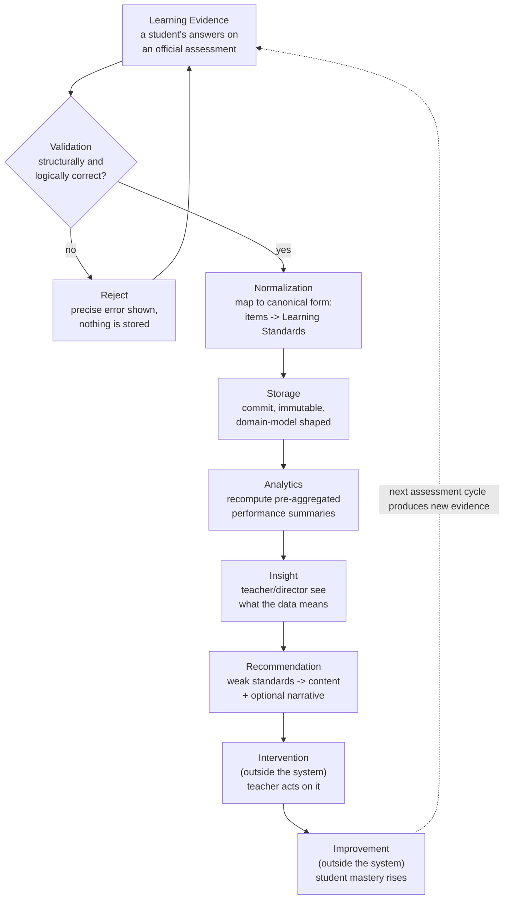

# Business Flow

**DMF Learning Analytics Platform (DLAP)**

| | |
|---|---|
| **Document ID** | ONET-DOC-010 |
| **Version** | 2.0.1 |
| **Status** | Frozen — DLAP Documentation Baseline v2.0.0 |
| **Date** | 2026-07-04 |
| **Author** | DMF Platform Team |
| **Related documents** | [00-Project-Overview](00-Project-Overview.md) · [01-PRD](01-PRD.md) · [02-System-Architecture](02-System-Architecture.md) · [Domain-Model](Domain-Model.md) |

## Revision History

| Version | Date | Description | Author |
|---|---|---|---|
| 1.0.0 | 2026-07-02 | Initial release, as part of the DLAP Documentation Baseline v2.0.0 freeze. Business-level process flow: Import → Validation → Store → Analytics → Dashboard → AI → Recommendation. | DMF Platform Team |
| 2.0.1 | 2026-07-04 | Post-Freeze Amendment — documentation alignment with approved [RFC-004](rfcs/RFC-004-multi-source-analytics-architecture.md) (no stage, business rule, or v1.0 behavior change). §4 Normalization cross-references the **Canonical Analytics Model** terminology this stage's output is now also named as. §6 Analytics adds one clarifying sentence on the two source-Level recompute paths, cross-referencing the technical detail rather than restating it (SSOT). | DMF Platform Team |
| 2.0.0 | 2026-07-02 | **Reframed from a system pipeline to a business value chain.** Replaced the 7-stage technical-pipeline model with the 9-stage chain Learning Evidence → Validation → Normalization → Storage → Analytics → Insight → Recommendation → Intervention → Improvement. This makes explicit two stages the old model stopped short of (Intervention, Improvement — the human/educational outcome the system exists to support, not something it executes) and splits Normalization out from Storage as its own step. **No functional or technical change** — every claim in v1.0.0 is preserved, re-homed under the new stage names; FR-006/FR-009's scope is unchanged, only described more precisely (see [§4 Normalization](#4-normalization)). | DMF Platform Team |

## Purpose and Relationship to Other Documents

This document answers "what happens, in what order, from the moment a student produces evidence of
their learning to the moment that evidence has actually changed something for them" — at a level a
non-engineer stakeholder (the director, an inspector, a new team member) can follow without reading
code or a sequence diagram. [02-System-Architecture.md](02-System-Architecture.md) already
documents the *technical* implementation of the system-internal stages in detail (its own sequence
diagrams in §7 and §9, and the architecture notes in §8, §11, §12); this document does not repeat
that detail — it is the business-value map those technical sections implement, extended past the
system's own boundary to the educational outcome the system is *for*. Per
[Architecture-Principles.md §1](Architecture-Principles.md#1-single-source-of-truth-ssot), every
technical claim here links to its authoritative technical section rather than restating it.

## Table of Contents

1. [The Business Flow](#1-the-business-flow)
2. [Learning Evidence](#2-learning-evidence)
3. [Validation](#3-validation)
4. [Normalization](#4-normalization)
5. [Storage](#5-storage)
6. [Analytics](#6-analytics)
7. [Insight](#7-insight)
8. [Recommendation](#8-recommendation)
9. [Intervention](#9-intervention)
10. [Improvement](#10-improvement)
11. [Failure Paths](#11-failure-paths)
12. [Cross-References](#12-cross-references)

---

## 1. The Business Flow

This is the same underlying process [01-PRD.md §1](01-PRD.md#1-executive-summary) and
[00-Project-Overview.md §3](00-Project-Overview.md#3-background) describe as the platform's reason
for existing, drawn as a full loop rather than a one-shot pipeline: a cycle that is supposed to
repeat every academic year, with each pass ideally showing **Improvement** over the last. The system
DLAP builds owns the first seven stages outright ([§2](#2-learning-evidence)–[§8](#8-recommendation));
the last two ([§9](#9-intervention), [§10](#10-improvement)) happen in the classroom, not in the
software — DLAP's job is to make them *possible and fast*, not to perform them.

## 2. Learning Evidence

**What it is:** The raw material the entire flow runs on — a student's actual answers on an
official assessment, as captured in the file สทศ (or, for a future assessment type, the relevant
issuing body) provides to the school. Naming this stage "Learning Evidence" rather than "Import"
is deliberate: the file is not data the system happens to receive, it is *evidence of learning* —
the fact that gives every later stage (Analytics, Insight, Recommendation) something true to say.

**What happens (system boundary begins here):** A teacher (or administrator) uploads the file —
PDF, `.xlsx`, or `.csv` — for their classroom's assessment. The system accepts it, performs a basic
size/MIME-type check, and queues it for processing; it does **not** parse or store anything yet.

**Who is involved:** The uploading teacher (or admin) is the only actor at this stage.

**Why it does not process inline:** Shared hosting has no long-running request budget large enough
to safely parse a large file synchronously — this stage always hands off to a background job, so
the uploader gets an immediate acknowledgment rather than waiting on parsing.

**Business rule:** Evidence already committed for the same school, assessment, and file path cannot
be silently re-imported — see PRD FR-007 (Duplicate Import Detection).

**Technical reference:** PRD FR-003/FR-004/FR-005;
[02-System-Architecture.md §7](02-System-Architecture.md#7-import-pipeline-architecture) (the
full technical sequence, including the cron hand-off — described there as "Import," the
system-level name for this stage).

## 3. Validation

**What happens:** The queued evidence is parsed and checked against two kinds of rules:
**structural** (does this look like a well-formed export at all — right columns, right encoding,
parseable table structure) and **logical** (are the values themselves sane — scores in range,
student IDs recognized). Content-level correctness that specifically concerns *mapping* (does
every item resolve to a Learning Standard) is where Validation and
[§4 Normalization](#4-normalization) meet — see that section for the boundary. Evidence that fails
either check is rejected with a specific, actionable reason; nothing from rejected evidence is ever
partially stored.

**Who is involved:** No human — this stage is fully automated, running as a background job.

**Business rule:** Rejection must name the exact row/column/value at fault (PRD FR-006's acceptance
criteria) — "the import failed" is never an acceptable message on its own.

**Technical reference:** PRD FR-006;
[02-System-Architecture.md §7](02-System-Architecture.md#7-import-pipeline-architecture).

## 4. Normalization

**What it is:** The step that turns validated-but-still-raw evidence into the platform's canonical
internal shape: resolving header aliases and encoding differences to a single internal
representation, and — the part with the most business significance — mapping every question to its
`Learning Standard` (สาระ → มาตรฐาน → ตัวชี้วัด). This was always part of the pipeline (it is
PRD FR-009, "Item-to-Standard Mapping," and part of FR-006's validation pass); v1.0.0 of this
document described it as folded into what it called "Store." Naming it as its own stage makes
explicit that mapping is a distinct kind of work from either checking correctness (Validation) or
persisting a result (Storage) — **this document's v2.0.0 revision changes no behavior, only the
model used to describe it** (see this document's Revision History).

**Why it matters enough to name separately:** Every downstream stage — Analytics, Insight,
Recommendation — reasons in terms of `Learning Standard`s, never in terms of raw item numbers.
Normalization is where that translation happens exactly once, so nothing later has to re-derive it.
This translated shape is what [RFC-004](rfcs/RFC-004-multi-source-analytics-architecture.md) names
the **Canonical Analytics Model** — the one internal shape every future assessment source's
evidence is translated into here, so Analytics never needs to know which source produced it (see
[02-System-Architecture.md §8.1](02-System-Architecture.md#81-source-independence--assessment-adapter-layer-and-canonical-analytics-model)).

**Who is involved:** No human — fully automated, immediately following a successful Validation.

**Business rule:** A question that cannot be resolved to a primary Learning Standard blocks the
entire batch from proceeding to Storage — PRD FR-009's "100% mapped" requirement is enforced here,
not treated as a warning to fix later.

**Technical reference:** PRD FR-009;
[02-System-Architecture.md §7](02-System-Architecture.md#7-import-pipeline-architecture) (the "Map"
step in that section's sequence diagram); [Domain-Model.md §5](Domain-Model.md#5-question) and
[§6](Domain-Model.md#6-learning-standard) (what a "resolved" mapping actually connects).

## 5. Storage

**What happens:** Normalized evidence is committed to the database in a single transaction: student
scores, individual question responses, and (implicitly, if new) the assessment/question rows they
belong to. This is the moment raw evidence becomes structured [Domain-Model.md](Domain-Model.md)
data — a `Student`'s `Enrollment` is confirmed, an `Assessment` and its `Question`s are recorded,
and each `Question`'s answer is linked to the `Learning Standard` [§4 Normalization](#4-normalization)
already resolved it to.

**Who is involved:** No human — the same background job that ran Validation and Normalization
performs the commit immediately after, if both passed.

**Business rule:** A commit is final and immutable — never overwritten or deleted; a later
correction is a *new* pass through the whole flow that supersedes the old evidence, never an edit
in place (PRD §21 Business Rules). This is what makes the audit trail in Import Logs meaningful.

**Technical reference:**
[02-System-Architecture.md §7](02-System-Architecture.md#7-import-pipeline-architecture) (the
transaction boundary, described there as "commit"); [03-Database-Design.md
§13](03-Database-Design.md#13-data-integrity-rules) (the "no partial commits, no hard delete" rules
enforced at this stage).

## 6. Analytics

**What happens:** Immediately after a successful Storage, the platform recomputes every summary
figure the new evidence affects — classroom, grade, and school-level percent-correct per Learning
Standard, plus item-difficulty statistics — so the next stage (Insight) never has to compute
anything live. This is also, architecturally, the stage where a future per-student longitudinal
Mastery figure would be recomputed, once that capability ships (not in v1.0 — see
[Domain-Model.md §8](Domain-Model.md#8-mastery)) — the same recomputation this stage already does,
extended to a second aggregation axis.

**Who is involved:** No human — automatic, triggered by a successful Storage.

**Business rule:** A dashboard must never show a number computed live from raw responses at
request time — every figure a user sees was pre-computed here, so response time does not depend on
how much historical evidence exists (PRD NFR, Performance). Which recompute path runs — recomputing
from raw item-level evidence, or upserting a Level 1 source's own already-published figures directly
— depends on that evidence's Assessment Data Level, not on anything this business-level description
needs to distinguish; see [RFC-004](rfcs/RFC-004-multi-source-analytics-architecture.md) and
[03-Database-Design.md §14](03-Database-Design.md#14-aggregation-recompute-strategy) for the
technical detail.

**Technical reference:** PRD FR-010/FR-011/FR-012/FR-013;
[02-System-Architecture.md §8](02-System-Architecture.md#8-analytics--aggregation-architecture).

## 7. Insight

**What it is:** The moment pre-computed Analytics results become something a person actually
understands — trend lines, a classroom×standard heatmap, item analysis, and (for the director)
whole-school views. "Insight" names the business outcome (a teacher now *knows* something they
didn't before); the **Dashboard** is the specific mechanism ([02-System-Architecture.md](02-System-Architecture.md)'s
module and PRD §22's UI) that delivers it — the same relationship this document draws between every
other stage name (the business concept) and its system-level implementation.

**Who is involved:** Teacher (own classroom only), School Director (whole school), System
Administrator (full access) — each bounded by the role scoping described in PRD §21's Permission
Matrix.

**Business rule:** A teacher's queries are always constrained server-side to their assigned
classroom(s) — this is enforced in the data-access layer, not merely hidden in the UI (PRD FR-002).

**Technical reference:** PRD §22 (Dashboard & Visualization);
[02-System-Architecture.md §9](02-System-Architecture.md#9-authentication--authorization) (the
access-scoping mechanism).

## 8. Recommendation

**What happens:** For standards below a configured performance threshold, the platform matches weak
`Learning Standard`s to `Learning Content` (worksheets, videos, lesson plans) — a deterministic,
always-on lookup, surfaced alongside the Insight that identified the gap. Optionally, if an
external LLM API is configured, a short natural-language narrative summarizing the pattern is
generated as well; this narrative is purely additive and its absence or failure never blocks the
deterministic recommendation list. (v1.0.0 of this document named the AI matching mechanism as its
own stage, "AI," positioned between Dashboard and Recommendation; v2.0.0 folds it into this single
Recommendation stage, since "which mechanism generates it" — rule-based lookup vs. optional LLM
narrative — is an implementation detail of *how* a Recommendation is produced, not a distinct
business-value step of its own.)

**Who is involved:** No human at generation time; a teacher or the director is the eventual reader,
via Insight.

**Business rule:** Only anonymized, aggregate data ever leaves the system in an outbound AI API
call — no student name, ID, or other identifying field is ever included (PRD FR-015).

**Technical reference:** PRD FR-014/FR-015;
[02-System-Architecture.md §11](02-System-Architecture.md#11-ai-diagnostics-integration);
[Domain-Model.md §9](Domain-Model.md#9-recommendation);
[03-Database-Design.md §10](03-Database-Design.md#10-table-definitions--reporting-diagnostics--platform)
(`ai_recommendations`).

## 9. Intervention

**What it is:** The point where the flow leaves the system. A Recommendation is only valuable if a
teacher or the director actually acts on it — assigning the suggested worksheet, running a
remedial lesson on the weak standard, adjusting instructional pacing for the next unit. **DLAP does
not perform, schedule, or track Intervention** — this is a deliberate system boundary, not a gap:
what a teacher does in their classroom is outside any software's authority to execute, and treating
it otherwise would be over-reach.

**Who is involved:** Teacher, School Director — this is entirely their action, not the system's.

**Why the flow still names it:** Because [Recommendation](#8-recommendation)'s entire reason to
exist is to make this stage more likely and better-targeted. A business flow that stopped at
"Recommendation shown on screen" would be describing a feature, not the outcome the feature is
for — and PRD §5's objectives are explicit that the point is enabling remediation "while the
results are still actionable," not merely displaying them.

**Technical reference:** none — by design, this stage has no corresponding system component. It is
documented here so the boundary is explicit, not accidentally implied.

## 10. Improvement

**What it is:** The result of a successful Intervention — the student's actual mastery of the
Learning Standard in question rises. Like Intervention, **Improvement happens in the student, not
in the system**; DLAP's role is to make it *observable*, across the next cycle's
[Learning Evidence](#2-learning-evidence), not to cause it directly.

**How the system makes it observable today (v1.0):** [§6 Analytics](#6-analytics)'s year-over-year
trend tracking (PRD FR-013) already shows whether a *cohort's* average performance on a standard
rose between academic years — a classroom- or school-level Improvement signal.

**How the system will make it observable per-student (future, not v1.0):** once
`student_standard_mastery` is populated (see [Domain-Model.md §8](Domain-Model.md#8-mastery) and
the YAGNI-justified deferral in [03-Database-Design.md
§9](03-Database-Design.md#9-table-definitions--aggregation--materialized-summaries)), the same
comparison becomes possible for one named student across their own Grade 1–6 history, not just a
cohort average — the longitudinal capability [ADR-006](Architecture-Decision-Record.md#adr-006--why-a-generic-student-centric-assessment-schema)
exists to enable.

**Closing the loop:** the next time this student sits an assessment, that assessment *is* new
[Learning Evidence](#2-learning-evidence) — this is why [§1](#1-the-business-flow)'s diagram draws
Improvement flowing back into Learning Evidence rather than terminating. The flow is a cycle a
school runs every year, not a pipeline that finishes.

## 11. Failure Paths

Not every run through this flow reaches Recommendation, and not every Recommendation leads to
Intervention or Improvement — the latter two are outside the system's control by design
([§9](#9-intervention), [§10](#10-improvement)). Within the system's own boundary, two failure
points are deliberate, visible, and by design, not edge cases papered over:

* **Validation failure** (§3): the flow returns to [§2 Learning Evidence](#2-learning-evidence) —
  the teacher corrects the source file and re-uploads. Nothing downstream of Validation ever runs
  for rejected evidence.
* **AI narrative failure** (§8, optional path only): if the external LLM call times out or is
  unconfigured, the flow continues to Recommendation using only the deterministic rule-based list —
  this is a graceful degradation, not a flow failure, per PRD FR-015.

There is no failure path *after* Storage (§5) that removes or rolls back already-committed data — a
correction is always a new pass through the whole flow (new evidence), never an edit that reaches
backward into an earlier stage's output.

## 12. Cross-References

* Technical implementation of every system-internal stage above:
  [02-System-Architecture.md](02-System-Architecture.md) §7 (Learning Evidence/Validation/
  Normalization/Storage — called "Import," "Validation," and the "Map"/"commit" steps there), §8
  (Analytics), §9 (Insight's access control), §11 (Recommendation).
* The data shape Storage produces and Analytics/Insight/Recommendation consume:
  [Domain-Model.md](Domain-Model.md).
* The functional requirements this flow satisfies: [01-PRD.md](01-PRD.md), FR-003–FR-018.
* The schema each stage reads from or writes to: [03-Database-Design.md](03-Database-Design.md).
* The practical, task-by-task build order for implementing this flow:
  [IMPLEMENTATION_GUIDE.md](../IMPLEMENTATION_GUIDE.md).
