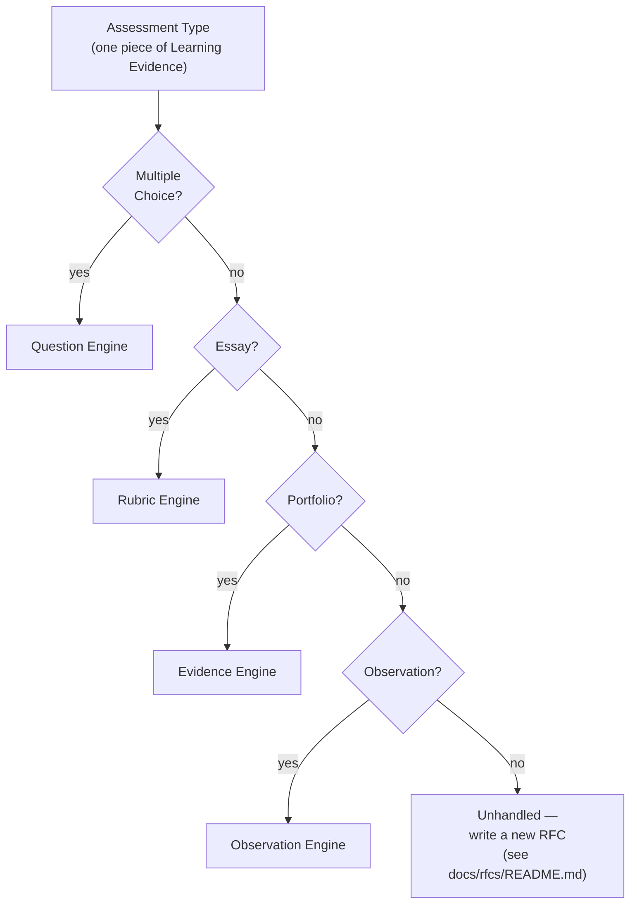

# Decision Tree — Evaluation Method Routing

**DMF Learning Analytics Platform (DLAP)**

| | |
|---|---|
| **Document ID** | ONET-DOC-013 |
| **Version** | 1.0.0 |
| **Status** | Frozen — DLAP Documentation Baseline v2.0.0 |
| **Date** | 2026-07-02 |
| **Author** | DMF Platform Team |
| **Related documents** | [Domain-Model](Domain-Model.md) · [Business-Flow](Business-Flow.md) · [03-Database-Design](03-Database-Design.md) · [Architecture-Decision-Record, ADR-006](Architecture-Decision-Record.md#adr-006--why-a-generic-student-centric-assessment-schema) · [rfcs/RFC-002](rfcs/RFC-002-support-rt.md) · [rfcs/RFC-003](rfcs/RFC-003-support-portfolio-assessment.md) |

## Revision History

| Version | Date | Description | Author |
|---|---|---|---|
| 1.0.0 | 2026-07-02 | Initial release, added as a Post-Freeze Amendment to the DLAP Documentation Baseline v2.0.0 (see [00-Project-Overview.md §13](00-Project-Overview.md#13-documentation-freeze)). Defines the evaluation-method decision tree that routes a piece of Learning Evidence to the engine that knows how to score it — the design-level answer [RFC-002](rfcs/RFC-002-support-rt.md) and [RFC-003](rfcs/RFC-003-support-portfolio-assessment.md) each called for a follow-on ADR to work out. | DMF Platform Team |

## Purpose

[RFC-002](rfcs/RFC-002-support-rt.md) found that RT's oral-fluency component has no discrete test
items. [RFC-003](rfcs/RFC-003-support-portfolio-assessment.md) found that Portfolio Assessment has
neither discrete items nor a single fixed assessment date. Both concluded the gap was real and
recommended a follow-on ADR before building either. This document is that design work: **not every
piece of Learning Evidence ([Business-Flow.md §2](Business-Flow.md#2-learning-evidence)) is scored
the same way**, and the platform needs an explicit rule for which scoring logic — which *engine* —
handles a given piece of evidence, instead of the Import/Normalization pipeline
([Business-Flow.md §4](Business-Flow.md#4-normalization)) assuming every assessment is
multiple-choice, item-based, the way O-NET is.

**This document proposes the routing logic and the responsibility boundary of each engine. It does
not, by itself, authorize a schema change.** Per [decisions/README.md
§1](../decisions/README.md#1-adr-vs-idr), an actual column/table change (see
[§7](#7-open-question-where-evaluation-method-lives-in-the-schema)) still needs its own ADR under
`docs/adr/` before implementation — this document is what that ADR would formalize, not a
substitute for it.

## Table of Contents

1. [The Decision Tree](#1-the-decision-tree)
2. [Multiple Choice → Question Engine](#2-multiple-choice--question-engine)
3. [Essay → Rubric Engine](#3-essay--rubric-engine)
4. [Portfolio → Evidence Engine](#4-portfolio--evidence-engine)
5. [Observation → Observation Engine](#5-observation--observation-engine)
6. [Assessment Type vs. Evaluation Method](#6-assessment-type-vs-evaluation-method)
7. [Open Question: Where Evaluation Method Lives in the Schema](#7-open-question-where-evaluation-method-lives-in-the-schema)
8. [Implementation Status](#8-implementation-status)
9. [Cross-References](#9-cross-references)

---

## 1. The Decision Tree

Each question is asked about **one piece of evidence**, not one `assessment_types` row — see
[§6](#6-assessment-type-vs-evaluation-method) for why that distinction is the central point of
this document. The tree always terminates: if none of the four questions is "yes," the correct
action is not to guess or force-fit an existing engine, but to write a new RFC
([docs/rfcs/README.md](rfcs/README.md)) — the same discipline
[RFC-003](rfcs/RFC-003-support-portfolio-assessment.md) applied to itself rather than force-fitting
Portfolio into the Question Engine.

## 2. Multiple Choice → Question Engine

**Characterizes:** discrete items, each with a fixed set of choices and exactly one correct answer.
O-NET (fully), and the written-comprehension component of RT and NT.

**Owns:** `questions`, `question_secondary_indicators`, `student_question_responses`,
`question_analysis` — the full pipeline already specified in
[03-Database-Design.md §6](03-Database-Design.md#6-table-definitions--questions--item-mapping) and
[§9](03-Database-Design.md#9-table-definitions--aggregation--materialized-summaries), and already
built in v1.0 for O-NET.

**Scoring logic:** `is_correct = (selected_choice == questions.correct_choice)`; percent-correct
aggregation per indicator, exactly as [03-Database-Design.md
§14](03-Database-Design.md#14-aggregation-recompute-strategy) already describes.

## 3. Essay → Rubric Engine

**Characterizes:** a free-response answer (a writing prompt, a short-answer question) evaluated
against multiple named criteria on a scale, not marked simply correct/incorrect. Relevant to the
reserved `WRITING_ASSESSMENT` and `COMPETENCY_ASSESSMENT` types
([00-Project-Overview.md §6](00-Project-Overview.md#6-scope)).

**Would own (not yet built):** a `rubric_criteria` reference table (each criterion linked to a
`Learning Standard`, mirroring how a `question` links to its `primary_indicator_id`) and a
`student_rubric_scores` table (one row per student, per criterion, per assessment — a scale score,
e.g., 1–4, in place of `is_correct`). Aggregation into `standard_performance_summary` would need a
percent-of-maximum-scale calculation instead of a percent-correct calculation, but would otherwise
follow the same recompute shape as [§14 of 03-Database-Design.md](03-Database-Design.md#14-aggregation-recompute-strategy).

**Scoring logic:** a teacher assigns a scale score per criterion; no automatic
correct/incorrect determination is possible (unlike Question Engine), so this engine's pipeline
has no equivalent of `correct_choice` — every score is a human judgment recorded, not computed.

## 4. Portfolio → Evidence Engine

**Characterizes:** a collection of student work, accumulated over a period rather than produced in
a single sitting, evaluated holistically against one or more `Learning Standard`s. This is exactly
[RFC-003](rfcs/RFC-003-support-portfolio-assessment.md)'s proposed `PORTFOLIO_ASSESSMENT` type.

**Would own (not yet built):** per RFC-003's Impact Analysis, this is the engine least like the
others — it does not naturally produce one `assessments` row per academic year. The two directions
RFC-003 raised (multiple `assessments` rows per year, or writing directly into a
`student_standard_mastery`-shaped structure without an `assessments`/`questions` detour) are
exactly what this engine's design would need to resolve, and **that resolution is still open** —
this document does not pick one, consistent with RFC-003's own conclusion that the choice needs its
own reviewed ADR, not a default assumption.

**Scoring logic:** a teacher rates accumulated evidence against a standard at whatever cadence the
work naturally accumulates (not a fixed test date) — the input shape a portfolio produces is
closer to "a stream of dated, standard-tagged evidence" than "a score for one event."

## 5. Observation → Observation Engine

**Characterizes:** a teacher directly observes a student performing a skill (reading aloud, a
practical demonstration) and records a single rating — no items, no criteria list, just one
judgment per observed performance. This is exactly the gap
[RFC-002](rfcs/RFC-002-support-rt.md) found in RT's oral-reading-fluency component, and is also
relevant to the observational parts of `CLASSROOM_ASSESSMENT`.

**Would own (not yet built):** a lightweight `student_observations` table — student, indicator,
academic year, a rating (e.g., words-correct-per-minute, or a rubric level), and the observing
teacher — writing directly into `student_scores` the same way RFC-002's Impact Analysis proposed
("`student_scores` does not require `student_question_responses` rows to exist"). This is the
*simplest* of the three new engines, because it produces exactly one number per observation, with
no sub-structure (unlike Rubric Engine's multiple criteria or Evidence Engine's accumulated
stream).

**Scoring logic:** the teacher's recorded rating *is* the score — there is no derivation step, only
a direct write, which is what makes this engine simpler than Rubric or Evidence despite solving a
structurally similar "no discrete items" problem.

## 6. Assessment Type vs. Evaluation Method

**The central architectural point of this document:** `assessment_types`
([03-Database-Design.md §4](03-Database-Design.md#4-table-definitions--assessment-framework)) and
the four evaluation methods above are **orthogonal**, not the same dimension. An assessment *type*
(O-NET, NT, RT, ...) answers "which testing program"; an evaluation *method* answers "how is this
particular piece of evidence scored" — and, as RFC-002 showed, **a single assessment type can span
more than one evaluation method**:

| Assessment Type | Component | Evaluation Method | Engine |
|---|---|---|---|
| O-NET | (all of it) | Multiple Choice | Question Engine |
| NT | (all of it, in current form) | Multiple Choice | Question Engine |
| RT | Written comprehension | Multiple Choice | Question Engine |
| RT | Oral reading fluency | Observation | Observation Engine |
| Writing Assessment (reserved) | Writing sample | Essay | Rubric Engine |
| Portfolio Assessment (proposed, RFC-003) | Accumulated work | Portfolio | Evidence Engine |
| Classroom Assessment (reserved) | Varies by teacher design | Any of the four | Whichever this tree routes to |

This is why [§1](#1-the-decision-tree)'s tree asks its questions about **one piece of evidence**,
not about an `assessment_types` row as a whole: RT does not get one answer from this tree, its two
components each do.

## 7. Open Question: Where Evaluation Method Lives in the Schema

Not resolved by this document — flagged explicitly, per [§Purpose](#purpose) above, for the
follow-on ADR:

* **Option A:** add `assessments.evaluation_method` (`ENUM('multiple_choice','essay','portfolio','observation')`).
  RT would then need **two** `assessments` rows (one per component) instead of one, which fits
  `assessments`' existing one-homogeneous-instrument-per-row grain
  ([03-Database-Design.md §4](03-Database-Design.md#4-table-definitions--assessment-framework))
  without changing it — the cleanest option for Multiple Choice, Essay, and Observation, but see
  the next bullet for Portfolio.
* **Option B:** Evidence Engine (Portfolio) bypasses `assessments` entirely, per
  [RFC-003](rfcs/RFC-003-support-portfolio-assessment.md#impact-analysis)'s Option 2 — meaning
  Option A's `evaluation_method` column would only ever hold three of the four values in practice,
  and Portfolio would need its own routing path outside this tree's `assessments`-shaped
  assumption.
* **Option C:** a new `assessment_components` table between `assessments` and `questions`/rubric
  tables/observation tables, so one `assessments` row (RT) can have multiple typed components
  without duplicating the row — more normalized than Option A, more schema surface than this
  platform has needed for anything else so far, so it should only be chosen if Option A's
  row-duplication turns out to cause a real problem (KISS —
  [Architecture-Principles.md §6](Architecture-Principles.md#6-kiss--keep-it-simple)), not
  pre-emptively.

The follow-on ADR should pick one of these (or a fourth option this document didn't anticipate) —
this document's job was to establish that the choice is real and to bound it, not to make it.

## 8. Implementation Status

| Engine | Status | Consumes RFC |
|---|---|---|
| Question Engine | **Built, v1.0** (O-NET) | — |
| Rubric Engine | Not built — reserved, no ADR yet | (would accompany a future Writing/Competency Assessment RFC) |
| Evidence Engine | Not built — reserved, no ADR yet | [RFC-003](rfcs/RFC-003-support-portfolio-assessment.md) |
| Observation Engine | Not built — reserved, no ADR yet | [RFC-002](rfcs/RFC-002-support-rt.md) |

Per YAGNI ([Architecture-Principles.md §7](Architecture-Principles.md#7-yagni--you-arent-gonna-need-it)),
no engine beyond Question Engine should be built until its corresponding RFC is approved and its
follow-on ADR (§7) is written — this document makes the *shape* of that future work explicit; it
does not schedule it.

## 9. Cross-References

* The RFCs whose open questions this document answers at the design level:
  [rfcs/RFC-002](rfcs/RFC-002-support-rt.md), [rfcs/RFC-003](rfcs/RFC-003-support-portfolio-assessment.md).
* The schema Question Engine already uses, and every future engine would extend:
  [03-Database-Design.md](03-Database-Design.md).
* Where a piece of evidence enters this routing decision:
  [Business-Flow.md §4 Normalization](Business-Flow.md#4-normalization).
* The architectural claim this whole document is in service of:
  [ADR-006](Architecture-Decision-Record.md#adr-006--why-a-generic-student-centric-assessment-schema).
* Where the follow-on ADR §7 calls for should be written once scoped:
  [decisions/README.md](../decisions/README.md) (if implementation-level) or `docs/adr/`
  (if architecture-level, which §7's schema choice is).
