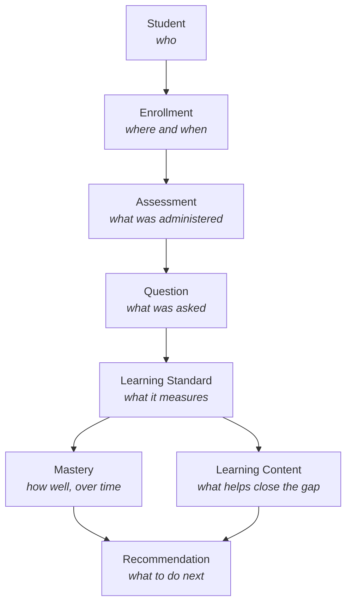

# Domain Model

**DMF Learning Analytics Platform (DLAP)**

| | |
|---|---|
| **Document ID** | ONET-DOC-009 |
| **Version** | 1.0.0 |
| **Status** | Frozen — DLAP Documentation Baseline v2.0.0 |
| **Date** | 2026-07-02 |
| **Author** | DMF Platform Team |
| **Related documents** | [00-Project-Overview](00-Project-Overview.md) · [01-PRD](01-PRD.md) · [03-Database-Design](03-Database-Design.md) · [Business-Flow](Business-Flow.md) · [Data-Dictionary](Data-Dictionary.md) |

## Revision History

| Version | Date | Description | Author |
|---|---|---|---|
| 1.0.0 | 2026-07-02 | Initial release, as part of the DLAP Documentation Baseline v2.0.0 freeze. Conceptual domain model: the chain of business concepts from Student through to Recommendation. | DMF Platform Team |

## Purpose and Relationship to 03-Database-Design.md

This document answers a different question than [03-Database-Design.md](03-Database-Design.md).
That document answers "what tables and columns exist, and how are they keyed together" — the
physical, structural view. This document answers **"what does the business actually reason about,
and how does one concept lead to the next"** — the conceptual view a teacher, the director, or a
new engineer should have in their head *before* looking at a single `CREATE TABLE` statement. Per
[Architecture-Principles.md §1](Architecture-Principles.md#1-single-source-of-truth-ssot), field
types and keys are not repeated here — every concept below links to the table(s) that implement it
in [03-Database-Design.md](03-Database-Design.md) and [Data-Dictionary.md](Data-Dictionary.md)
rather than restating them.

## Table of Contents

1. [The Domain Chain](#1-the-domain-chain)
2. [Student](#2-student)
3. [Enrollment](#3-enrollment)
4. [Assessment](#4-assessment)
5. [Question](#5-question)
6. [Learning Standard](#6-learning-standard)
7. [Learning Content](#7-learning-content)
8. [Mastery](#8-mastery)
9. [Recommendation](#9-recommendation)
10. [How the Chain Answers the Platform's Core Question](#10-how-the-chain-answers-the-platforms-core-question)
11. [Cross-References](#11-cross-references)

---

## 1. The Domain Chain

Each arrow is a real dependency, not just a reading order: an `Enrollment` cannot exist without a
`Student`; a `Question` only has meaning through the `Assessment` it belongs to and the `Learning
Standard` it measures; a `Recommendation` only has evidence behind it because `Mastery` was
computed from many `Question`-level observations first. This is the same dependency direction
[02-System-Architecture.md §3](02-System-Architecture.md#3-module-decomposition)'s module graph
encodes at the code level — the domain model and the module boundaries are two views of the same
underlying shape, which is itself the point of
[ADR-006](Architecture-Decision-Record.md#adr-006--why-a-generic-student-centric-assessment-schema):
the shape was chosen once, deliberately, and everything else follows it.

## 2. Student

**What it is:** The person the entire platform exists to understand. Per
[00-Project-Overview.md §3](00-Project-Overview.md#3-background), the student — not any exam — is
the platform's primary entity; every other concept in this chain is, ultimately, a fact recorded
*about* a student or *derived from* facts recorded about one.

**What it is not:** A row that belongs to one classroom, one year, or one assessment. A student's
identity is stable across their entire time at the school (ป.1 through ป.6), which is precisely
what [§3 Enrollment](#3-enrollment) exists to separate out.

**Implemented as:** `students` — [03-Database-Design.md §3](03-Database-Design.md#3-table-definitions--organizational),
[Data-Dictionary.md §1](Data-Dictionary.md#1-organizational).

## 3. Enrollment

**What it is:** The answer to "which grade, which classroom, which academic year" for a given
student — recorded once per academic year, so a student's full Grade 1–6 path through the school
is a queryable sequence, not a single "current" fact that overwrites its own history.

**Why it is a separate concept from Student:** A student is one thing across six years; their
classroom and grade level are six different facts, one per year. Collapsing enrollment into the
student record (a single "current classroom" column with no history) is exactly what the pre-DLAP
exam-centric design implicitly did, and exactly what
[ADR-006](Architecture-Decision-Record.md#adr-006--why-a-generic-student-centric-assessment-schema)
identified as insufficient for longitudinal analysis.

**Implemented as:** `student_enrollments` (the authoritative history) and `classrooms` (what a
student is enrolled *into*); `students.classroom_id` is a denormalized convenience pointer to the
*current* enrollment only — see
[03-Database-Design.md §3](03-Database-Design.md#3-table-definitions--organizational).

## 4. Assessment

**What it is:** One measured event — a specific assessment type, subject, grade level, and
academic year (e.g., "O-NET, Mathematics, ป.6, academic year 2569"). An assessment is something
that *happens to* a student's enrollment period; it does not define or own the student.

**Why "Assessment" and not "Exam":** O-NET is one of eleven assessment types this platform's data
model recognizes (only O-NET is active in v1.0) — see
[00-Project-Overview.md §6](00-Project-Overview.md#6-scope). "Assessment" is the domain's general
term; "O-NET" is one specific value the domain takes in v1.0.

**Implemented as:** `assessment_types` (the reference list of what *kinds* of assessment exist) and
`assessments` (one row per actual administration) —
[03-Database-Design.md §4](03-Database-Design.md#4-table-definitions--assessment-framework).

## 5. Question

**What it is:** One item within one assessment — the actual thing a student answers. A question
belongs to exactly one assessment and, critically, is mapped to exactly one primary Learning
Standard (plus, optionally, secondary ones), which is what makes every question a bridge between
"what was asked" and "what it measures."

**Why it matters that this mapping is mandatory:** PRD FR-009 requires 100% of items to resolve to
a standard — a `Question` with no `Learning Standard` behind it would be unusable data, since
nothing downstream (Mastery, Recommendation) would know what it was evidence *of*.

**Implemented as:** `questions` and `question_secondary_indicators` —
[03-Database-Design.md §6](03-Database-Design.md#6-table-definitions--questions--item-mapping).

## 6. Learning Standard

**What it is:** The national curriculum's own hierarchy — สาระ (strand) → มาตรฐาน (standard) →
ตัวชี้วัด (indicator) — that exists independently of any assessment. A Learning Standard is defined
by the Ministry of Education's curriculum, not by this platform, and not by any single assessment
type.

**Why it sits in the middle of the chain, not at either end:** Every `Question`, from any
assessment type, at any grade level, resolves to a Learning Standard — this is the one concept in
the chain every future assessment type will reuse without modification, per
[03-Database-Design.md §5](03-Database-Design.md#5-table-definitions--standards-catalogue)'s note
that this hierarchy needed no change for the v2.0.0 redesign.

**Implemented as:** `learning_strands` → `learning_standards` → `learning_indicators` —
[03-Database-Design.md §5](03-Database-Design.md#5-table-definitions--standards-catalogue).

## 7. Learning Content

**What it is:** A teaching resource (worksheet, video, lesson plan, external link) associated with
a Learning Standard, intended to close a gap once one is identified.

**Where it sits in the chain:** Learning Content is reached *from* a Learning Standard, in
parallel with Mastery — a low-mastery indicator is what triggers a Learning Content lookup, not the
other way around.

**Implemented as:** `learning_contents` —
[03-Database-Design.md §10](03-Database-Design.md#10-table-definitions--reporting-diagnostics--platform).

## 8. Mastery

**What it is:** How well a student (or a classroom, grade, or school) has performed against a
specific Learning Standard — the aggregated, computed answer to "based on every Question we have
evidence for, how solid is this understanding." This concept exists at two different scopes that
must not be confused:

* **Group mastery** — classroom, grade, or school-level, for a single academic year: "how did this
  classroom do on this indicator this year." This is what v1.0's dashboards actually show.
* **Student mastery** — one student, tracked across every academic year and assessment type they
  have been measured on: "how has *this* student done on this indicator, from Grade 1 to Grade 6."
  This is the longitudinal capability the DLAP redesign exists to enable, and it is schema-ready
  but **not populated in v1.0** — see the status note in
  [03-Database-Design.md §9](03-Database-Design.md#9-table-definitions--aggregation--materialized-summaries)
  and the YAGNI reasoning in
  [Architecture-Principles.md §7](Architecture-Principles.md#7-yagni--you-arent-gonna-need-it).

**Implemented as:** `standard_performance_summary` (group mastery) and `student_standard_mastery`
(student mastery) — both in
[03-Database-Design.md §9](03-Database-Design.md#9-table-definitions--aggregation--materialized-summaries).

## 9. Recommendation

**What it is:** The end of the chain — a concrete next action, derived from Mastery (which
indicators are weak) and pointing at Learning Content (what addresses that weakness), optionally
narrated in natural language. This is where the domain model stops being descriptive ("here is what
happened") and becomes prescriptive ("here is what to do about it").

**Two forms, per PRD FR-014/FR-015:** a deterministic, always-available rule-based match
(threshold on Mastery → Learning Content lookup), and an optional LLM-generated narrative summary
layered on top, which must never be a precondition for the rule-based recommendation existing —
see [02-System-Architecture.md §11](02-System-Architecture.md#11-ai-diagnostics-integration).

**Implemented as:** `ai_recommendations` —
[03-Database-Design.md §10](03-Database-Design.md#10-table-definitions--reporting-diagnostics--platform).

## 10. How the Chain Answers the Platform's Core Question

[00-Project-Overview.md §3](00-Project-Overview.md#3-background) poses the platform's reason for
existing as a single question: *how is this specific student progressing, from Grade 1 through
Grade 6, across every assessment they ever sit?* Walking the chain answers it directly:

1. **Student** identifies *who*.
2. **Enrollment** identifies *where and when* in their six-year path.
3. **Assessment** identifies *what was administered* during that enrollment period.
4. **Question** identifies *what was actually asked*, item by item.
5. **Learning Standard** translates each question into *what national competency it measured*.
6. **Mastery** aggregates every such observation, for that student, across every year and
   assessment type, into *how solid that competency is, and whether it's improving*.
7. **Learning Content** and **Recommendation** turn a weak Mastery signal into *what a teacher
   should actually do next*.

v1.0 walks this exact chain for one assessment type only (O-NET, Grade 6) — the chain itself does
not change when NT, RT, or any other reserved assessment type is eventually activated; only the
`assessment_types` row and the corresponding import template do
([01-PRD.md §6](01-PRD.md#6-scope)).

## 11. Cross-References

* Physical schema for every concept above: [03-Database-Design.md](03-Database-Design.md).
* Field-level business meaning and validation: [Data-Dictionary.md](Data-Dictionary.md).
* The operational pipeline that populates this domain model from an uploaded file:
  [Business-Flow.md](Business-Flow.md).
* The architectural decision this domain shape is built on:
  [Architecture-Decision-Record.md, ADR-006](Architecture-Decision-Record.md#adr-006--why-a-generic-student-centric-assessment-schema).
