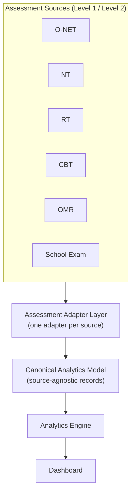

# RFC-004 — Multi-Source Analytics Architecture (Official O-NET + Raw Assessment Data)

**Status:** Proposed
**Author:** DMF Platform Team
**Date:** 2026-07-03

## Revision History

| Version | Date | Description | Author |
|---|---|---|---|
| 1.0 | 2026-07-03 | Initial proposal, following direct verification of `Onet/2566–2568/` against the Sprint 4 Analytics Engine's paused assumptions. | DMF Platform Team |
| 1.1 | 2026-07-03 | Amendment: reframed around the platform's long-term identity as a generic, source-independent Assessment Analytics Platform, not an O-NET-anchored one. Softened the `standard_performance_summary` recommendation (no presumed re-keying direction — deferred to a future ADR without prejudging its answer). Added §Assessment Data Classification (Level 1/2/3). Broadened `student_question_responses`/`question_analysis`'s reserved-column language from "O-NET vs. Raw Assessment" to the full named set of future sources (NT, RT, School Assessment, OMR, CBT, third-party, future AI-based assessment). No conclusion from v1.0 was reversed except the `standard_performance_summary` keying lean. | DMF Platform Team |
| 1.2 | 2026-07-04 | Clarification pass (no direction change): added the Assessment Adapter Layer / Canonical Analytics Model as the concrete extension point a future source plugs into, with a diagram, in Analysis §6 — grounded in the Normalization module (T2.5) already built. Added §Non-Goals to bound scope explicitly. | DMF Platform Team |

## Background

Sprint 4 (Analytics Engine) was paused before any code was written because `student_question_responses`
— the table `question_analysis` and `standard_performance_summary`'s documented recompute algorithm
([03-Database-Design.md §14](../03-Database-Design.md#14-aggregation-recompute-strategy)) both assume
as their input — has no writer anywhere in the Import pipeline (T2.1–T2.7), and a first pass at
"where would this data come from" concluded that the official O-NET report set does not provide it
either.

That conclusion was verified directly against primary sources, not assumed: every PDF under
`Onet/2566/`, `Onet/2567/`, `Onet/2568/` for this school (code `1047010005`) was read.

**This platform's long-term identity is not an O-NET reporting tool.** Per
[00-Project-Overview.md §6](../00-Project-Overview.md#6-scope) and
[ADR-006](../Architecture-Decision-Record.md#adr-006--why-a-generic-student-centric-assessment-schema),
DLAP already reserves eleven assessment-type codes beyond O-NET (NT, RT, LAS, Pre/Mid/Post-Test,
Classroom/Reading/Writing/Competency Assessment, and — per [RFC-003](RFC-003-support-portfolio-assessment.md)
— a proposed twelfth, Portfolio). O-NET is the first *concrete, evidenced* data source this platform
has, not a template every future source must conform to. v1.0 of this RFC risked treating O-NET's
specific report structure and granularity as if it were a permanent architectural boundary, simply
because it was the only source with primary-source evidence available. This amendment corrects that
framing: the evidence gathered from `Onet/` remains valid and useful — it just describes what *one*
source (a "Level 1" source, see below) can and cannot provide, not a ceiling on what the schema should
ever support.

## Evidence

Every finding below is sourced directly from the primary documents named — no report structure is
assumed or reconstructed from memory. This evidence characterizes O-NET specifically; it is treated
below as one instance of a general source *category* (Level 1 — Official Published Statistics), not as
the definition of that category or of the architecture as a whole.

### O-NET report inventory (verified across `Onet/2566/`, `Onet/2567/`, `Onet/2568/`)

The official สทศ (NIETS) school report set for this school is **seven distinct report editions**,
consistent in structure across all three years:

| Edition | File pattern | Grain | Provides |
|---|---|---|---|
| ฉบับที่ 1 | `IndividualScore_*` | Per student, subject-level | ปรนัย/อัตนัย/รวม (objective/subjective/total) per subject, a per-subject quality level (1.00–4.00), a weighted composite score, plus the official per-subject score-range→quality-level lookup table (recalculated every year). |
| ฉบับที่ 2 | `StatbySchool_*` | Per **มาตรฐาน** (Learning **Standard**) | Examinee count, Mean, S.D., Max, Min, Median, Mode — compared across school / school-size / location / province / affiliation / region / country. |
| ฉบับที่ 3 | `PercentCorrectbySchool_*` | Per **question/item**, school-wide | Percent-correct across the same seven comparison tiers. |
| ฉบับที่ 4 | `ScoreDistributionBySchool_*` | Per subject, school-wide | Count/% of examinees per 10-point score bucket. |
| ฉบับที่ 5 | `ContentStatbySchool_*` | Per **สาระ** (Learning **Strand**) | Same statistics shape as ฉบับที่ 2, one tier broader. |
| ฉบับที่ 6 | `SbjStatbySchool_*` | Per whole **subject** | Same statistics shape again, plus an urban/rural (ในเมือง/นอกเมือง) breakdown. |
| (unnumbered) | `ONET_SCH_StdQualityLevel_*` | Per สาระ, categorical | Which content areas fall into ดีเยี่ยม/มาตรฐาน/ปรับปรุง (Excellent/Standard/Needs-Improvement) — no numeric values. |

**Confirmed absent from all seven editions, all three years:** student-level item response,
selected-choice distribution, distractor frequency, per-student correct/incorrect record. ฉบับที่ 1
(the only per-student report) stops at subject totals; ฉบับที่ 3 (the only per-item report) is
aggregated at school level and above, never per student.

**Also confirmed:** the finest grain สทศ ever publishes is **มาตรฐาน (Standard)**, not **ตัวชี้วัด
(Indicator)** — no report breaks any statistic down to indicator level. **This is evidence about
O-NET's own reporting granularity — it is not, by itself, evidence about what the platform's schema
should permanently support**, since a different source (e.g. a well-tagged classroom assessment
system) could plausibly report at indicator grain. See Analysis §3 (`standard_performance_summary`)
for how this RFC now treats that distinction.

### Existing precedent already in the frozen decision record

[RFC-002 §Impact Analysis](RFC-002-support-rt.md#impact-analysis) already encountered and resolved
the identical structural question, for a different assessment type: RT's written component "fits the
existing schema with no changes," but its oral-fluency component "does not naturally populate
`questions` or `student_question_responses`, because there are no discrete items to respond to" — yet
it "can still populate `student_scores` directly." RFC-002's conclusion was that this needs "a small,
explicit extension to the Analytics recompute logic to also aggregate directly from `student_scores`
when no `student_question_responses` exist for an assessment" — not a schema redesign. This is the
same lesson this RFC applies to O-NET, generalized: **the schema is designed for the richest source it
needs to support; a coarser source simply doesn't populate every column, and that is a normal,
expected state, not a defect.**

## Problem Statement

This platform's identity is not in question — it is, and has been since
[ADR-006](../Architecture-Decision-Record.md#adr-006--why-a-generic-student-centric-assessment-schema),
a generic, source-independent Assessment Analytics Platform. What v1.0 of this RFC got wrong was
treating "O-NET-only vs. Multi-Source" as the open question, when the real open questions are
narrower: **(1) does any existing table or recommendation accidentally assume O-NET's specific
reporting granularity as a permanent ceiling, and (2) for each such case, what is the source-independent
design that treats O-NET as one example of a broader source category, rather than the definition of
that category?**

## Non-Goals

* This RFC does **not** attempt to redesign the Analytics Engine for every future assessment source.
  Its purpose is only to establish that the platform architecture must remain source-independent — the
  Assessment Adapter Layer and Canonical Analytics Model (Analysis §6) are the extension point a
  future source plugs into; this RFC does not design an adapter for any source beyond the one O-NET
  evidence already justifies.
* This RFC does not commit to a delivery date, priority, or even certainty for any Level 2 source
  (OMR, CBT, School Assessment, third-party, AI-based) — "future" means "not yet scoped," not "next
  sprint."
* This RFC does not resolve `standard_performance_summary`'s grain-mismatch question — explicitly
  deferred to a future ADR (Analysis §4), not decided or prejudged here.
* This RFC does not propose new tables for the four currently-unmodeled Level 1 report types
  (strand/subject/score-distribution/quality-level data) — a follow-on RFC's job, not this one's.

## Analysis

### 1. Assessment Data Classification

Every current and future data source this platform will ever ingest falls into one of three levels.
This classification is the vocabulary the rest of this RFC (and future RFCs/ADRs about new sources)
should use, in place of the O-NET-specific "official report vs. raw response" framing v1.0 used.

**Level 1 — Official Published Statistics**
*Examples:* O-NET reports, NT reports, RT reports (once activated per
[RFC-001](RFC-001-support-nt.md)/[RFC-002](RFC-002-support-rt.md)), and any future national or
provincial assessment's published school report.
*Characteristics:* aggregated (never per-student-per-item), benchmark-oriented (compares the school
against size/location/province/region/national peer groups), school-level (or, at finest,
subject/standard/strand-level — never classroom or indicator-level in the sources evidenced so far),
official (produced by the testing authority, not the school).
*Analytics this level alone can produce:* student subject scores; item difficulty at school scope;
standard/strand/subject-level performance at whatever grain the specific Level 1 source publishes
(standard-grain for O-NET, evidenced above — a different Level 1 source could in principle publish at
a different grain); score distribution; quality-level categorization; year-over-year trend (a
comparison of already-published Level 1 figures across years, no other level needed).

**Level 2 — Raw Assessment Data**
*Examples:* OMR-scanned answer sheets, CBT/online examination systems, school-set examinations,
classroom assessments, third-party assessment platforms.
*Characteristics:* student-level, item-level (a discrete record of which student answered which
question, with which selected choice, correctly or not), supports advanced analytics a Level 1 source
structurally cannot.
*Analytics this level enables (beyond everything Level 1 enables):* item discrimination
(point-biserial correlation); distractor/selected-choice frequency; standard or indicator-level
performance at whatever grain the item-to-standard mapping in `learning_indicators`/
`learning_standards` supports — which, since Level 2 data is student- and item-level, can in principle
reach indicator grain and classroom scope, neither of which any evidenced Level 1 source can reach;
per-student mastery.

**Level 3 — Derived Analytics**
*Examples:* difficulty, discrimination, distractor analysis, mastery, AI-generated recommendations,
trend analysis.
*Characteristics:* not a data *source* at all — Level 3 is always computed from Level 1 and/or Level 2
data already imported; it never has its own import path.
*Which Level 3 analytics need which input level:*

| Level 3 analytic | Needs | Why |
|---|---|---|
| Trend analysis | Level 1 (sufficient) | A comparison of already-aggregated figures across years/sources — no item-level data required. |
| Difficulty (school scope) | Level 1 (sufficient) | Directly published by a Level 1 source when available (e.g. O-NET's ฉบับที่ 3); otherwise computable from Level 2. |
| Difficulty (classroom scope) | Level 2 (required) | No evidenced Level 1 source publishes below school scope. |
| Standard/strand performance, at the grain a given Level 1 source publishes | Level 1 (sufficient) | Direct import, no computation. |
| Standard/indicator performance, at a finer grain than a given Level 1 source publishes | Level 2 (required) | Only a student-/item-level source can be aggregated to an arbitrary grain. |
| Discrimination | Level 2 (required) | Needs per-student item correctness correlated against per-student total score — structurally absent from every evidenced Level 1 source. |
| Distractor frequency | Level 2 (required) | Needs per-student selected choice — same reason. |
| Student mastery | Level 2 (required) | Needs per-student, per-item correctness mapped to indicators. |
| AI recommendation | Level 1, Level 2, and/or Level 3 outputs | Consumes whatever aggregate/derived figures are already available (FR-014/FR-015) — not itself tied to any one input level. |

### 2. `student_question_responses` — schema remains valid; only the documented producer changes

**Unchanged conclusion, broadened evidence base.** The table's column shape (`student_id`,
`question_id`, `selected_choice`, `is_correct`) makes no assumption specific to any one Level 2 source
— it is equally the correct destination for an OMR export, a CBT system's result feed, a school
examination's manually-entered records, or a third-party platform's API response. **Recommendation:
preserve the schema exactly as designed; clarify only the documented producer**, from "O-NET" (which
this RFC's evidence confirms can never populate it) to "any Level 2 source — OMR, CBT, School
Assessment, third-party assessment platforms, or a future AI-based assessment system, none of which
are built yet."

### 3. `question_analysis` — which columns need which level, and how to label the gap

| Column | Needs | Recommendation |
|---|---|---|
| `difficulty_index` (school scope) | Level 1 (sufficient) — evidenced today via O-NET ฉบับที่ 3 | In scope for Sprint 4 now. |
| `difficulty_index` (classroom scope) | Level 2 | **Reserved for Future Assessment Sources** — not a defect, not built until a Level 2 source exists. |
| `discrimination_index` | Level 2, always | **Reserved for Future Assessment Sources** — remain nullable, no schema change. |
| `distractor_frequency_json` | Level 2, always | **Reserved for Future Assessment Sources** — remain nullable, no schema change. |

No column is recommended for removal or redesign. `Data-Dictionary.md` should eventually state
explicitly (not done in this RFC) that an absent value in a Reserved column under a Level-1-only import
is expected application behavior, not a recompute bug — extending its existing "a *wrong* value here
is a bug" language to also cover "an *absent* value here, when only Level 1 data has ever been
imported, is not."

### 4. `standard_performance_summary` — defer to a future ADR, do not presume a keying direction

v1.0 of this RFC recommended re-keying this table from `indicator_id` to `standard_id`, reasoning from
O-NET's evidenced ceiling (standard-grain only). **That recommendation is withdrawn as stated.**
O-NET's inability to reach indicator grain is a fact about O-NET (a Level 1 source), not evidence that
the *platform's* permanent granularity should be capped there. A well-tagged Level 2 source — items
already carry `primary_indicator_id`/`question_secondary_indicators` mappings via the existing
`learning_indicators` catalog, exercised today by Normalization (T2.5) — could reach indicator grain
without difficulty. Designing the schema around the *coarsest* evidenced source, rather than the
*richest plausible* one, would be the premature-optimization mistake this RFC's Quality Rules warn
against.

**What remains true and unresolved:** the table is keyed on `indicator_id`, and no evidenced source
today (O-NET) can fully populate a row at that grain — only at `standard_id` grain. That is a genuine
open question about *how* a coarser-grain Level 1 source should populate a table designed for
indicator grain (leave `indicator_id` referencing some canonical/"any" indicator under the standard?
introduce a parallel standard-grain aggregate? something else?) — not a question this RFC has enough
evidence to answer, and not one it will presume an answer to. **Recommendation: a future ADR should
resolve this specifically — how a standard-grain-only Level 1 source populates an indicator-grain
table — without this RFC prejudging whether that ADR's answer involves changing `indicator_id`,
adding a parallel table, or something not yet considered.** The table's `scope` enum
(`classroom`/`grade`/`school`) has the same open-question status for the same reason: O-NET evidences
`school` scope plus several comparison tiers no column currently models; whether `classroom`/`grade`
stay defined for a future Level 2 source, get extended, or need reconsideration is deferred to the same
future ADR, not decided here.

### 5. `student_standard_mastery` — YAGNI status, unaffected by source classification

**Unchanged from v1.0.** The deferral ([03-Database-Design.md §9](../03-Database-Design.md#9-table-definitions--aggregation--materialized-summaries),
restated four times across the frozen doc set) was conditioned on the absence of a **consuming
feature**, not on data availability. This holds regardless of which level of source eventually supplies
the data — even a rich Level 2 source arriving tomorrow would not, by itself, create the per-student
longitudinal report feature that would justify writing to it. "Can we get the data" (a source-level
question, addressed by Level 1/2/3 classification above) and "should we build the feature" (a
product-scope question) remain separate questions; this RFC only addresses the first.

### 6. Architecture Impact — explicitly source-independent

**Confirmed valid for every future source, at every level.** Repository → Service (including Import) →
Analytics → Action/Dashboard makes no structural assumption about which system produced the imported
data — a repository is equally pure CRUD whether the row came from an O-NET-report-derived CSV, an
OMR export, a CBT API response, or a future AI-based assessment's output.

**The concrete extension point this RFC recommends documenting** is not a new layer bolted onto that
architecture, but a naming of two things that already exist in embryonic form (Normalization, T2.5)
and should be recognized as the pattern every future source follows:

* **Assessment Adapter Layer** — one adapter per source, owning everything specific to that source:
  parsing its file/API shape, and — critically — knowing whether that source is Level 1 (already
  aggregated) or Level 2 (raw item response), and doing whatever translation that implies. This is
  where the "two recompute paths" this RFC's earlier draft assigned to the Analytics Engine itself
  actually belong: an O-NET adapter emits already-aggregated Canonical records directly; a future OMR
  or CBT adapter computes per-item Canonical records from raw responses before they ever leave the
  adapter. **The Analytics Engine never needs to know which kind of adapter produced its input.**
* **Canonical Analytics Model** — the one internal shape every adapter produces and the Analytics
  Engine always consumes, regardless of source. This is not a new invention — it generalizes the
  pattern the Normalization module (`app/Analytics/Normalization/*`, T2.5) already implements today:
  `ItemIndicatorNormalizer` already turns per-response evidence into a source-agnostic
  `NormalizedRecord`/`NormalizedStandardMapping` shape, resolved against the same
  `learning_indicators`/`learning_standards`/`learning_strands` catalog regardless of where the
  response came from. This RFC's recommendation is to recognize that shape as the Canonical Analytics
  Model's first real instance, and extend the same principle to Level 1 (pre-aggregated) sources —
  not to invent a parallel concept from nothing.

Which documents need this clarification (not redesign, per this RFC's scope) is otherwise unchanged
from v1.0: [02-System-Architecture.md §8](../02-System-Architecture.md#8-analytics--aggregation-architecture),
[03-Database-Design.md §14](../03-Database-Design.md#14-aggregation-recompute-strategy), and
[01-PRD.md](../01-PRD.md) FR-010/FR-011/FR-012's "aggregated from committed item-level scores" wording
— none edited here. Designing the Assessment Adapter interface itself is explicitly out of scope for
this RFC — see Non-Goals.

### 7. Recommended v1.0 product scope

Ship v1.0 Analytics against the **first available Level 1 source (O-NET)** — student scores, school-
level item difficulty, school-level standard/strand/subject statistics, score distribution, quality
level, year-over-year trend — while documenting the architecture as source-independent from the start,
not as "O-NET-first" in any sense that implies O-NET shaped the design. Level 2-dependent capabilities
remain schema-ready-but-unpopulated, the same discipline already applied to `student_standard_mastery`.
No code is written speculatively for a Level 2 source that isn't scoped or requested yet (YAGNI) — this
preserves backward compatibility, since nothing about supporting a future second source requires
changing how the first is imported or stored.

## Alternatives

* **O-NET-only Analytics Platform** — formally retire `student_question_responses` and
  `question_analysis`'s Level-2-dependent columns as permanently unsupported. Rejected: contradicts
  this platform's own already-established identity ([ADR-006](../Architecture-Decision-Record.md#adr-006--why-a-generic-student-centric-assessment-schema),
  eleven-plus reserved assessment types) — this was never a live option, only an anti-pattern this RFC
  exists to rule out explicitly.
* **Full Level 2 build-out now** — build OMR/CBT import templates and indicator/classroom-grain
  aggregation immediately. Rejected: no concrete Level 2 source has been named, requested, or scoped by
  any stakeholder yet; building toward a hypothetical source is exactly the speculative work YAGNI
  exists to prevent.
* **Recommended — Source-Independent Architecture, Level-1-First Delivery:** document the
  Level 1/2/3 classification and source-independence now (this RFC), implement only what the first
  available Level 1 source (O-NET) supports in v1.0, leave every future source's import path to its
  own future RFC/IDR when named.

## Recommendation

1. Adopt the Level 1 / Level 2 / Level 3 Assessment Data Classification as the platform's standing
   vocabulary for source-related design questions, replacing the "O-NET vs. raw response" framing.
2. `student_question_responses`: keep the table exactly as designed; document its producer as "any
   Level 2 source (OMR, CBT, School Assessment, third-party, future AI-based assessment) — none built
   yet," not "O-NET."
3. `question_analysis.discrimination_index` / `.distractor_frequency_json` / `.difficulty_index`
   (classroom scope): keep, remain nullable, labeled **Reserved for Future Assessment Sources**.
4. `question_analysis.difficulty_index` (school scope): in scope for Sprint 4 now, Level 1-sufficient,
   sourced from O-NET ฉบับที่ 3.
5. `standard_performance_summary`: **defer to a future ADR** the question of how a standard-grain-only
   Level 1 source populates an indicator-grain table (and what its `scope` enum should ultimately
   support) — explicitly **without** presuming that ADR will replace `indicator_id` with `standard_id`.
6. `student_standard_mastery`: YAGNI stands, unaffected by source classification.
7. New table candidates for สาระ/subject/score-distribution/quality-level data: out of this RFC's
   scope — a follow-on RFC should decide whether v1.0 needs them.
8. Document the layered architecture (Repository → Service → Analytics → Action/Dashboard) as
   explicitly source-independent, valid for every level and every named future source.
9. Name the **Assessment Adapter Layer** and **Canonical Analytics Model** (Analysis §6) as the
   concrete extension point a future source plugs into — recognizing the Normalization module (T2.5)
   as the Canonical Model's first real instance, not proposing a new one. Designing an adapter
   interface is explicitly out of scope (see Non-Goals).

## Migration Impact

None required by this RFC's approval alone (no code, no database changes, per this RFC's own scope).
Approval creates one downstream obligation, not executed here: the future ADR on
`standard_performance_summary`'s grain-mismatch handling. `Data-Dictionary.md`'s source language for
`student_question_responses` and `question_analysis`'s reserved columns will need a Post-Freeze
Amendment once a separate PRD update is approved — also not done here. No production data is affected
— nothing has ever been written to any of the tables this RFC discusses.

## Future Expansion

* Level 2 import templates (OMR, CBT, School Assessment, third-party, future AI-based assessment),
  each scoped by its own future RFC/IDR when a real source is named — matching the no-fabricated-
  template discipline already applied to O-NET (T2.2).
* Level 1 tables for สาระ/subject/score-distribution/quality-level data, if a follow-on RFC finds v1.0
  or a later release needs them.
* Classroom-scope and indicator-grain aggregation, once a Level 2 source with classroom rosters and
  indicator-tagged items exists.
* `student_standard_mastery` population, once the per-student longitudinal report feature is scoped —
  independent of source level, per Analysis §5.
* NT/RT activation ([RFC-001](RFC-001-support-nt.md)/[RFC-002](RFC-002-support-rt.md)), once approved,
  slot into this classification as additional Level 1 sources without needing changes to this RFC's
  recommendations.

## Open Questions

1. How should a standard-grain-only Level 1 source populate an indicator-grain
   `standard_performance_summary` row — deferred to a future ADR, explicitly not pre-answered here.
2. Should the four currently-unmodeled O-NET report types (strand/subject/score-distribution/
   quality-level) get Level 1 tables in v1.0, or wait for a dedicated follow-on RFC?
3. Is there a concrete, named candidate for the first Level 2 source this architecture should design
   toward (a specific OMR vendor, CBT platform, or in-house tool), or is Level 2 still fully
   hypothetical? Naming one, even non-committally, would sharpen what the future ADR actually needs to
   solve for.
4. Should `standard_performance_summary.scope` be extended now to name the comparison tiers O-NET
   already evidences (school-size, location, province, affiliation, region, country), or is that a
   separate, later concern from the indicator/standard grain question?

## Approval Required

School Director + System Administrator, per the standard Approval Flow
([01-PRD.md §21](../01-PRD.md#21-core-product-capabilities)). Per the precedent set in
[RFC-003 §Approval Path](RFC-003-support-portfolio-assessment.md#approval-path): because this RFC
recommends a follow-on ADR (`standard_performance_summary`'s grain-mismatch handling) as a near-term
consequence, approval of that specific recommendation should be understood as "approved to write the
follow-on ADR and bring it back for review" — with the ADR's scope now explicitly *not* predetermined
to any particular keying outcome. The remaining recommendations (adopting the Level 1/2/3
classification; reclassifying `student_question_responses`'s documented producer; keeping
`question_analysis`'s reserved columns as-is; documenting source-independence) are documentation-
clarification decisions that do not themselves require a follow-on ADR.

## Cross-References

* [RFC-001](RFC-001-support-nt.md), [RFC-002](RFC-002-support-rt.md) — NT and RT as additional Level 1
  sources this classification already accommodates without modification.
* [RFC-003](RFC-003-support-portfolio-assessment.md) — the two-step "approved to write the ADR"
  approval pattern this RFC's Approval Required section follows.
* [ADR-006](../Architecture-Decision-Record.md#adr-006--why-a-generic-student-centric-assessment-schema) —
  the generic-schema, source-independent principle this entire RFC is grounded in.
* [00-Project-Overview.md §6](../00-Project-Overview.md#6-scope) — the eleven-plus reserved assessment
  types that already establish this platform's multi-source identity, independent of this RFC.
* [03-Database-Design.md §9](../03-Database-Design.md#9-table-definitions--aggregation--materialized-summaries),
  [§14](../03-Database-Design.md#14-aggregation-recompute-strategy) — the table definitions and
  recompute algorithm this RFC's Analysis section evaluates against real report evidence.
* `Onet/2566/`, `Onet/2567/`, `Onet/2568/` — the primary source documents this RFC's Evidence section
  is drawn from directly, characterizing O-NET as one Level 1 source among several named in Future
  Expansion.
* `app/Analytics/Normalization/*` (T2.5, already built and approved — see `PROJECT_BOARD.md`) — the
  existing code this RFC's Canonical Analytics Model recommendation is grounded in, not a new
  abstraction invented for this RFC.
